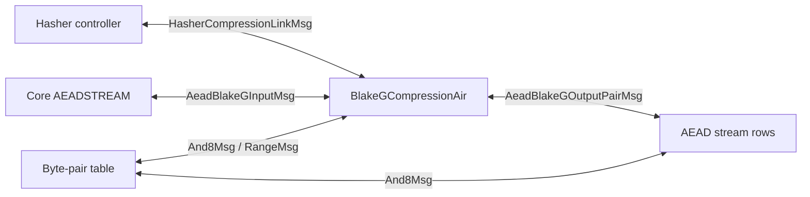

# BlakeG Compression AIR

`BlakeGCompressionAir` proves one Eidos/BlakeG compression. Semantically, it
maps a packed 12-felt input state to a packed 4-felt output chaining value:

```text
(R[0], ..., R[7], C[0], ..., C[3]) -> (D[0], ..., D[3])
```

The hasher controller records compression requests in the Chiplets trace. This
AIR proves the full compression computation and connects it to the rest of the
VM through the lookup argument.

The page is organized in four layers:

1. the external interface and compression boundary;
2. the 64-row trace layout;
3. the local constraints for each row family;
4. the lookup argument and the auxiliary-column layout.

## Terminology

- A **row selector** is a 64-periodic flag that identifies the row family inside
  one compression block.
- A **layout slot** is a fixed group of main-trace cells used together by a row
  family.
- A **range limb** is a 16-bit limb checked through the shared byte-pair table.
- A **canonicality** constraint rules out a second field representation for the
  same packed value.

## External Interface

In compression mode, the AIR proves:

```text
cv_out = BlakeGCompress(block, cv_in)
```

The lookup argument links the packed boundary `(block, cv_in, cv_out)` to
hasher-controller requests. Multiple non-contiguous controller rows may request
the same compression tuple. The BlakeG trace stores one 64-row block for that
tuple; its interface row carries the aggregate count used by the lookup
argument.

In AEAD-XOF mode, the same local compression trace is exposed through a
different lookup surface. Core requests the counter-derived state
`[counter, 0, ..., 0, K_CTR]`; the BlakeG interface row receives `[R, C]`; the
footer rows expose all 16 raw output words as eight two-word keystream pairs
for the AEAD stream rows. The exact messages are described in
[Lookup Argument and Auxiliary Columns](#lookup-argument-and-auxiliary-columns).

The trace carries two label columns for this split. `mode = 0` means packed
compression, and `mode = 1` means AEAD-XOF. The `clk` label is meaningful only
in AEAD-XOF mode: it ties the BlakeG input and output-pair messages to the
corresponding Core stream request. Packed-compression rows force `clk = 0`.



## Compression Boundary

The external compression state is packed in field elements:

```text
(R[0], ..., R[7], C[0], ..., C[3]) -> (D[0], ..., D[3])
```

- `R[0..7]` is the 8-felt rate block.
- `C[0..3]` is the input chaining value.
- `D[0..3]` is the output chaining value.

Each field element carries two 32-bit words:

```text
R[j] = m[2j] + 2^32 * m[2j + 1]
C[t] = h[2t] + 2^32 * h[2t + 1]
```

The round core does not operate on packed field elements. It operates on:

```text
m[0..15]    block words
h[0..7]     input chaining words
v[0..15]    working state
```

The AIR proves the packed/unpacked boundary explicitly:

- message rows unpack `R` into `m`;
- row `I` carries both packed `C` and unpacked `h`, and constrains
  `C[t] = h[2t] + 2^32 * h[2t + 1]`;
- row `0` (the first `A` row), row `1` (the first `B` row), and the footer
  rows use the same `h` words, linked to row `I` by input-chaining messages.

With `m` and `h` fixed, the working state starts as:

```text
v[0..7]   = h[0..7]
v[8..15]  = BlakeG IV[0..7]
```

Let `W[0..15]` denote the value of `v[0..15]` after the seven BLAKE3 rounds.
The full 16-word BLAKE3 compression output is:

```text
y[i]     = W[i]     xor W[i + 8]    for i = 0..7
y[8 + i] = W[8 + i] xor h[i]        for i = 0..7
```

The top-bit-mask Eidos finalizer packs the low half `y[0..7]` into the output
field elements:

```text
D[t] = y[2t] + 2^32 * clear_top_bit(y[2t + 1])
```

AEAD-XOF mode uses all 16 raw words `y[0..15]` as keystream material. The
top-bit mask is used only for the packed compression output `D`.

## Compression at a Glance

The AIR proves one compression by splitting the work across four logical stages:

```text
Packed boundary:
    R[0..7], C[0..3]

Decomposition:
    M0/M1: R[0..7] -> m[0..15]
    I:     C[0..3] <-> h[0..7]

Round core:
    G-core: m[0..15], h[0..7] -> W[0..15]

Footer:
    F0..F3: W[0..15], h[0..7] -> y[0..15]
            y[0..7] -> D[0..3]
            y[0..15] -> AEAD-XOF output pairs, when mode = 1
```

The fixed 64-row schedule stores these stages in a different order. Transition
constraints and the lookup argument connect the stored rows into the logical
pipeline above.

## Row Schedule

One compression block has 64 rows:

| Rows | Family | Role |
| ---- | ------ | ---- |
| `0..55` | G-core | Seven rounds, eight G rows per round. |
| `56..59` | Footer `F0..F3` | Fold `W` into `D`, expose AEAD-XOF pairs, bind footer `h`. |
| `60` | Message row `M0` | Message words `m[0..7]`, range limbs, `R[0..3]` packing. |
| `61` | Message row `M1` | Message words `m[8..15]`, range limbs, `R[4..7]` packing. |
| `62` | Interface row `I` | External `R`, `C`, `D`, unpacked `h`, mode, multiplicity. |
| `63` | Idle row `O` | No constrained payload and no lookup activity. |

The physical order is not the algorithmic order. Message rows are stored after
the round rows even though their `m[i]` values are used during the rounds.
Footer and interface rows are also late in the period even though they carry
the input and output boundary values. Local transition constraints and the
lookup argument connect those rows into one 64-row compression block.

## Physical Layout Reference

The 80 main-trace columns are overlaid by row family: a physical column can have
different semantic roles on different row types, and the row selector fixes the
role. The tables in this section are layout references; the constraint section
interprets them.

The tables below use two shorthand forms:

- `slot16(x, y, z)` means 16 consecutive 3-column slots in columns `0..47`.
- `msg4(i, w)` means four message slots in columns `48..59`. Each slot uses
  `(message_index, message_word)`. The third cell follows the byte-slot stride
  used by A/C rows and is constrained to zero so these cells can share the
  fixed three-cell slot shape described in the lookup section.

### Round-row column bands

| Row type | Rows | `0..47` | `48..59` | `60..63` | `64..67` | `68..71` | `72..75` | `76..79` |
| -------- | ---- | ------- | -------- | -------- | -------- | -------- | -------- | -------- |
| `A_col` | `8r + 0` | `slot16(d, a_new, d & a_new)` | `msg4(i, m)` | `a[0..3]` | `b[0..3]` | `c[0..3]` | `k3_lo[0..3]` | `k3_hi[0..3]` |
| `B_col` | `8r + 1` | `slot16(b, c_new, rot12_part)` | empty | empty | `a[0..3]` | `d[0..3]` | `k2[0..3]` | empty |
| `C_col` | `8r + 2` | `slot16(d, a_new, d & a_new)` | `msg4(i, m)` | `a[0..3]` | `b[0..3]` | `c[0..3]` | `k3_lo[0..3]` | `k3_hi[0..3]` |
| `D_col` | `8r + 3` | `slot16(b, c_new, rot7_part)` | empty | empty | `a[0..3]` | `d[0..3]` | `k2[0..3]` | empty |
| `A_diag` | `8r + 4` | same as `A_col` | same | same | same | same | same | same |
| `B_diag` | `8r + 5` | same as `B_col` | same | same | same | same | same | same |
| `C_diag` | `8r + 6` | same as `C_col` | same | same | same | same | same | same |
| `D_diag` | `8r + 7` | same as `D_col` | same | same | same | same | same | same |

The computation rows repeat this 8-row pattern for each round `r = 0, ..., 6`:

| Row | Type | Half-round | Main trace contents |
| --- | ---- | ---------- | ------------------- |
| `8r + 0` | `A_col` | column | 16 byte slots for `d`, `a_new`, and `d & a_new`; four message slots; `a`, `b`, `c`, and `k3` bits. |
| `8r + 1` | `B_col` | column | 16 byte slots for `b`, `c_new`, and rotated byte contributions; `a`, `d`, and `k2`. |
| `8r + 2` | `C_col` | column | Same layout as `A_col`, with the second scheduled message word and rotation by `8`. |
| `8r + 3` | `D_col` | column | Same layout as `B_col`, with rotation by `7`. |
| `8r + 4` | `A_diag` | diagonal | Same layout as `A_col`, using the diagonal lane schedule. |
| `8r + 5` | `B_diag` | diagonal | Same layout as `B_col`, using the diagonal lane schedule. |
| `8r + 6` | `C_diag` | diagonal | Same layout as `C_col`, using the diagonal lane schedule. |
| `8r + 7` | `D_diag` | diagonal | Same layout as `D_col`, then remapped into the next round or, on row `55`, into `F0`. |

Rows `A` and `C` span all 80 physical columns, but only 76 cells carry live
values. The four unused cells are the third cells of the stride-3 `msg4` slots
described above. Rows `B` and `D` are sparser: they use the byte slots and the
packed `a`, `d`, and `k2` tail fields, but do not need message slots or `k3`
bits.

On `A` and `C` rows, `d` is present only through the byte slots in
`slot16(d, a_new, d & a_new)`; there is no separate packed `d[0..3]` tail field
on those rows.

Row `0` is an `A_col` row with the same physical layout as every other `A` row,
but its `a[0..3]` cells in columns `60..63` hold `h[0..3]`, and its `b[0..3]`
cells in columns `64..67` hold `h[4..7]`. Its input-chaining messages bind
pairs `(h[0], h[1])` and `(h[2], h[3])` to the matching `h` words on row `I`.

Pairs `(h[4], h[5])` and `(h[6], h[7])` are emitted from lookup-bank slots `16`
and `17` on the first `B` row. A local equality ties those routed fields to the
first `B` row's byte-decomposed `b` words, so the routed pairs inherit the same
byte range checks as the words used by the round core. The row-`0` to first-`B`
transition also constrains each first-`B` `b` word, reconstructed from its
bytes, to equal the corresponding row-`0` `b` word.

### Non-round column bands

The eight non-round rows close the compression block by moving from the final
working state `W[0..15]` back to the packed VM-facing interface:

```text
W[0..15], h[0..7]  -> y[0..15]
y[0..7]            -> D[0..3]
y[0..15]           -> AEAD-XOF output pairs
R[0..7]           <-> m[0..15]
h[0..7]            -> C[0..3]
```

They do this as three small state machines:

- `F0..F3` consume the final working state two output lanes at a time. Each row
  computes one low output pair, one high output pair, one packed `C[t]`, and
  one packed `D[t]`.
- `M0/M1` bind the packed rate block `R[0..7]` to the 16 message words
  `m[0..15]` used by the round rows.
- `I` presents the external boundary used by the lookup argument. Row `O` is
  the idle tail row of the 64-row period.

The footer rows need special handling because only `F0` is adjacent to the last
G row. Row `55` transitions into `F0`, so `F0` receives the final working state
`W[0..15]`. The footer then streams that state through four rows.

On each footer row, four `W` words are **current**: they are byte-decomposed in
columns `0..47` and used immediately by the output-XOR constraints. The other
`W` words are **future**: they are carried as packed words until a later footer
row byte-decomposes them.

The consumption order is:

```text
F0 current: W[0], W[1], W[8],  W[9]
F1 current: W[2], W[3], W[10], W[11]
F2 current: W[4], W[5], W[12], W[13]
F3 current: W[6], W[7], W[14], W[15]
```

`F0` queues the three later groups as packed words. Each footer transition
constrains the next row's current words to equal the queue head, then shifts
the remaining queue forward.

Footer row `F_t` uses the column bands as follows:

| Columns | Footer meaning |
| ------- | -------------- |
| `0..23` | Byte slots for the high output pair: `W[8 + 2t] xor h[2t]` and `W[9 + 2t] xor h[2t + 1]`. |
| `24..47` | Byte slots for the low output pair: `W[2t] xor W[8 + 2t]` and `W[2t + 1] xor W[9 + 2t]`. |
| `48..50` | Input-CV canonicality witnesses. |
| `51..53` | Top-bit finalizer fields for the packed output. |
| `54` | Footer row index `t`. |
| `55..56` | Stored `h[2t]`, `h[2t + 1]`, bound to the row's `h` bytes. |
| `57..68` | Packed future `W` queue entries. |
| `69..72` | `C[0..3]` accumulator; `F_t` defines `C[t]`. |
| `73..76` | `D[0..3]` accumulator; `F_t` defines `D[t]`. |
| `77` | Footer spare cell, constrained to zero. |
| `78..79` | `mode`, `clk`. |

Rows `M0`, `M1`, and `I` then carry the packed boundary values:

| Row | `0..47` | `48..53` | `54..59` | `60..65` | `66..69` | `70..73` | `74..77` | `78..79` |
| --- | ------- | -------- | -------- | -------- | -------- | -------- | -------- | -------- |
| `M0` | `m[0..5]` slots and range limbs | range limbs | range limbs, canonicality witnesses | `m[6]`, `m[7]`, canonicality witnesses | canonicality flags | `C[0..3]` | `D[0..3]` | `mode`, `clk` |
| `M1` | `m[8..13]` slots and range limbs | tail range limbs | carried `R[0..3]`, canonicality witnesses | `m[14]`, `m[15]`, canonicality witnesses | canonicality flags | `C[0..3]` | `D[0..3]` | `mode`, `clk` |
| `I` | `h` pair slots in `0..11` | `R[0..5]` | `R[6..7]`, `C[0..1]` | `C[2..3]`, `D[0..1]` | `D[2..3]`, multiplicity | empty | empty | `mode`, `clk` |
| `O` | empty | empty | empty | empty | empty | empty | empty | empty |

`C` and `D` are logical values whose physical columns change between row
families. The forwarding constraints make that movement explicit:

```text
F3 -> M0 -> M1 -> I
```

The column placement is:

| Segment | `C` columns | `D` columns | Role |
| ------- | ----------- | ----------- | ---- |
| `F0..F3` | `69..72` | `73..76` | Accumulators filled one C/D slot at a time. On `F_t`, `C[t]` and `D[t]` are written, earlier slots are copied forward, and later slots are zero until written. |
| `M0/M1` | `70..73` | `74..77` | Forwarding slots. The message rows keep the completed footer accumulators while they bind `R` to `m[0..15]`. |
| `I` | `56..59` | `60..63` | External boundary slots used by compression or AEAD input binding. |

The layout uses the tail columns that are free on each row family, rather than
reserving one fixed `C/D` band across all non-round rows.

## Constraints by Row Family

The constraints are described in logical order rather than physical row order:
interface boundary, message decomposition, round core, footer, and idle row.
This section covers local and transition constraints only. Lookup messages,
auxiliary columns, and LogUp routing are described in
[Lookup Argument and Auxiliary Columns](#lookup-argument-and-auxiliary-columns).

### Interface Row `I`

Row `I` is the module boundary. It carries:

```text
h[0..7] | R[0..7] | C[0..3] | D[0..3] | multiplicity | mode, clk
```

The packed `C` values are the external input chaining value. The `h` words are
the unpacked representation used by the round core. The row binds the two views
with:

```text
C[t] = h[2t] + 2^32 * h[2t + 1]
```

The row also constrains the compression mode. `mode` is Boolean. When `mode = 0`
(packed compression), `clk` is forced to zero. When `mode = 1` (AEAD-XOF),
`clk` is carried from the footer through `M0` and `M1` into row `I`.

Row `I` is the only external boundary row in the compression period. Row `O`
has no output payload.

### Message Rows `M0` and `M1`

Rows `M0` and `M1` carry the block words:

```text
M0: m[0..7]  | 16-bit limbs | canonicality witnesses | C,D | mode,clk
M1: m[8..15] | 16-bit limbs | canonicality witnesses | C,D | mode,clk
```

Their local constraints:

- decompose each `m[i]` into two 16-bit limbs;
- pack `R[j] = m[2j] + 2^32 * m[2j + 1]`;
- enforce canonical field representation for each packed `R[j]`;
- forward `C`, `D`, `mode`, and `clk` toward row `I`.

The message rows do not decide which scheduled round uses a word. They only
bind the packed rate block `R[0..7]` to the 16 message words `m[0..15]`.

### G-core Rows

Rows `0..55` prove the seven BLAKE3 rounds. Each round has eight rows: four
column rows followed by four diagonal rows. Each row contains four parallel G
lanes. In one lane, `(a, b, c, d)` denotes the four working-state words selected
by that row's column or diagonal schedule.

`A` and `C` rows perform the first and third quarter-round steps. Each lane
carries:

```text
a, b, c                          current state words
d bytes                          byte decomposition of d; no separate packed d field
msg_index, msg_word              scheduled message word
k3                               carry for a + b + msg_word
a_new bytes                      byte decomposition of a_new
```

`msg_index` is constrained to the BlakeG SIGMA schedule for the row and lane.
This gives the scheduled word a local position before the lookup argument binds
`msg_word` to the matching `m[msg_index]` value from `M0` or `M1`.

An `A` or `C` row lane computes:

```text
a_new = a + b + msg_word - 2^32 * k3     with k3 in {0, 1, 2}
d_new = rotr(d xor a_new, 16 or 8)
```

The row carries byte witnesses:

```text
(d_byte[j], a_new_byte[j], d_byte[j] & a_new_byte[j]) for j = 0..3
```

Those bytes define `d xor a_new`; the shared byte-pair table binds the byte
range and AND relation in the lookup section. `A` rows use rotation by `16`;
`C` rows use rotation by `8`.

`B` and `D` rows perform the second and fourth quarter-round steps. Each lane
carries:

```text
a, d                             current state words
b bytes                          byte decomposition of b
c_new bytes                      byte decomposition of c_new
k2                               carry for c + d
rot_part[0..3]                   rotated byte contributions for b_new
```

A `B` or `D` row lane computes:

```text
c_new = c + d - 2^32 * k2     with k2 in {0, 1}
x     = b xor c_new
b_new = rotr32(x, 12)         on B rows
b_new = rotr32(x, 7)          on D rows
```

The row sums the four `rot_part` values to obtain `b_new`. The byte-pair table
defines those `rot_part` values by byte position.

The row-to-row constraints carry the lane state through each G application:

```text
A row  -> B row: a_new and d_new are carried into the B row.
B row  -> C row: (a, b_new, c_new, d) becomes the C-row state.
C row  -> D row: a_new and d_new are carried into the D row.
D row  -> next A: (a, b_new, c_new, d) is remapped into the next half-round.
```

The D-row remap is fixed by the BLAKE3 column/diagonal schedule:

```text
column -> diagonal: a[g], b[(g+3)%4], c[(g+2)%4], d[(g+1)%4]
diagonal -> column: a[g], b[(g+1)%4], c[(g+2)%4], d[(g+3)%4]
```

Row `0` pins `v[8..15]` to the BlakeG IV constants. It also holds `h[0..7]` in
its `a` and `b` tail columns. The first `B` row routes the `h[4..7]` words
through lookup-bank slots `16` and `17`, with local equalities tying those routed
fields to byte-decomposed `B.b` words and transition constraints tying `B.b`
back to row `0`. Row `55` forwards the final working state `W[0..15]` into the
footer.

### Footer Rows `F0..F3`

Footer rows take `W[0..15]` and fold it into the packed output. Row `F_t`
handles lanes `2t` and `2t + 1`:

```text
input CV pair:    h[2t], h[2t + 1]
working words:    W[2t], W[2t + 1], W[8 + 2t], W[9 + 2t]
W carry-forward:  words needed by later footer rows
accumulators:     C[0..3], D[0..3]
AEAD label:       mode, clk
```

Each footer row computes one low output pair:

```text
y[2t]     = W[2t]     xor W[8 + 2t]
y[2t + 1] = W[2t + 1] xor W[9 + 2t]
```

and one high output pair:

```text
y[8 + 2t] = W[8 + 2t] xor h[2t]
y[9 + 2t] = W[9 + 2t] xor h[2t + 1]
```

The low pair is also packed into the compression output `D[t]`:

```text
D[t] = y[2t] + 2^32 * clear_top_bit(y[2t + 1])
```

The row packs `C[t]` from the same `h` pair:

```text
C[t] = h[2t] + 2^32 * h[2t + 1]
```

This identity is a boundary-binding constraint: it ties the footer's
byte-decomposed `h` words to the packed input chaining value used at the
external interface. Footer constraints also enforce canonicality for this
input-CV packing.

The `C` and `D` slots are accumulators because the four packed values are filled
on four different footer rows. Row `F_t` fills `C[t]` and `D[t]`, copies earlier
slots forward, and keeps later slots zero. Row `F3` has all four `C` and `D`
values and forwards them into `M0`, then `M0/M1` forward them to row `I`.

AEAD-XOF labels follow the same route. The footer rows constrain `(mode, clk)`
to be constant across `F0..F3`; `F3` forwards the labels to `M0`, `M0` forwards
them to `M1`, and `M1` forwards them to row `I`.

### Idle Row `O`

Row `O` has no constrained payload. It remains in the fixed 64-row period, but
the lookup accumulator is checked cyclically from the last row back to the first
row. BlakeG therefore no longer needs a terminal lookup-idle row for
accumulator closure. The current layout leaves the row payload-free.

## Lookup Argument and Auxiliary Columns

The local constraints above prove the arithmetic inside one compression block.
The lookup argument connects those local facts to the byte-pair table, the
hasher controller, Core AEADSTREAM, and AEAD stream rows. This section describes
that lookup surface and the production auxiliary-column packing.

### Lookup Terms

- A **lookup message** is a signed LogUp contribution. It has a `BusId` domain,
  payload fields, and a signed multiplicity. Matching positive and negative
  messages cancel in the LogUp accumulator.
- A **lookup fraction** is the rational term used for one lookup message:
  multiplicity divided by the challenge-compressed encoding of the message
  domain and payload.
- An **auxiliary lookup column** stores the prover-supplied value for one lookup
  fraction, or for a batch of compatible fractions.
- A **narrow slot** is a three-cell lookup-bank slot in the BlakeG main trace.
  Different row families can interpret the same physical slot as different
  lookup messages, but the encoded denominator always has one bus prefix and
  three payload cells.
- **Selected-slot encoding** is the row-kind-dependent choice of the bus prefix
  and signed multiplicity for a narrow slot.
- A **batch-2** lookup column combines two lookup fractions in one auxiliary
  lookup column.
- An **annex column** is an auxiliary lookup column that holds at most one
  active lookup fraction on a row. BlakeG uses annex columns for messages that
  do not fit the narrow-slot bank.

### Logical Lookup Messages

Every lookup message has a fixed `BusId` domain and a payload. The domain is
part of the encoded denominator, so messages from different relations cannot
cancel each other. The signs below are LogUp multiplicities: matching positive
and negative contributions with the same encoded payload cancel in the LogUp
accumulator.

| Message | Payload | Participants |
| ------- | ------- | -------- |
| `And8Msg` | `[a, b, result]` plus byte-pair domain | G-core, footer, byte-pair table |
| `RangeMsg` | `[value]` | Message rows, interface row, byte-pair table |
| `BlakeGWordMsg` | `[word_index, word]` | Message rows, G-core |
| `BlakeGInputPairMsg` | `[pair_index, h_even, h_odd]` | Interface row, row `0`, first `B` row, footer |
| `HasherCompressionLinkMsg` | `[block(8), cv_in(4), cv_out(4)]` | Interface row, hasher controller |
| `AeadBlakeGInputMsg` | `[clk, state(12)]` | Interface row, Core AEAD request |
| `AeadBlakeGOutputPairMsg` | `[clk, first_lane_idx, value0, value1]` | Footer, AEAD stream rows |

LogUp checks message balance, not row order. Ordering inside a compression
block comes from the 64-periodic row schedule and the local transition
constraints.

### Byte-Pair Table

The byte-pair table is a preprocessed service used by BlakeG and other VM
paths. For each byte pair `(a, b)`, it provides:

- ordinary `a & b`;
- four `rotr12` contribution domains;
- four `rotr7` contribution domains;
- the 16-bit range value `256 * a + b`.

The table contributes the positive side of these messages with dynamic
multiplicities. BlakeG rows contribute the matching negative side. This keeps
byte-level facts out of the BlakeG main trace while still binding every byte
witness used by the compression constraints.

The rotation domains are indexed by byte position. For a B row, the AIR proves
`b_new = rotr32(b xor c_new, 12)` by summing four table contributions. If
`x_j = b_byte[j] xor c_new_byte[j]`, then the byte-pair table returns:

```text
rot12_part[j] = rotr32(x_j * 2^(8*j), 12)
```

The four `rot12_part[j]` values sum to the rotated word. The `rotr7` domains
work the same way on D rows. Separate domains for `j = 0..3` prevent a
contribution for one byte position from canceling a contribution for another.

### External Binding Messages

In packed-compression mode, the hasher controller contributes `+1` to:

```text
HasherCompressionLinkMsg { block = R, cv_in = C, cv_out = D }
```

Row `I` contributes the matching negative message with the aggregate
multiplicity for identical compression tuples. This allows multiple
non-contiguous controller rows to request the same compression while the BlakeG
trace stores one 64-row block for that tuple.

In AEAD-XOF mode, Core AEADSTREAM contributes `+1` to:

```text
AeadBlakeGInputMsg { clk, state = [counter, 0, ..., 0, K_CTR] }
```

Row `I` contributes the negative message:

```text
AeadBlakeGInputMsg { clk, state = [R, C] }
```

The lookup equality therefore binds the BlakeG input state to the AEAD counter
block: `R[0] = counter`, `R[1..7] = 0`, and `C[0..3] = K_CTR[0..3]`. Footer
rows contribute the negative output-pair messages, and AEAD stream rows
contribute the matching positive messages at lane indices
`0, 2, 4, 6, 8, 10, 12, 14`.

The `clk` and `first_lane_idx` fields prevent an output pair from one stream
request or lane from balancing another.

### Row-family Emission Map

The concrete row-family map is:

| Row kind | Selector | Narrow selected-slot contributions | Annex contributions |
| -------- | -------- | ---------------------------------- | ------------------- |
| First `A` row (`0`) | `is_first` | slots `0..15`: `-And8Msg`; slots `16..19`: `+BlakeGWordMsg` | input pairs `0/1` |
| Other `A` rows | `is_a - is_first` | slots `0..15`: `-And8Msg`; slots `16..19`: `+BlakeGWordMsg` | none |
| `C` rows | `is_c` | slots `0..15`: `-And8Msg`; slots `16..19`: `+BlakeGWordMsg` | none |
| First `B` row (`1`) | `is_first_b` | slots `0..15`: `-rot12`; slots `16..17`: input pairs `2/3` | none |
| Other `B` rows | `is_b - is_first_b` | slots `0..15`: `-rot12` | none |
| `D` rows | `is_d` | slots `0..15`: `-rot7` | none |
| Footer `F_t` | `is_f[t]` | slots `0..15`: `-And8Msg`; slot `17`: top-bit `-And8Msg`; slot `18`: input pair `t` | AEAD mode: low and high output pairs |
| `M0` | `is_msg_row0` | slots `0..5`: `-7 * BlakeGWordMsg(m[0..5])`; slots `6..17`: `-RangeMsg` | `m[6]`, `m[7]` word messages |
| `M1` | `is_msg_row1` | slots `0..5`: `-7 * BlakeGWordMsg(m[8..13])`; slots `6..13`: `-RangeMsg` | `m[14]`, `m[15]` word messages |
| Interface `I` | `is_iface_in` | slots `0..3`: `+2 * BlakeGInputPairMsg`; slots `4..15`: `-RangeMsg` | compression link or AEAD input |
| Idle `O` | none | none | none |

The table counts a message with multiplicity `-7` as one lookup contribution,
because it occupies one lookup fraction:

| Row(s) | Active lookup contributions |
| ------ | --------------------------- |
| `0` | 16 `And8Msg` for `d & a_new`, 4 `BlakeGWordMsg`, and 2 first-row `BlakeGInputPairMsg`: 22 total. |
| First `B` row | 16 `rotr12` byte-pair messages and 2 routed first-row `BlakeGInputPairMsg`: 18 total. |
| `A` rows except row `0` | 16 `And8Msg` for `d & a_new` and 4 `BlakeGWordMsg`: 20 total. |
| `C` rows | 16 `And8Msg` for `d & a_new` and 4 `BlakeGWordMsg`: 20 total. |
| Other `B` rows | 16 byte-pair rotation messages in the `rotr12` domains: 16 total. |
| `D` rows | 16 byte-pair rotation messages in the `rotr7` domains: 16 total. |
| `F0..F3` in compression mode | 16 ordinary `And8Msg`, 1 top-bit `And8Msg`, and 1 `BlakeGInputPairMsg`: 18 total. |
| `F0..F3` in AEAD-XOF mode | The compression-mode 18 plus low and high `AeadBlakeGOutputPairMsg`: 20 total. |
| `M0` | 12 local `RangeMsg` for 16-bit limbs and 8 `BlakeGWordMsg`: 20 total. |
| `M1` | 8 local `RangeMsg` for 16-bit limbs and 8 `BlakeGWordMsg`: 16 total. |
| `I` | 4 `BlakeGInputPairMsg` with multiplicity `+2`, 12 routed message-limb `RangeMsg`, plus either one `HasherCompressionLinkMsg` or one `AeadBlakeGInputMsg`: 17 total. |
| `O` | No lookup contributions. |

Per 64-row block, this gives 1,137 active lookup contributions in compression
mode. AEAD-XOF mode adds eight output-pair contributions, for 1,145 total. The
peak row pressure is 22 on row `0`; after subtracting each row's annex
contributions, every row fits the twenty narrow slots.

### Narrow Slots and Selected-slot Encoding

The production lookup bank has twenty physical narrow slots. Each narrow slot
is a fixed three-cell payload:

```text
slot_s = (f_s0, f_s1, f_s2)
```

The row kind gives those cells their meaning. For example, the same physical
slot can be an `And8Msg` on an `A` row, a `rotr12` contribution on a `B` row, a
range check on a message row, or an input-chaining pair on row `I`. The row kind
is fixed by 64-periodic selectors, so the AIR can select the bus prefix and
signed multiplicity algebraically.

The lookup denominator for slot `s` is always encoded with the same shape:

```text
D_s = P_s + beta0 * f_s0 + beta1 * f_s1 + beta2 * f_s2
```

`P_s` is the selected bus prefix. The signed multiplicity `mu_s` is selected
separately. An inactive slot uses the `RangeMsg` prefix with multiplicity zero.
This does not emit a range lookup; it only gives the batch denominator a defined
value after two slots are batched.

The three-cell shape keeps `D_s` linear in trace cells. The slot relation can
change by row family, but the denominator shape cannot: `RangeMsg[value]` is
encoded as `[value, 0, 0]`, and `BlakeGWordMsg[index, word]` is encoded as
`[index, word, 0]`.

For the selected-slot algebra, use:

```text
AC = is_a + is_c
B  = is_b
D  = is_d
F  = is_footer
M0 = is_msg_row0
M1 = is_msg_row1
M  = M0 + M1
I  = is_iface_in
FB = is_first_b
```

Bus-prefix shorthand:

```text
P_AND       = And8Msg
P_R12[j]    = BlakeG rot12 byte-position j
P_R7[j]     = BlakeG rot7 byte-position j
P_WORD      = BlakeGWordMsg
P_HIN       = BlakeGInputPairMsg
P_RANGE     = RangeMsg
```

Then each slot contributes the fraction:

```text
mu_s / D_s
```

The selected prefixes and multiplicities are:

| Slots | `P_s` before inactive fallback | `mu_s` |
| ----- | ------------------------------ | ------ |
| `0..3` | `(AC + F) * P_AND + B * P_R12[s % 4] + D * P_R7[s % 4] + M * P_WORD + I * P_HIN` | `-AC - B - D - F - 7*M0 - 7*M1 + 2*I` |
| `4..5` | `(AC + F) * P_AND + B * P_R12[s % 4] + D * P_R7[s % 4] + M * P_WORD + I * P_RANGE` | `-AC - B - D - F - 7*M0 - 7*M1 - I` |
| `6..13` | `(AC + F) * P_AND + B * P_R12[s % 4] + D * P_R7[s % 4] + (M + I) * P_RANGE` | `-AC - B - D - F - M0 - M1 - I` |
| `14..15` | `(AC + F) * P_AND + B * P_R12[s % 4] + D * P_R7[s % 4] + (M0 + I) * P_RANGE` | `-AC - B - D - F - M0 - I` |
| `16` | `AC * P_WORD + M0 * P_RANGE + FB * P_HIN` | `AC - M0 - FB` |
| `17` | `AC * P_WORD + F * P_AND + M0 * P_RANGE + FB * P_HIN` | `AC - F - M0 - FB` |
| `18` | `AC * P_WORD + F * P_HIN` | `AC - F` |
| `19` | `AC * P_WORD` | `AC` |

When no active prefix term applies for a slot, the inactive fallback sets
`P_s = P_RANGE` and `mu_s = 0`.

### Auxiliary Column Shape

The production AIR packs the logical lookup messages into:

```text
[2; 10] + [1; 2]
```

That is, ten auxiliary columns each batch two selected narrow slots, and two
annex columns each carry at most one active fraction per row. The batch columns
do not change message payloads or signs; they only combine compatible fractions
whose row selectors and degree bounds fit the lookup backend.

The annex columns handle the cases that do not fit the narrow-slot packing:
first-row input-chaining pairs, message-word tail lookups, AEAD-XOF output
pairs, and the compression/AEAD input interface link.

The first ten auxiliary columns batch slot `i` with slot `i + 10`:

```text
aux[k] = mu_k / D_k + mu_(k+10) / D_(k+10),    k = 0..9
```

Equivalently:

```text
aux[k] = (mu_k * D_(k+10) + mu_(k+10) * D_k) / (D_k * D_(k+10))
```

This low-half / high-half pairing is a routing choice. After the first-row,
first-`B`, message-row, footer, and interface exceptions are routed, every
active row fits the same ten batch-2 columns.

The routed layout is part of the production shape:

- first-row input-chaining pairs `0/1` are emitted from row `0`;
- first-row input-chaining pairs `2/3` are emitted from the first `B` row and
  constrained equal to byte-decomposed `B.b` words;
- `M0` range-checks 12 limbs locally and routes 4 limb checks through `M1` to
  row `I`;
- `M1` range-checks 8 limbs locally and routes 8 limb checks to row `I`;
- row `I` carries the 12 routed `RangeMsg` contributions and the external
  compression or AEAD input message.

Those routes reduce peak narrow-slot pressure without changing the LogUp
payloads. Each route has a matching local equality constraint before the routed
value is used by another lookup relation.

### Degree Bound

The shape is not `[2; 12]` because the two annex columns cannot accept a second
simultaneously active lookup fraction under the degree-3 BlakeG budget.
Disjoint row-gated sharing is already used in the annex columns; the obstruction
is batching two active denominators on the same row.

For one lookup column, the lookup builder composes the row's rational sum as:

```text
V / U
```

and the AIR checks, on transition rows:

```text
U * aux - V = 0
```

If the column has declared degree `Deg { v, u }`, the transition degree is:

```text
max(v, u + 1)
```

The ten narrow columns are selected batch-2 columns. Each selected slot has a
linear encoded denominator and a linear multiplicity, so batching two slots
gives:

```text
slot0 = m0 / D0,   deg(m0) = 1, deg(D0) = 1
slot1 = m1 / D1,   deg(m1) = 1, deg(D1) = 1

slot0 + slot1 = (m0 * D1 + m1 * D0) / (D0 * D1)
```

Thus:

```text
Deg { v: 2, u: 2 }
transition degree = max(2, 2 + 1) = 3
```

Selected batch-2 columns fit the degree-3 budget. The selected-slot degree bound
relies on the fixed three-cell encoding above: every selected denominator stays
linear, even though different row families interpret the slot payload
differently.

The annex columns are different. Each one has active branches with denominator
degree two:

```text
annex0: Deg { v: 3, u: 2 }
annex1: Deg { v: 2, u: 2 }
```

Their transition degrees are:

```text
annex0: max(3, 2 + 1) = 3
annex1: max(2, 2 + 1) = 3
```

Those branches are already at the denominator side of the degree-3 budget. A
second simultaneously active non-constant denominator of degree at least one
would need a real batch, which cross-multiplies:

```text
(V0 / U0) + (V1 / U1)
    = (V0 * U1 + V1 * U0) / (U0 * U1)
```

For either annex column, this gives:

```text
u >= 2 + 1 = 3
transition degree >= 3 + 1 = 4
```

For `annex0`, the numerator side also exceeds the budget on the
compression-link branch because that branch already gives `v = 3`, so
`v >= 3 + 1 = 4`. For `annex1`, the denominator side alone is enough to force
degree 4.

That would exceed the degree-3 BlakeG AIR. Declaring a second annex slot without
batching a second active lookup would not reduce the committed trace, auxiliary
width, or prover work. The production shape is therefore ten batch-2 columns
plus two one-fraction annex columns.

## Code Map

- `air/src/constraints/lookup/blakeg_compression_air.rs`: BlakeG lookup columns
  and row gates.
- `air/src/constraints/lookup/messages.rs`: message payloads and `BusId`
  encodings.
- `air/src/constraints/lookup/and8_lookup_air.rs`: byte-pair table side.
- `air/src/constraints/blakeg_compression/layout.rs`: physical column layout
  constants and column-index helpers.
- `air/src/constraints/blakeg_compression/`: local BlakeG row constraints.
- `processor/src/trace/chiplets/hasher/blakeg_trace.rs`: compression trace
  generation.
- `processor/src/trace/tests/lookup.rs`: prover/constraint lookup oracle.
