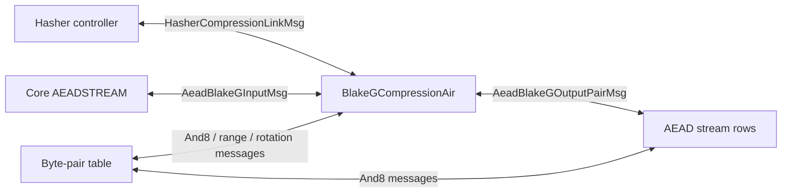

# BlakeG Compression AIR

`BlakeGCompressionAir` proves one Eidos/BlakeG compression. It is a standalone
AIR linked to the VM by LogUp messages: the hasher controller or AEAD stream
logic provides the public request, and this AIR proves the 32-bit BlakeG
computation behind that request.

The packed compression interface is:

```text
(R[0], ..., R[7], C[0], ..., C[3]) -> (D[0], ..., D[3])
```

where:

```text
R[j] = m[2j] + 2^32 * m[2j + 1]
C[t] = h[2t] + 2^32 * h[2t + 1]
D[t] = y[2t] + 2^32 * clear_top_bit(y[2t + 1])
```

`R` is the packed rate block, `C` is the packed input chaining value, and `D`
is the packed output chaining value. The round core works on unpacked 32-bit
words:

```text
m[0..15]    message block
h[0..7]     input chaining value
v[0..15]    working state
```

The initial working state is:

```text
v[0..7]   = h[0..7]
v[8..15]  = BlakeG IV[0..7]
```

After seven BLAKE3 rounds, let `W[0..15]` be the final working state. The full
16-word compression output is:

```text
y[i]     = W[i]     xor W[i + 8]    for i = 0..7
y[8 + i] = W[8 + i] xor h[i]        for i = 0..7
```

Packed compression mode exposes `D[0..3]`. AEAD-XOF mode exposes all
`y[0..15]` words as eight two-word keystream pairs. The top-bit finalizer is
used only for the packed output `D`.

## Trace Shape

One compression block has 32 rows and 128 main columns.

| Rows | Family | Role |
| ---- | ------ | ---- |
| `0..27` | Fused G rows | Seven rounds, four fused rows per round. |
| `28..31` | Footer rows `F0..F3` | Fold `W`, bind `R` and `C`, expose `D` and AEAD-XOF output pairs. |

There are no separate message, interface, or idle rows. The four footer rows
carry the packed boundary values, range-check the message words, bind the input
chaining value, and contribute the external lookup messages.

The row selectors are 32-periodic. They identify the row family and route both
local constraints and lookup messages.

The logical dependencies are:

```text
packed boundary:
    R[0..7], C[0..3]

footer rows:
    R[0..7] -> m[0..15]
    C[0..3] <-> h[0..7]

fused rows:
    m[0..15], h[0..7] -> W[0..15]

footer rows:
    W[0..15], h[0..7] -> y[0..15]
    y[0..7]            -> D[0..3]
    y[0..15]           -> AEAD-XOF output pairs, when mode = 1
```

The footer rows are physically after the fused rows. This is sound because the
message words and input-CV words are not consumed by row order alone: local
constraints fix their row payloads, and LogUp messages bind those payloads to
the fused rows as a multiset. Row order matters for the working state `v`, which
is carried by transition constraints through the 28 fused rows and then into
`F0`.



## External Messages

The AIR has two external modes.

In packed-compression mode, the hasher controller contributes the positive side
of:

```text
HasherCompressionLinkMsg { block = R, cv_in = C, cv_out = D }
```

The final footer row contributes the matching negative side. If multiple
controller rows request the same `(R, C, D)` tuple, the final footer row uses
the aggregate compression multiplicity.

In AEAD-XOF mode, Core contributes the positive side of:

```text
AeadBlakeGInputMsg { clk, state = [counter, 0, ..., 0, K_CTR] }
```

The final footer row contributes the matching negative side. This binds:

```text
R[0]    = counter
R[1..7] = 0
C[0..3] = K_CTR[0..3]
```

Footer rows also contribute the negative side of:

```text
AeadBlakeGOutputPairMsg { clk, first_lane_idx, value0, value1 }
```

for lane indices `0, 2, 4, 6, 8, 10, 12, 14`. The AEAD stream rows contribute
the positive side. The `clk` and lane index domain-separate stream requests and
output positions.

Footer rows carry two labels for this split. `mode = 0` means packed
compression, and `mode = 1` means AEAD-XOF. `clk` is meaningful only in
AEAD-XOF mode; packed-compression rows force `clk = 0`.

## Fused G Rows

Rows `0..27` prove the seven BLAKE3 rounds. Each round has four rows:

| Round row | Row kind | Lane schedule | Rotations |
| --------- | -------- | ------------- | --------- |
| `4r + 0` | `AB` | column | `16`, then `12` |
| `4r + 1` | `CD` | column | `8`, then `7` |
| `4r + 2` | `ABDiag` | diagonal | `16`, then `12` |
| `4r + 3` | `CDDiag` | diagonal | `8`, then `7` |

Each row has four lanes. For lane `g`, the periodic columns select the
working-state positions `(a, b, c, d)` and the BLAKE3 `SIGMA` message index
`msg_index`. The row constrains the message slot index to that scheduled value.

One fused row performs two dependent G steps:

```text
a_new = a + b + m[msg_index] - 2^32 * k3
d_new = rotr32(d xor a_new, 16 or 8)
c_new = c + d_new - 2^32 * k2
b_new = rotr32(b xor c_new, 12 or 7)
```

`k3` is two bits because the three-word sum has carry `0`, `1`, or `2`. `k2`
is one bit.

The fused-row column layout is:

| Columns | Meaning |
| ------- | ------- |
| `0..47` | Sixteen `(d_byte, a_new_byte, d_byte & a_new_byte)` slots. |
| `48..95` | Sixteen `(b_byte, c_new_byte, rotated_contribution)` slots. |
| `96..107` | Four `(msg_index, msg_word, 0)` slots. |
| `108..111` | Packed `a[0..3]`. |
| `112..115` | Packed `c[0..3]`. |
| `116..119` | Low carry bit of `k3[0..3]`. |
| `120..123` | High carry bit of `k3[0..3]`. |
| `124..127` | Carry bit `k2[0..3]`. |

The byte slots serve both the local constraints and the byte-pair lookup table.
Local constraints recompose the byte-decomposed `d`, `a_new`, `b`, and `c_new`
words before those values are used in row transitions.

For the second rotation in a fused row, the table supplies one contribution per
byte position. If `x_j = b_byte[j] xor c_new_byte[j]`, then:

```text
rot_part[j] = rotr32(x_j * 2^(8*j), rotation)
```

The four `rot_part[j]` values sum to `b_new`. The byte position is part of the
lookup domain, so a contribution for one byte position cannot cancel a
contribution for another.

Row `0` also binds the input chaining value. Its `a` tail cells hold
`h[0..3]`. Its `b` words are reconstructed from the `b_byte` lookup slots and
hold `h[4..7]`. Row `0` contributes four negative input-CV pair messages, one
for each `(h[2t], h[2t + 1])`; the four footer rows contribute the matching
positive messages.

The row-to-row transition constraints carry the working state through the
column and diagonal schedules. The last fused row forwards `W[0..15]` to
footer row `F0`.

## Footer Rows

Footer row `F_t`, for `t = 0..3`, handles lanes `2t` and `2t + 1`.

It computes:

```text
low[2t]      = W[2t]     xor W[8 + 2t]
low[2t + 1]  = W[2t + 1] xor W[9 + 2t]
high[2t]     = W[8 + 2t] xor h[2t]
high[2t + 1] = W[9 + 2t] xor h[2t + 1]
```

The low pair contributes to packed output `D[t]`. The low and high pairs
together are the AEAD-XOF output lanes for that footer row.

The footer rows also fill prefix accumulators:

```text
F0: R[0..1], C[0], D[0]
F1: R[0..3], C[0..1], D[0..1]
F2: R[0..5], C[0..2], D[0..2]
F3: R[0..7], C[0..3], D[0..3]
```

The final footer row has the complete external state. It contributes the
compression-link singleton in packed-compression mode or the AEAD-input
singleton in AEAD-XOF mode.

The footer layout is:

| Columns | Meaning |
| ------- | ------- |
| `0..23` | Byte slots for `high[2t]` and `high[2t + 1]`. |
| `24..47` | Byte slots for `low[2t]` and `low[2t + 1]`. |
| `48..50` | Top-bit finalizer slot for `D[t]`. |
| `51..53` | Input-CV pair slot `(t, h[2t], h[2t + 1])`. |
| `54..65` | Four message-word slots for `m[4t..4t + 3]`. |
| `66..89` | Eight 16-bit range slots for those four message words. |
| `90..97` | Prefix accumulator for `R[0..7]`. |
| `98..101` | Prefix accumulator for `C[0..3]`. |
| `102..105` | Prefix accumulator for `D[0..3]`. |
| `106..117` | Future-`W` queue. |
| `118..121` | Canonicality witnesses for the two new `R` values. |
| `122..123` | Canonicality witnesses for the new `C` value. |
| `124` | Compression multiplicity. |
| `125` | Spare, constrained to zero. |
| `126` | Mode: `0` for packed compression, `1` for AEAD-XOF. |
| `127` | AEAD clock label; zero in packed-compression mode. |

Each footer row introduces two new `R` values and one new `C` value. Those
packed values are constrained to be canonical field elements. Later prefix
slots are constrained to zero until their footer row defines them. Footer
transitions copy the already-defined prefix values and keep `mode`, `clk`, and
compression multiplicity constant across `F0..F3`.

Only `F0` is adjacent to the last fused row, so it receives all `W` words. The
footer rows then stream the words needed by later rows through the future-`W`
queue:

```text
F0 current: W[0], W[1], W[8],  W[9]
F1 current: W[2], W[3], W[10], W[11]
F2 current: W[4], W[5], W[12], W[13]
F3 current: W[6], W[7], W[14], W[15]
```

`F0` queues the three later groups as packed words. Each footer transition
constrains the next row's current words to equal the queue head, then shifts
the remaining queue forward.

## Lookup Argument

The AIR uses the shared LogUp lookup argument for byte operations,
message-word binding, input-CV binding, and external VM messages.

### Message Domains

| Message | Payload | Participants |
| ------- | ------- | ------------ |
| `And8Msg` | byte pair and `a & b` | Fused rows, footer rows, byte-pair table |
| `RangeMsg` | 16-bit value | Footer range slots, byte-pair table |
| `BlakeGWordMsg` | `(word_index, word)` | Fused rows, footer rows |
| `BlakeGInputPairMsg` | `(pair_index, h_even, h_odd)` | Row `0`, footer rows |
| `HasherCompressionLinkMsg` | `(R[0..7], C[0..3], D[0..3])` | Hasher controller, final footer row |
| `AeadBlakeGInputMsg` | `(clk, R[0..7], C[0..3])` | Core AEADSTREAM, final footer row |
| `AeadBlakeGOutputPairMsg` | `(clk, first_lane_idx, value0, value1)` | Footer rows, AEAD stream rows |

The message signs are chosen so matching payloads cancel in the LogUp
accumulator:

- each fused row contributes four positive `BlakeGWordMsg` lookups, one per
  lane;
- each footer row contributes four message-word lookups with multiplicity `-7`,
  because every message word is used once in each of the seven rounds;
- row `0` contributes four negative input-CV pair lookups;
- the footer rows contribute the four matching positive input-CV pair lookups;
- the final footer row contributes the negative side of either the
  compression-link message or the AEAD-input message;
- AEAD-XOF footer rows additionally contribute eight negative output-pair
  messages.

The lookup argument checks multiset equality. Row order is enforced separately
by the 32-periodic selectors and local transition constraints.

### Byte-Pair Table

The byte-pair table is a preprocessed service used by BlakeG and other VM
paths. For each byte pair `(a, b)`, it provides:

- ordinary `a & b`;
- four `rotr12` contribution domains;
- four `rotr7` contribution domains;
- the 16-bit range value `256 * a + b`.

The table contributes the positive side of these messages with dynamic
multiplicities. BlakeG contributes the matching negative side for byte facts
and range limbs.

### Row Ledger

The concrete lookup ledger is:

| Row kind | Narrow contributions | Singleton contributions |
| -------- | -------------------- | ----------------------- |
| Row `0` | 16 `-And8Msg`, 16 `-BlakeGRot12Pos*`, 4 `+BlakeGWordMsg`, 4 `-BlakeGInputPairMsg` | none |
| Other `AB`/`ABDiag` rows | 16 `-And8Msg`, 16 `-BlakeGRot12Pos*`, 4 `+BlakeGWordMsg` | none |
| `CD`/`CDDiag` rows | 16 `-And8Msg`, 16 `-BlakeGRot7Pos*`, 4 `+BlakeGWordMsg` | none |
| Non-final footer rows | 17 `-And8Msg`, 1 `+BlakeGInputPairMsg`, 4 `-7 * BlakeGWordMsg`, 8 `-RangeMsg` | AEAD-XOF mode: low and high output pairs |
| Final footer row | same footer narrow contributions | packed mode: `-multiplicity * HasherCompressionLinkMsg`; AEAD-XOF mode: `-AeadBlakeGInputMsg` plus low and high output pairs |

A message with multiplicity `-7` occupies one lookup fraction. Per block,
packed-compression mode has 1,133 active lookup contributions. AEAD-XOF mode
replaces the compression-link singleton with the AEAD-input singleton and adds
eight output-pair contributions, for 1,141 total.

### Auxiliary Columns

The BlakeG lookup trace has 24 auxiliary columns:

```text
[2; 20] + [1; 4]
```

The first twenty columns are batch-2 columns. They batch adjacent narrow lookup
slots from the main trace. A narrow slot has three payload cells:

```text
slot = (f0, f1, f2)
denominator = selected_bus_prefix + beta0*f0 + beta1*f1 + beta2*f2
```

The row selector determines each slot's bus prefix and signed multiplicity.
Most narrow lookups read a physical three-cell slot directly; the same slot
position can be an `And8Msg` on a fused row or a `RangeMsg` on a footer row.
Row `0` input-CV lookups use the same narrow-column bank, but derive their
payloads from the row's packed `a` words and byte-reconstructed `b` words.
The fixed payload width keeps denominators linear before two fractions are
batched.

For batch column `k`, the prover supplies:

```text
mu_(2k) / D_(2k) + mu_(2k + 1) / D_(2k + 1)
```

where each `D_s` has the fixed three-cell denominator shape above. Inactive
slots use a dummy range-check prefix with multiplicity zero; they do not emit a
range lookup.

The four singleton columns carry messages that do not fit the narrow-slot
bank:

| Column | Message |
| ------ | ------- |
| `20` | `HasherCompressionLinkMsg` |
| `21` | `AeadBlakeGInputMsg` |
| `22` | Low-half `AeadBlakeGOutputPairMsg` |
| `23` | High-half `AeadBlakeGOutputPairMsg` |

The peak narrow-slot pressure is row `0`, with 40 narrow lookups. Batch-2
packing therefore needs 20 narrow columns. The final footer row uses one
singleton in packed-compression mode and three singleton columns in AEAD-XOF
mode.

## Code Map

- `air/src/constraints/blakeg_compression/layout.rs`: physical column layout.
- `air/src/constraints/blakeg_compression/trace.rs`: witness generation for one
  32-row block.
- `air/src/constraints/blakeg_compression/symbolic.rs`: AIR constraints.
- `air/src/constraints/blakeg_compression/lookup.rs`: lookup-column routing.
- `air/src/constraints/lookup/messages.rs`: `BusId` domains and payload
  encodings.
- `processor/src/trace/chiplets/hasher/mod.rs`: integration with the chiplets
  trace.
