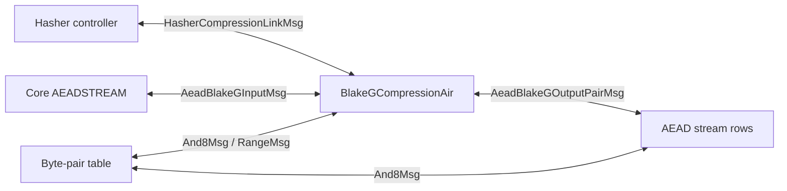

# BlakeG Compression AIR

`BlakeGCompressionAir` proves one Eidos/BlakeG compression. The functional
object is a map from a packed 12-felt input state to a packed 4-felt output
chaining value:

```text
(R[0], ..., R[7], C[0], ..., C[3]) -> (D[0], ..., D[3])
```

The hasher controller records compact requests in the Chiplets trace. This AIR
proves the full compression computation and connects it to the rest of the VM
with LogUp messages.

This page describes the logical interface first, then the dataflow through the
64-row trace, then the physical layout, constraints, and lookup messages.

## External Interface

In compression mode, the AIR proves:

```text
cv_out = BlakeGCompress(block, cv_in)
```

and balances one message against the hasher controller:

```text
HasherCompressionLinkMsg { block(8), cv_in(4), cv_out(4) }
```

The controller contributes the positive side of this message. The BlakeG
interface row contributes the negative side with the compression multiplicity.

In AEAD-XOF mode, the same local compression trace is used with a different bus
surface:

```text
AeadBlakeGInputMsg      { clk, state(12) }
AeadBlakeGOutputPairMsg { clk, first_lane_idx, value0, value1 }
```

The Core-side `AEADSTREAM` request contributes the positive input message, and
the BlakeG interface row contributes the matching negative message. Footer rows
contribute negative output-pair messages; AEAD stream rows contribute the
matching positive pairs.

The trace carries two label columns for this split. `mode = 0` means packed
compression, and `mode = 1` means AEAD-XOF. The `clk` label is meaningful only
in AEAD-XOF mode: it ties the BlakeG input and output-pair messages to the
corresponding Core stream request. Packed-compression rows force `clk = 0`.



## Compression Boundary

The external compression state is packed in field elements:

```text
(R[0], ..., R[7], C[0], ..., C[3]) -> (D[0], ..., D[3])
```

- `R[0..7]` is the 8-felt rate block.
- `C[0..3]` is the input chaining value.
- `D[0..3]` is the output chaining value.

Each field element carries two 32-bit words:

```text
R[j] = m[2j] + 2^32 * m[2j + 1]
C[t] = h[2t] + 2^32 * h[2t + 1]
```

The round core does not operate on packed field elements. It operates on:

```text
m[0..15]    block words
h[0..7]     input chaining words
v[0..15]    working state
```

The AIR proves the packed/unpacked boundary explicitly:

- message rows unpack `R` into `m`;
- row `I` carries both packed `C` and unpacked `h`, and constrains
  `C[t] = h[2t] + 2^32 * h[2t + 1]`;
- row `0` and the footer rows use the same `h` words, linked to row `I` by
  input-chaining lookups.

With `m` and `h` fixed, the working state starts as:

```text
v[0..7]   = h[0..7]
v[8..15]  = BlakeG IV[0..7]
```

Let `W[0..15]` denote the value of `v[0..15]` after the seven BLAKE3 rounds.
The full 16-word BLAKE3 compression output is:

```text
y[i]     = W[i]     xor W[i + 8]    for i = 0..7
y[8 + i] = W[8 + i] xor h[i]        for i = 0..7
```

The top-bit-mask Eidos finalizer packs the low half `y[0..7]` into the output
field elements:

```text
D[t] = y[2t] + 2^32 * clear_top_bit(y[2t + 1])
```

AEAD-XOF mode uses all 16 raw words `y[0..15]` as keystream material. The
top-bit mask is used only for the packed compression output `D`.

## Row Schedule

One compression block has 64 rows:

| Rows | Family | Role |
| ---- | ------ | ---- |
| `0..55` | G-core | Seven rounds, eight G rows per round. |
| `56..59` | Footer `F0..F3` | Fold `W` into `D`, expose AEAD-XOF pairs, bind footer `h`. |
| `60` | Message row `M0` | Message words `m[0..7]`, range limbs, `R[0..3]` packing. |
| `61` | Message row `M1` | Message words `m[8..15]`, range limbs, `R[4..7]` packing. |
| `62` | Interface row `I` | External `R`, `C`, `D`, unpacked `h`, mode, multiplicity. |
| `63` | Output/idle row `O` | Forwarded `[R, D]` and multiplicity; no lookup messages. |

The physical order is not the algorithmic order. Message rows are stored after
the round rows even though their `m[i]` values are used during the rounds.
Footer and interface rows are also late in the period even though they carry
the input and output boundary values. Local transition constraints and LogUp
messages connect those rows into one 64-row compression block.

## Module Dataflow

The AIR is easiest to read as a module with three boundary objects and three
internal submodules.

The boundary objects are:

- `R[0..7]`: the packed rate block received from the hasher controller or the
  AEAD-XOF request.
- `C[0..3]`: the packed input chaining value.
- `D[0..3]`: the packed output chaining value produced by the compression.

The internal submodules are:

- `M0/M1`, which decompose `R` into the 16 message words `m[0..15]` and prove
  the packed representation is canonical.
- `G-core`, which uses `m` and unpacked chaining words `h[0..7]` to compute the
  final working state `W[0..15]`.
- `F0..F3`, which fold `W` and `h` into the full output words `y[0..15]`,
  pack `y[0..7]` into `D`, and expose all `y[0..15]` in AEAD-XOF mode.

Row `I` is the external interface. It carries packed `R`, packed `C`, packed
`D`, and unpacked `h`, and it emits the compression or AEAD input lookup
message. Row `O` is a lookup-idle row used by the last-row-idle accumulator.

The next section is a physical layout reference. It explains where values live
in the 80 columns. The later "Constraints by Row Family" section explains what
each row family proves.

## Physical Layout Reference

The 80 main-trace columns are overlaid by row family. The same physical column
can mean different things on different row types; the row selector fixes the
meaning. The tables in this section are layout references, not the primary
soundness argument.

The tables below use two shorthand forms:

- `slot16(x, y, z)` means 16 consecutive 3-column slots in columns `0..47`.
- `msg4(i, w)` means four message slots in columns `48..59`. Each slot uses
  `(message_index, message_word)`. The third cell follows the byte-slot stride
  used by A/C rows; it is unused and could be recovered by a denser row layout.

### Round-row column bands

| Row type | Rows | `0..47` | `48..59` | `60..63` | `64..67` | `68..71` | `72..75` | `76..79` |
| -------- | ---- | ------- | -------- | -------- | -------- | -------- | -------- | -------- |
| `A_col` | `8r + 0` | `slot16(d, a_new, d & a_new)` | `msg4(i, m)` | `a[0..3]` | `b[0..3]` | `c[0..3]` | `k3_lo[0..3]` | `k3_hi[0..3]` |
| `B_col` | `8r + 1` | `slot16(b, c_new, rot12_part)` | empty | empty | `a[0..3]` | `d[0..3]` | `k2[0..3]` | empty |
| `C_col` | `8r + 2` | `slot16(d, a_new, d & a_new)` | `msg4(i, m)` | `a[0..3]` | `b[0..3]` | `c[0..3]` | `k3_lo[0..3]` | `k3_hi[0..3]` |
| `D_col` | `8r + 3` | `slot16(b, c_new, rot7_part)` | empty | empty | `a[0..3]` | `d[0..3]` | `k2[0..3]` | empty |
| `A_diag` | `8r + 4` | same as `A_col` | same | same | same | same | same | same |
| `B_diag` | `8r + 5` | same as `B_col` | same | same | same | same | same | same |
| `C_diag` | `8r + 6` | same as `C_col` | same | same | same | same | same | same |
| `D_diag` | `8r + 7` | same as `D_col` | same | same | same | same | same | same |

The computation rows repeat this 8-row pattern for each round `r = 0, ..., 6`:

| Row | Type | Half-round | Main trace contents |
| --- | ---- | ---------- | ------------------- |
| `8r + 0` | `A_col` | column | 16 byte slots for `d`, `a_new`, and `d & a_new`; four message slots; `a`, `b`, `c`, and `k3` bits. |
| `8r + 1` | `B_col` | column | 16 byte slots for `b`, `c_new`, and rotated byte contributions; `a`, `d`, and `k2`. |
| `8r + 2` | `C_col` | column | Same layout as `A_col`, with the second scheduled message word and rotation by `8`. |
| `8r + 3` | `D_col` | column | Same layout as `B_col`, with rotation by `7`. |
| `8r + 4` | `A_diag` | diagonal | Same layout as `A_col`, using the diagonal lane schedule. |
| `8r + 5` | `B_diag` | diagonal | Same layout as `B_col`, using the diagonal lane schedule. |
| `8r + 6` | `C_diag` | diagonal | Same layout as `C_col`, using the diagonal lane schedule. |
| `8r + 7` | `D_diag` | diagonal | Same layout as `D_col`, then remapped into the next round or, on row `55`, into `F0`. |

Rows `A` and `C` span all 80 physical columns, but only 76 cells carry live
values. The four unused cells are the third cells of the stride-3 `msg4` slots
described above. Rows `B` and `D` are sparser: they use the byte slots and the
packed `a`, `d`, and `k2` tail fields, but do not need message slots or `k3`
bits. This is a layout cost of keeping the four G-step row families separate; a
fused or reordered row layout could improve occupancy, but would need a
separate constraint and lookup-pressure analysis.

Row `0` is an `A_col` row with the same physical layout as every other `A` row,
but its `a[0..3]` cells in columns `60..63` hold `h[0..3]`, and its `b[0..3]`
cells in columns `64..67` hold `h[4..7]`. The row emits four first-row
input-chaining lookup messages from those eight words.

### Non-round column bands

The eight non-round rows close the compression block by moving from the final
working state `W[0..15]` back to the packed VM-facing interface:

```text
W[0..15], h[0..7]  -> y[0..15]
y[0..7]            -> D[0..3]
y[0..15]           -> AEAD-XOF output pairs
R[0..7]           <-> m[0..15]
h[0..7]            -> C[0..3]
```

They do this as three small state machines:

- `F0..F3` consume the final working state two output lanes at a time. Each row
  computes one low output pair, one high output pair, one packed `C[t]`, and
  one packed `D[t]`.
- `M0/M1` bind the packed rate block `R[0..7]` to the 16 message words
  `m[0..15]` used by the round rows.
- `I/O` present the external boundary: row `I` emits the LogUp messages, and
  row `O` is an inactive row for last-row-idle lookup accumulation.

The footer rows need special handling because only `F0` is adjacent to the last
G row. Row `55` transitions into `F0`, so `F0` can receive the final working
state. The later footer rows still need parts of that same `W[0..15]`, so the
footer block carries a queue of future `W` words:

| Footer row | Current words consumed on this row | Future words carried to later footer rows |
| ---------- | ---------------------------------- | ----------------------------------------- |
| `F0` | `W[0], W[1], W[8], W[9]` | `W[2], W[3], W[10], W[11], W[4], W[5], W[12], W[13], W[6], W[7], W[14], W[15]` |
| `F1` | `W[2], W[3], W[10], W[11]` | `W[4], W[5], W[12], W[13], W[6], W[7], W[14], W[15]` |
| `F2` | `W[4], W[5], W[12], W[13]` | `W[6], W[7], W[14], W[15]` |
| `F3` | `W[6], W[7], W[14], W[15]` | none |

Each footer transition constrains the next row's current words to equal the
queue head, then shifts the remaining queue words forward. This is why the
layout table below has scattered `future W` cells: they are not extra state;
they are the remaining final working-state words needed by later footer rows.

The table is intentionally coarse. A non-empty cell means the row uses some or
all columns in that band.

Column-table terms:

- `footer byte slots` are the 16 stride-3 byte slots in columns `0..47`.
  On `F_t`, the first eight slots hold bytes of
  `(W[8 + 2t], h[2t], W[8 + 2t] & h[2t])` and
  `(W[9 + 2t], h[2t + 1], W[9 + 2t] & h[2t + 1])`, which bind the high output
  pair `y[8 + 2t], y[9 + 2t]`. The last eight slots hold bytes of
  `(W[2t], W[8 + 2t], W[2t] & W[8 + 2t])` and
  `(W[2t + 1], W[9 + 2t], W[2t + 1] & W[9 + 2t])`, which bind the low output
  pair `y[2t], y[2t + 1]`.
- `future W` means the queue cells described above.
- `C` is the input chaining value packed as four field elements.
- `D` is the packed output chaining value after the top-bit finalizer.
- `mode, clk` are the output-mode label columns described in the external
  interface section.

| Row | `0..47` | `48..53` | `54..59` | `60..65` | `66..69` | `70..73` | `74..77` | `78..79` |
| --- | ------- | -------- | -------- | -------- | -------- | -------- | -------- | -------- |
| `F_t` | 16 footer byte slots | canonicality and top-bit witnesses | `t`, `h[2t]`, `h[2t+1]`, future `W` | future `W` | `C` accumulator; `F_t` writes `C[t]` | `D` accumulator; `F_t` writes `D[t]` | spare plus future `W` | `mode`, `clk` |
| `M0` | `m[0..5]` slots and range limbs | range limbs | range limbs, canonicality witnesses | `m[6]`, `m[7]`, canonicality witnesses | canonicality flags | `C[0..3]` | `D[0..3]` | `mode`, `clk` |
| `M1` | `m[8..13]` slots and range limbs | tail range limbs | carried `R[0..3]`, canonicality witnesses | `m[14]`, `m[15]`, canonicality witnesses | canonicality flags | `C[0..3]` | `D[0..3]` | `mode`, `clk` |
| `I` | `h` pair slots in `0..11` | `R[0..5]` | `R[6..7]`, `C[0..1]` | `C[2..3]`, `D[0..1]` | `D[2..3]`, multiplicity | empty | empty | `mode`, `clk` |
| `O` | `[R[0..7], D[0..3], multiplicity]` in `0..12` | empty | empty | empty | empty | empty | empty | `mode`, `clk` |

`C` and `D` are logical values, not fixed physical columns across every row
family. They are fixed inside the footer block, then forwarded through the row
families that need them:

| Segment | `C` columns | `D` columns | Role |
| ------- | ----------- | ----------- | ---- |
| `F0..F3` | `66..69` | `70..73` | Accumulators filled one C/D slot at a time. On `F_t`, `C[t]` and `D[t]` are written, earlier slots are copied forward, and later slots are zero until written. |
| `M0/M1` | `70..73` | `74..77` | Forwarding slots. The message rows keep the completed footer accumulators while they bind `R` to `m[0..15]`. |
| `I` | `56..59` | `60..63` | External boundary slots used by the compression or AEAD input lookup message. |
| `O` | none | `8..11` | VM-visible output forwarding; `C` is no longer needed. |

The forwarding constraints enforce the path
`F3 -> M0 -> M1 -> I` for both `C` and `D`, and `I -> O` for `D`. A denser
layout could keep these values in the same physical columns across more row
families, but it would have to repack the message-row canonicality fields,
future-`W` cells, and interface payload without increasing lookup pressure.

## Constraints by Row Family

### Interface Row `I`

Row `I` is the module boundary. It carries:

```text
h[0..7] | R[0..7] | C[0..3] | D[0..3] | multiplicity | mode, clk
```

The packed `C` values are the external input chaining value. The `h` words are
the unpacked representation used by the round core. The row binds the two views
with:

```text
C[t] = h[2t] + 2^32 * h[2t + 1]
```

Row `I` contributes the external lookup messages:

- in compression mode, it contributes `-multiplicity` to
  `HasherCompressionLinkMsg { R, C, D }`;
- in AEAD-XOF mode, it contributes `-1` to
  `AeadBlakeGInputMsg { clk, state = [R, C] }`;
- it contributes `+2` to each input-chaining pair
  `BlakeGInputPairMsg { pair_index, h_even, h_odd }`.

Row `0` and the matching footer row each contribute `-1` to the same
input-chaining pair.

Row `I` also forwards `[R, D]` and `multiplicity` to row `O`. This is local
trace routing; row `O` does not contribute lookup messages.

### Message Rows `M0` and `M1`

Rows `M0` and `M1` carry the block words:

```text
M0: m[0..7]  | 16-bit limbs | canonicality witnesses | C,D | mode,clk
M1: m[8..15] | 16-bit limbs | canonicality witnesses | C,D | mode,clk
```

Their local constraints:

- decompose each `m[i]` into two 16-bit limbs;
- pack `R[j] = m[2j] + 2^32 * m[2j + 1]`;
- enforce canonical field representation for each packed `R[j]`.

Their lookup contributions:

- `-1` for each 16-bit limb range check;
- `-7` for each `BlakeGWordMsg { word_index, word }`.

The G-core contributes `+1` to the matching word message each time the BLAKE3
schedule uses the corresponding message word. The word index is part of the
payload, so equal word values at different schedule positions cannot be swapped.

`M0` and `M1` also forward the completed `C` and `D` accumulators from the
footer to row `I`.

### G-core Rows

Rows `0..55` prove the seven BLAKE3 rounds. Each round has eight rows: four
column rows followed by four diagonal rows. Each row contains four parallel G
lanes. In one lane, `(a, b, c, d)` denotes the four working-state words selected
by that row's column or diagonal schedule.

`A` and `C` rows perform the first and third quarter-round steps. Each lane
carries:

```text
a, b, c                         current state words
d bytes                          byte decomposition of d
msg_index, msg_word              scheduled message word
k3                               carry for a + b + msg_word
a_new bytes                      byte decomposition of a_new
```

`msg_index` is not an arbitrary label. The row constrains it to the BlakeG
SIGMA schedule. The lookup contribution
`BlakeGWordMsg { word_index: msg_index, word: msg_word }` then binds
`msg_word` to the `m[msg_index]` value decomposed on `M0` or `M1`.

An `A` or `C` row lane computes:

```text
a_new = a + b + msg_word - 2^32 * k3     with k3 in {0, 1, 2}
d_new = rotr(d xor a_new, 16 or 8)
```

The row carries byte witnesses:

```text
(d_byte[j], a_new_byte[j], d_byte[j] & a_new_byte[j]) for j = 0..3
```

Those bytes prove `d xor a_new` through ordinary `And8Msg` lookups. `A` rows
use rotation by `16`; `C` rows use rotation by `8`.

`B` and `D` rows perform the second and fourth quarter-round steps. Each lane
carries:

```text
a, d                             current state words
b bytes                          byte decomposition of b
c_new bytes                      byte decomposition of c_new
k2                               carry for c + d
rot_part[0..3]                   byte-pair table contributions for b_new
```

A `B` or `D` row lane computes:

```text
c_new = c + d - 2^32 * k2     with k2 in {0, 1}
x     = b xor c_new
b_new = rotr32(x, 12)         on B rows
b_new = rotr32(x, 7)          on D rows
```

The byte-pair table returns one rotated contribution per byte:

```text
rot_part[j] = rotr32((b_byte[j] xor c_new_byte[j]) << (8*j), r)
```

where `r` is `12` on B rows and `7` on D rows. The row sums the four
`rot_part` values to obtain `b_new`.

The row-to-row constraints carry the lane state through each G application:

```text
A row  -> B row: a_new and d_new are carried into the B row.
B row  -> C row: (a, b_new, c_new, d) becomes the C-row state.
C row  -> D row: a_new and d_new are carried into the D row.
D row  -> next A: (a, b_new, c_new, d) is remapped into the next half-round.
```

The D-row remap is fixed by the BLAKE3 column/diagonal schedule:

```text
column -> diagonal: a[g], b[(g+3)%4], c[(g+2)%4], d[(g+1)%4]
diagonal -> column: a[g], b[(g+1)%4], c[(g+2)%4], d[(g+3)%4]
```

Row `0` additionally contributes `-1` to each input-chaining pair and pins
`v[8..15]` to the BlakeG IV constants. Row `55` forwards the final working
state `W[0..15]` into the footer.

### Footer Rows `F0..F3`

Footer rows take `W[0..15]` and fold it into the packed output. Row `F_t`
handles lanes `2t` and `2t + 1`:

```text
input CV pair:    h[2t], h[2t + 1]
working words:    W[2t], W[2t + 1], W[8 + 2t], W[9 + 2t]
W carry-forward:  words needed by later footer rows
accumulators:     C[0..3], D[0..3]
AEAD label:       mode, clk
```

Each footer row computes one low output pair:

```text
y[2t]     = W[2t]     xor W[8 + 2t]
y[2t + 1] = W[2t + 1] xor W[9 + 2t]
```

and one high output pair:

```text
y[8 + 2t] = W[8 + 2t] xor h[2t]
y[9 + 2t] = W[9 + 2t] xor h[2t + 1]
```

The low pair is also packed into the compression output `D[t]`:

```text
D[t] = y[2t] + 2^32 * clear_top_bit(y[2t + 1])
```

The row also packs `C[t]` from the same `h` pair:

```text
C[t] = h[2t] + 2^32 * h[2t + 1]
```

This `C` identity is not part of BlakeG's compression formula. It is a binding
constraint: footer byte lookups range-check the `h` words, and the `C[t]`
packing ties those byte-bound words to the packed input chaining value used by
the external interface. Footer constraints also enforce canonicality for this
input-CV packing.

Footer lookup obligations:

- `-1` to the row's `BlakeGInputPairMsg`;
- `-1` to each ordinary `And8Msg` for the low output fold, high output fold,
  and output top-bit mask;
- in AEAD-XOF mode, `-1` to each `AeadBlakeGOutputPairMsg`: the low pair
  `y[2t], y[2t + 1]` and the high pair `y[8 + 2t], y[9 + 2t]`.

The `C` and `D` slots are accumulators because the four packed values are filled
on four different footer rows. Row `F_t` fills `C[t]` and `D[t]`, copies earlier
slots forward, and keeps later slots zero. Row `F3` has all four `C` and `D`
values and forwards them into `M0`, then `M0/M1` forward them to row `I`.

AEAD-XOF labels follow the same route. The footer rows constrain `(mode, clk)`
to be constant across `F0..F3`; `F3` forwards the labels to `M0`, `M0` forwards
them to `M1`, and `M1` forwards them to row `I`. Non-AEAD rows force `clk = 0`.

### Output/Idle Row `O`

Row `O` carries the forwarded `[R, D]` state and multiplicity from row `I`, but
it has no lookup messages. It gives the current last-row-idle lookup accumulator
a final row with no active BlakeG lookups, and it keeps each compression block
on a 64-row period. A wrapped lookup accumulator could use this row differently.

## Lookup Pressure by Row

The layout described here uses 24 BlakeG lookup columns. Columns `0..15` carry
byte-pair or range facts. Columns `16..23` carry word-level facts,
input-chaining facts, the interface link, and AEAD-XOF output pairs.

The table below counts active logical lookup contributions per row. It counts a
single message with multiplicity `-7` as one lookup contribution, because it
occupies one lookup fraction.

| Row(s) | Active lookup contributions |
| ------ | --------------------------- |
| `0` | 16 `And8Msg` for `d & a_new`, 4 `BlakeGWordMsg`, and 4 first-row `BlakeGInputPairMsg`: 24 total. |
| `A` rows except row `0` | 16 `And8Msg` for `d & a_new` and 4 `BlakeGWordMsg`: 20 total. |
| `C` rows | 16 `And8Msg` for `d & a_new` and 4 `BlakeGWordMsg`: 20 total. |
| `B` rows | 16 byte-pair rotation messages in the `rotr12` domains: 16 total. |
| `D` rows | 16 byte-pair rotation messages in the `rotr7` domains: 16 total. |
| `F0..F3` in compression mode | 16 ordinary `And8Msg`, 1 top-bit `And8Msg`, and 1 `BlakeGInputPairMsg`: 18 total. |
| `F0..F3` in AEAD-XOF mode | The compression-mode 18 plus low and high `AeadBlakeGOutputPairMsg`: 20 total. |
| `M0` | 16 `RangeMsg` for the 16-bit limbs and 8 `BlakeGWordMsg`: 24 total. |
| `M1` | 16 `RangeMsg` for the 16-bit limbs and 8 `BlakeGWordMsg`: 24 total. |
| `I` | 4 `BlakeGInputPairMsg` with multiplicity `+2`, plus either one `HasherCompressionLinkMsg` or one `AeadBlakeGInputMsg`: 5 total. |
| `O` | No lookup contributions. |

Per 64-row block, this gives 1,137 active lookup contributions in compression
mode and 1,145 in AEAD-XOF mode. The peak row pressure is 24, reached by row
`0`, `M0`, and `M1`.

## Main-trace Utilization

The 64-row by 80-column block has 5,120 cells. Counting semantic payload cells,
the current layout uses about 4,242 cells, or 82.85%. Counting explicit helper
and zero-filled layout cells raises the accounting to about 85.20%, but the
semantic number is the useful design metric.

Most slack is concentrated in a few places:

| Source | Slack |
| ------ | ----: |
| `B/D` rows | 560 cells |
| `I/O` rows | 114 cells |
| unused third field in `A/C` message slots | 112 cells |
| `M0/M1` rows | 60 cells |
| footer rows | 32 cells |

This slack does not directly reduce auxiliary columns. It helps only if it lets
the AIR move lookup work away from high-pressure rows, add helper values that
lower a concrete degree bottleneck, or route values to a lower-pressure row
without losing the binding, range, or canonicality constraints.

Deferred layout questions:

- Restore the optimized lookup batching first; that is the direct path back to
  the 12-auxiliary-column target.
- Investigate whether `B/D` row slack can absorb message-word, range, or
  canonicality work currently concentrated on `M0/M1`.
- Revisit row `O` only if BlakeG moves from last-row-idle lookup accumulation
  to wrapped lookup accumulation; otherwise it must stay lookup-idle.
- Consider moving `A/C` carry bits into the unused message-slot fields only if
  footer/message/interface tail rows no longer keep the width at 80.
- Add degree-reduction helper columns only when a degree report shows that the
  helper unlocks a specific lookup batch or auxiliary-column reduction.

## Forwarding and Duplicated Values

Several values appear on more than one row. These copies have three roles:

- **Representation binding.** Packed interface felts and unpacked 32-bit words
  must be tied together. For example, row `I` carries both `C` and `h`, and the
  AIR constrains `C[t] = h[2t] + 2^32 * h[2t + 1]`.
- **Lookup locality.** Some lookup messages are emitted from rows that have the
  right selector and enough lookup-column capacity, not necessarily from the row
  where the value first appears.
- **Accumulator layout.** Footer row `F_t` writes `C[t]` and `D[t]`. The
  completed vectors are then routed to row `I`, where the external messages are
  matched.

This forwarding is trace-level routing, not part of BlakeG itself.

The following simplifications are intentionally deferred until the optimized
12-auxiliary-column layout is restored and its pressure ledger is available:

- decide whether row `O` can be reused under wrapped lookup accumulation;
- reconsider whether compression-link and AEAD input messages can move off row
  `I`;
- revisit the `C`/`D` forwarding path through `M0` and `M1`;
- prune value routing that exists only for lookup-pressure management;
- delete unused columns or helpers only after the relation digest, recursive
  verifier artifacts, and lookup oracle tests agree with the new layout.

## Shared Byte-pair Table

The byte-pair table is a preprocessed service used by BlakeG and other VM
paths. For each byte pair `(a, b)`, it provides:

- ordinary `a & b`;
- four `rotr12` contribution domains;
- four `rotr7` contribution domains;
- the 16-bit range value `256 * a + b`.

The table contributes the positive side of these messages with dynamic
multiplicities. BlakeG rows contribute the matching negative side. This keeps
byte-level facts out of the main trace while still binding every byte witness
used by the compression constraints.

## Lookup Messages

Every lookup message has a fixed `BusId` domain and a payload. The domain is
part of the encoded denominator, so messages from different relations cannot
cancel each other.

The signs below are LogUp multiplicities. A positive and a negative contribution
with the same encoded payload cancel. LogUp does not encode row order; row order
comes from the AIR transition constraints and periodic selectors.

| Message | Payload | Participants |
| ------- | ------- | -------- |
| `And8Msg` | `[a, b, result]` plus byte-pair domain | G-core, footer, byte-pair table |
| `RangeMsg` | `[value]` | Message rows, byte-pair table |
| `BlakeGWordMsg` | `[word_index, word]` | Message rows, G-core |
| `BlakeGInputPairMsg` | `[pair_index, h_even, h_odd]` | Interface row, row `0`, footer |
| `HasherCompressionLinkMsg` | `[block(8), cv_in(4), cv_out(4)]` | Interface row, hasher controller |
| `AeadBlakeGInputMsg` | `[clk, state(12)]` | Interface row, Core AEAD request |
| `AeadBlakeGOutputPairMsg` | `[clk, first_lane_idx, value0, value1]` | Footer, AEAD stream rows |
| `AeadStreamRequestMsg` | `[ctx, clk, src_ptr, dst_ptr, lane_base]` | Core AEAD request, AEAD stream rows |

The LogUp accumulator enforces that positive and negative contributions for
each encoded message balance. Row order does not matter; payload and domain
must match.

## AEAD-XOF Binding

One `AEADSTREAM` operation links three components:

1. Core, which knows `K_CTR`, `counter`, source pointer, destination pointer,
   context, and clock.
2. `BlakeGCompressionAir`, which proves the XOF compression.
3. AEAD stream rows, which read plaintext, receive XOF limbs, XOR at the byte
   level, and write ciphertext.

The LogUp links are:

- Core contributes `+1` to:

  ```text
  AeadBlakeGInputMsg { clk, state = [counter, 0, ..., 0, K_CTR] }
  ```
- Row `I` in `BlakeGCompressionAir` contributes the matching `-1`.
- Each footer row contributes `-1` to a low output pair and `-1` to a high
  output pair, both carrying `(clk, first_lane_idx)`.
- AEAD stream rows contribute the matching `+1` output-pair messages at lane
  indices `0, 2, 4, 6, 8, 10, 12, 14`.
- Core contributes `-2` to each `AeadStreamRequestMsg`; the two 4-row halves of
  each 8-row stream entry contribute the two matching `+1` requests.
- The AEAD stream entry reads one plaintext word from memory and writes two
  ciphertext words. Phases `0` and `4` read the same plaintext word. Phases `3`
  and `7` write the two ciphertext words.

The row ordering is enforced outside LogUp:

- BlakeG rows use a fixed 64-row periodic schedule. Row-to-row constraints link
  the G-core, footer rows, message rows, and interface row inside each block.
- AEAD stream rows use an 8-row phase schedule. Phase-alignment constraints make
  each stream entry start on phase `0` and prevent early termination before
  phase `7`.
- Carry constraints link phases `0 -> 1 -> 2 -> 3` and `4 -> 5 -> 6 -> 7`.
  The normalized stream-request message binds the two 4-row halves of an entry
  to the same `(ctx, clk, src_ptr, dst_ptr, lane_base)` request.

Reordering independent compression blocks or independent stream entries does not
break soundness, because the balanced messages include the clock, lane index,
and pointer fields needed to bind each entry to its Core request.

## Soundness Checklist

The lookup design relies on these obligations:

- Each payload field is locally constrained, table-bound by the lookup itself,
  or tied to a locally constrained value before it affects another relation.
- Message domains are fixed by `BusId`.
- `BlakeGWordMsg` includes both the schedule index and the word.
- `BlakeGInputPairMsg` balances exactly as `+2 - 1 - 1` across row `I`, row `0`,
  and footer rows.
- The footer side of `BlakeGInputPairMsg` is byte-bound by the footer AND8
  lookups and canonicality gadget, so the row-`0` and row-`I` copies of `h`
  inherit the same range and packing constraints.
- `HasherCompressionLinkMsg` includes `block`, `cv_in`, and `cv_out`; the
  controller address is handled by the hasher-controller relation.
- AEAD-XOF output messages include both clock and lane index.
- AEAD stream requests include context, clock, source pointer, destination
  pointer, and lane base.
- The prover path and constraint path are checked by the lookup oracle test,
  which compares committed fractions against the constraint-side messages.

These obligations are independent of physical lookup-column packing. Packing may
change the number of auxiliary columns; it must not change message payloads,
signed multiplicities, or row gates.

## Baseline Lookup Layout

The baseline layout allows at most one active BlakeG lookup fraction per
auxiliary column on each row. It uses 24 BlakeG lookup columns:

- columns `0..15`: byte-pair and range lookups;
- columns `16..23`: word-level lookups, input-chaining lookups,
  compression-link, and AEAD-XOF lookups.

This layout exposes the module interfaces without batch packing or routing
values through unrelated rows. Some singleton columns still contain disjoint
row-gated relations; the baseline avoids batching, not all column sharing. It is
an audit baseline, not the final column-minimized layout.

## Optimization Ladder

The optimized AIR keeps the same logical interfaces and reduces physical cost in
stages:

1. Share lookup columns across row families whose selectors are disjoint.
2. Route values only when the destination row still carries the needed equality,
   range, and canonicality constraints.
3. Batch compatible lookup fractions in one auxiliary column when the resulting
   numerator and denominator degrees fit the AIR degree budget.
4. Keep an oracle test that compares prover-side fractions with the
   constraint-side message path after each packing change.

These optimizations are implementation details. The audit target remains the
logical module interface described above.

## Code Map

- `air/src/constraints/lookup/blakeg_compression_air.rs`: BlakeG lookup columns
  and row gates.
- `air/src/constraints/lookup/messages.rs`: message payloads and `BusId`
  encodings.
- `air/src/constraints/lookup/and8_lookup_air.rs`: byte-pair table side.
- `air/src/constraints/blakeg_compression/`: local BlakeG row constraints.
- `processor/src/trace/chiplets/hasher/blakeg_trace.rs`: compression trace
  generation.
- `processor/src/trace/tests/lookup.rs`: prover/constraint lookup oracle.
