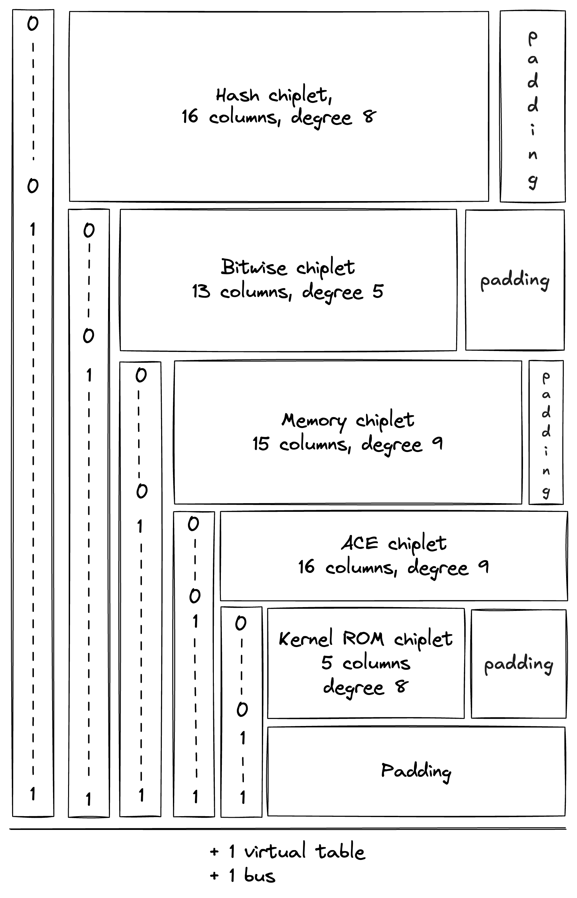

# Chiplets

The Chiplets module contains specialized components dedicated to accelerating complex computations. Each chiplet specializes in executing a specific type of computation and is responsible for proving both the correctness of its computations and its own internal consistency.

Currently, Miden VM relies on 5 chiplets:

- The [Hash Chiplet](./hasher.md) (also referred to as the Hasher), used to compute native VM hashes both for sequential hashing and for Merkle tree hashing.
- The [Bitwise Chiplet](./bitwise.md), used to compute bitwise operations (e.g., `AND`, `XOR`) over 32-bit integers.
- The [Memory Chiplet](./memory.md), used to support random-access memory in the VM.
- The [Arithmetic Circuit Evaluation (ACE)](./ace.md), used to ensure that arithmetic circuits evaluate to zero.
- The [Kernel ROM Chiplet](kernel_rom.md), used to enable executing kernel procedures during the [`SYSCALL` operation](../programs.md#syscall-block).

Each chiplet executes its computations separately from the rest of the VM and proves the internal correctness of its execution trace in a unique way that is specific to the operation(s) it supports. These methods are described by each chiplet’s documentation.

## Chiplets module trace

The execution trace of the Chiplets module is generated by stacking the execution traces of each of its chiplet components. Because each chiplet is expected to generate significantly fewer trace rows than the other VM components (i.e., the decoder, stack, and range checker), stacking them enables the same functionality without adding as many columns to the execution trace.

Each chiplet is identified within the Chiplets module by one or more chiplet selector columns which cause its constraints to be selectively applied.

The result is an execution trace of 25 trace columns: 22 shared chiplet cells, the `stream_mode` selector, the `aead_stream_active` helper flag, and the chiplet row counter. The widest overlay is the AEAD stream path, which reuses the bitwise region and extends through `chiplets[2..22]`.

During the finalization of the overall execution trace, the chiplets' traces (including internal selectors) are appended to the trace of the Chiplets module one after another, as pictured. Thus, when one chiplet's trace ends, the trace of the next chiplet starts in the subsequent row.

Additionally, a padding segment is added to the end of the Chiplets module's trace so that the number of rows in the table always matches the overall trace length of the other VM processors, regardless of the length of the chiplet traces. The padding will simply contain zeroes.

### Chiplets order

The order in which the chiplets are stacked is determined by the requirements of each chiplet, including the width of its execution trace and the degree of its constraints.

For simplicity, all of the "cyclic" chiplets which operate in multi-row cycles and require starting at particular row increments should come before any non-cyclic chiplets, and these should be ordered from longest-cycle to shortest-cycle. This avoids any additional alignment padding between chiplets.

After that, chiplets are ordered by degree of constraints so that higher-degree chiplets get lower-degree chiplet selector flags.

The resulting order is as follows:

| Segment | Row structure | Overlay columns | Selector condition |
| ------- | ------------- | --------------- | ------------------ |
| Hasher controller | input/output controller rows | `chiplets[1..20]` | `s_ctrl = 1` |
| Normal bitwise | 8-row AND/XOR cycles | `chiplets[2..15]` | `s_ctrl = 0`, `s1 = 0`, `stream_mode = 0` |
| AEAD stream | 8-row stream entries | `chiplets[2..22]` plus stream flags | `s_ctrl = 0`, `s1 = 0`, `stream_mode = 1` |
| Memory | memory event rows | `chiplets[3..18]` | `s_ctrl = 0`, `s1 = 1`, `s2 = 0` |
| ACE | arithmetic-circuit rows | `chiplets[4..20]` | `s_ctrl = 0`, `s1 = 1`, `s2 = 1`, `s3 = 0` |
| Kernel ROM | kernel procedure rows | `chiplets[5..10]` | `s_ctrl = 0`, `s1 = 1`, `s2 = 1`, `s3 = 1`, `s4 = 0` |
| Padding | zero payload rows | remaining rows | padding selector state |

### Additional requirements for stacking execution traces

Stacking the chiplets introduces one new complexity. Each chiplet proves its own correctness with its own set of internal transition constraints, many of which are enforced between each row in its trace and the next row. As a result, when the chiplets are stacked, transition constraints applied to the final row of one chiplet will cause a conflict with the first row of the following chiplet.

This is true for any transition constraints that are applied at every row and selected by a `Chiplet Selector Flag` for the current row. (Therefore, cyclic transition constraints controlled by periodic columns do not cause any issue.)

This requires the following adjustments for each chiplet.

**In the hash chiplet:** controller constraints explicitly confine the controller boundary. BlakeG compression steps are proved by `BlakeGCompressionAir`.

**In the bitwise chiplet:** normal bitwise rows and AEAD stream rows are both 8-row cycles selected by `stream_mode`, so their internal transitions stay within their own cycles.

**In the memory chiplet:** all transition constraints cause a conflict. To adjust for this, the selector flag for the memory chiplet is designed to exclude its last row. Thus, memory constraints will not be applied when transitioning from the last row of the memory chiplet to the following row. This is achieved without any additional increase in the degree of constraints by using $s'_2$ as a selector instead of $s_2$ as seen [below](#chiplet-selector-constraints).

**In the ACE chiplet:** some transition constraints must be disabled in the last row. The flags are derived both from the chiplet selectors and are described in the [flags and boundary constraints section](./ace.md#flags).

**In the kernel ROM chiplet:** the transition constraints referring to the $s_{first}'$ column cause a conflict.
It is resolved by enforcing the initial value of this selector in the last row of the previous chiplet,
and disabling the hash equality constraint in the last row.

## Message domains {#operation-labels}

Chiplet interactions are encoded as LogUp messages. Each message kind has a fixed `BusId`
domain, and the bus prefix derived from that domain prevents messages of different kinds from
canceling each other. The current domains are defined in
`air/src/constraints/lookup/messages.rs`.

The chiplets module participates in these message families:

| Message family | Purpose |
| -------------- | ------- |
| Hasher controller messages | Stack and decoder requests to controller rows, including linear hash, Merkle path, Merkle update, digest return, and full-state return messages. |
| Memory messages | Element and word reads/writes between VM users and the memory chiplet. |
| Bitwise messages | Normal `U32AND`/`U32XOR` requests and responses. |
| Kernel ROM messages | Kernel procedure initialization and `SYSCALL` lookup messages. |
| ACE messages | ACE initialization plus ACE wiring and memory-read interactions. |
| BlakeG compression link | The controller input/output transition is linked to `BlakeGCompressionAir` by `[block(8), cv_in(4), cv_out(4)]`. |
| Byte-pair lookup messages | AND8 and BlakeG rotation-contribution lookups against the byte-pair preprocessed table. |
| BlakeG internal messages | BlakeG compression word-routing and message-schedule lookups internal to `BlakeGCompressionAir`. |
| AEAD stream messages | AEAD-XOF input, AEAD-XOF output pairs, and AEAD stream row requests. |

## Chiplets module constraints

### Chiplet selector constraints

Let `s_ctrl = chiplets[0]`. Controller rows are selected directly by `s_ctrl`.
All other chiplets are selected under the virtual flag `s0 = 1 - s_ctrl`; `s1..s4`
then subdivide the non-controller region.

The enforced selector invariants are:

- `s_ctrl` is binary.
- Once `s_ctrl = 0`, controller rows cannot appear again.
- Under `s0`, selectors `s1..s4` are binary and can only move from `0` to `1`.
- `stream_mode` is binary under `s0` and must be zero once `s1 = 1`.
- `aead_stream_active = s0 * stream_mode`.
- On the last row, `s_ctrl = 0` and `s1 = s2 = s3 = s4 = 1`.

These invariants define the active regions:

| Region | Active flag |
| ------ | ----------- |
| Hasher controller | `s_ctrl` |
| Normal bitwise | `s0 * (1 - s1) * (1 - stream_mode)` |
| AEAD stream | `aead_stream_active` |
| Memory | `s0 * s1 * (1 - s2)` |
| ACE | `s0 * s1 * s2 * (1 - s3)` |
| Kernel ROM | `s0 * s1 * s2 * s3 * (1 - s4)` |

Internal chiplet constraints are gated by these region flags. Transition constraints additionally
use boundary-aware flags so they do not cross from the last row of one chiplet segment into the
first row of the next segment.

## Lookup relations

Chiplet interactions are balanced with LogUp lookup columns. A producer inserts a message into its
domain, and a consumer removes the same message from the same domain. The order of rows does not
matter; the LogUp accumulator enforces multiset equality for each participating column.

The chiplets module contributes several logical lookup relations. These relations are packed into
the chiplet lookup columns; some domains share a physical column when their row gates are disjoint.

- **Chiplet requests/responses:** stack, decoder, and public-input requests are balanced by hasher
  controller, normal bitwise, memory, ACE-init, and kernel-ROM responses.
- **Hasher compression link:** hasher controller input/output transitions are balanced against
  `BlakeGCompressionAir` compression rows.
- **Hash-kernel table:** Merkle sibling entries, ACE memory reads, AEAD stream memory I/O, and
  memory-side range checks share one LogUp column with disjoint row gates.
- **AEAD stream links:** Core requests, BlakeG-XOF input/output messages, stream rows, memory
  messages, and byte-pair lookups bind the stream encryption path.

The message encoding is domain separated by `BusId`; see
`air/src/constraints/lookup/messages.rs` for the complete list of domains and payload shapes.
