# Miden VM Program decoder

Miden VM program decoder is responsible for ensuring that a program with a given [MAST root](../programs.md) is executed by the VM. As the VM executes a program, the decoder does the following:

1. Decodes a sequence of field elements supplied by the prover into individual operation codes (or *opcodes* for short).
2. Organizes the sequence of field elements into code blocks, and computes the hash of the program according to the methodology described [here](../programs.md#program-hash-computation).

At the end of program execution, the decoder outputs the computed program hash. This hash binds the sequence of opcodes executed by the VM to a program the prover claims to have executed. The verifier uses this hash during the STARK proof verification process to verify that the proof attests to a correct execution of a specific program (i.e., the prover didn't claim to execute program $A$ while in fact executing a different program $B$).

The sections below describe how Miden VM decoder works. Throughout these sections we make the following assumptions:

1. An opcode requires $7$ bits to represent.
2. An immediate value requires one full field element to represent.
3. A `NOOP` operation has a numeric value of $0$, and thus, can be encoded as seven zeros. Executing a `NOOP` operation does not change the state of the VM, but it does advance operation counter, and may affect program hash.

## Program execution

Miden VM programs consist of a set of code blocks organized into a binary tree. The leaves of the tree contain linear sequences of instructions, and control flow is defined by the internal nodes of the tree.

Managing control flow in the VM is accomplished by executing control flow operations listed in the table below. Each of these operations require exactly one VM cycle to execute.

| Operation | Description |
| --------- | ----------- |
| `JOIN`    | Initiates processing of a new [Join block](../programs.md#join-block). |
| `SPLIT`   | Initiates processing of a new [Split block](../programs.md#split-block). |
| `LOOP`    | Initiates processing of a new [Loop block](../programs.md#loop-block). |
| `REPEAT`  | Initiates a new iteration of an executing loop. |
| `SPAN`    | Initiates processing of a new [Span block](../programs.md#span-block). |
| `RESPAN`  | Initiates processing of a new operation batch within a span block. |
| `END`     | Marks the end of a program block. |
| `HALT`    | Marks the end of the entire program. |

Let's consider a simple program below:

```
begin
    <operations1>
    if.true
        <operations2>
    else
        <operations3>
    end
end
```

Block structure of this program is shown below.

```
JOIN
    SPAN
        <operations1>
    END
    SPLIT
        SPAN
            <operations2>
        END
        SPAN
            <operations3>
        END
    END
END
```

Executing this program on the VM can result in one of two possible instruction sequences. First, if after operations in `<operations1>` are executed the top of the stack is $1$, the VM will execute the following:

```
JOIN
SPAN
<operations1>
END
SPLIT
SPAN
<operations2>
END
END
END
HALT
```

However, if after `<operations1>` are executed, the top of the stack is $0$, the VM will execute the following:

```
JOIN
SPAN
<operations1>
END
SPLIT
SPAN
<operations3>
END
END
END
HALT
```

The main task of the decoder is to output exactly the same program hash, regardless of which one of the two possible execution paths was taken. However, before we can describe how this is achieved, we need to give an overview of the overall decoder structure.

## Decoder structure

The decoder is one of the more complex parts of the VM. It consists of the following components:

* Main [execution trace](#decoder-trace) consisting of $24$ trace columns which contain the state of the decoder at a given cycle of a computation.
* Connection to the hash chiplet, which is used to offload [hash computations](#program-block-hashing) from the decoder.
* $3$ [virtual tables](#control-flow-tables) (implemented via multi-set checks), which keep track of code blocks and operations executing on the VM.

### Decoder trace

Decoder trace columns can be grouped into several logical sets of registers as illustrated below.


These registers have the following meanings:

1. Block address register $a$. This register contains address of the hasher for the current block (row index from the auxiliary hashing table). It also serves the role of unique block identifiers. This is convenient, because hasher addresses are guaranteed to be unique.
2. Registers $b_0, ..., b_6$, which encode opcodes for operation to be executed by the VM. Each of these registers can contain a single binary value (either $1$ or $0$). And together these values describe a single opcode.
3. Hasher registers $h_0, ..., h_7$. When control flow operations are executed, these registers are used to provide inputs for the current block's hash computation (e.g., for `JOIN`, `SPLIT`, `LOOP`, `SPAN` operations) or to record the result of the hash computation (i.e., for `END` operation). However, when regular operations are executed, $2$ of these registers are used to help with op group decoding, and the remaining $6$ can be used to hold operation-specific helper variables.
4. Register $sp$ which contains a binary flag indicating whether the VM is currently executing instructions inside a *span* block. The flag is set to $1$ when the VM executes non-control flow instructions, and is set to $0$ otherwise.
5. Register $gc$ which keep track of the number of unprocessed operation groups in a given *span* block.
6. Register $ox$ which keeps track of a currently executing operation's index within its operation group.
7. Operation batch flags $c_0, c_1, c_2$ which indicate how many operation groups a given operation batch contains. These flags are set only for `SPAN` and `RESPAN` operations, and are set to $0$'s otherwise.
8. Two additional registers (not shown) used primarily for constraint degree reduction.

### Program block hashing

To compute hashes of program blocks, the decoder relies on the [hash chiplet](../chiplets/hasher.md). Specifically, the decoder needs to perform two types of hashing operations:

1. A simple 2-to-1 hash, where we provide a sequence of $8$ field elements, and get back $4$ field elements representing the result. Computing such a hash requires $8$ rows in the hash chiplet.
2. A sequential hash of $n$ elements. Computing such a hash requires multiple absorption steps, and at each step $8$ field elements are absorbed into the hasher. Thus, computing a sequential hash of $n$ elements requires $\lceil {n/8} \rceil$ rows in the hash chiplet. At the end, we also get $4$ field elements representing the result.

We denote the running product column used to keep track of hash chiplet state as $p_0$. To make hashing requests to the hash chiplet and to read the results from it, we will need to divide out relevant values from this column as described below.

#### Simple 2-to-1 hash

To initiate a 2-to-1 hash of $8$ elements ($v_0, ..., v_7$) we need to divide $p_0$ by the following value:

$$
\alpha_0 + \alpha_1 \cdot m_{bp} + \alpha_2 \cdot r + \alpha_4 \cdot 8 + \sum_{i=0}^7 (\alpha_{i+8} \cdot v_i)
$$

where:
* $m_{bp}$ is a label indicating beginning of a new permutation. Value of this label is computed based on hash chiplet selector flags according to the methodology described [here](../programs.md#multiset-check-constraints).
* $r$ is the address of the row at which the hashing begins.
* $\alpha_4 \cdot 8$ indicates that we are hashing a total of $8$ elements.
* Some $\alpha$ values are skipped in the above (e.g., $\alpha_3$) because of the specifics of how auxiliary hasher table rows are reduces to field elements (described [here](../programs.md#multiset-check-constraints)). For example, $a_3$ is used a coefficient for node index values during Merkle path computations in the hasher, and thus, is not relevant in this case.

To read the $4$-element result ($u_0, ..., u_3$), we need to divide $p_0$ by the following value:

$$
\alpha_0 + \alpha_1 \cdot m_{hout} + \alpha_2 \cdot (r + 7) + \sum_{i=0}^3 (\alpha_{i+8} \cdot u_i)
$$

where:
* $m_{hout}$ is a label indicating return of the hash value. Value of this label is computed based on hash chiplet selector flags according to the methodology described [here](../programs.md#multiset-check-constraints).
* $r$ is the address of the row at which the hashing began.

#### Sequential hash

To initiate a sequential hash of $n$ elements ($v_0, ..., v_{n-1}$), we need to divide $p_0$ by the following value:

$$
\alpha_0 + \alpha_1 \cdot m_{bp} + \alpha_2 \cdot r + \alpha_4 \cdot n + \sum_{i=0}^7 (\alpha_{i+8} \cdot v_i)
$$

This also absorbs the first $8$ elements of the sequence into the hasher state. Then, to absorb the next sequence of $8$ elements (e.g., $v_8, ..., v_{15}$), we need to divide $p_0$ by the following value:

$$
\alpha_0 + \alpha_1 \cdot m_{abp} + \alpha_2 \cdot (r + 7) + \sum_{i=0}^7 (\alpha_{i+8} \cdot v_{i + 8})
$$

Where $m_{abp}$ is a label indicating absorption of more elements into the hasher state. Value of this label is computed based on hash chiplet selector flags according to the methodology described [here](../programs.md#multiset-check-constraints).

We can keep absorbing elements into the hasher in the similar manner until all elements have been absorbed. Then, to read the result (e.g., $u_0, ..., u_3$), we need to divide $p_0$ by the following value:

$$
\alpha_0 + \alpha_1 \cdot m_{hout} + \alpha_2 \cdot (r + \lceil n / 8 \rceil \cdot 8  - 1) + \sum_{i=0}^3 (\alpha_{i+8} \cdot u_i)
$$

Thus, for example, if $n = 14$, the result will of the hash will be available at hasher row $r + 15$.

### Control flow tables

In addition to the hash chiplet, control flow operations rely on $3$ virtual tables: *block stack* table, *block hash* table, and _op group_ table. These tables are virtual in that they don't require separate trace columns. Their state is described solely by running product columns: $p_1$, $p_2$, and $p_3$. The tables are described in the following sections.

#### Block stack table

When the VM starts executing a new program block, it adds its block ID together with the ID of its parent block (and some additional info) to the *block stack* table. When a program block is fully executed, it is removed from the table. In this way, the table represents a stack of blocks which are currently executing on the VM. By the time program execution completes, block stack table must be empty.

The table can be thought of as consisting of $3$ columns as shown below:


where:
* The first column ($t_0$) contains the ID of the block.
* The second column ($t_1$) contains the ID of the parent block. If the block has no parent (i.e., it is a root block of the program), parent ID is 0.
* The third column ($t_2$) contains a binary value which is set to $1$ is the block is a *loop* block, and to $0$ otherwise.

Running product column $p_1$ is used to keep track of the state of the table. At any step of the computation, the current value of $p_1$ defines which rows are present in the table.

To reduce a row in the block stack table to a single value, we compute the following.

$$
row = \alpha_0 + \sum_{i=0}^3 (\alpha_{i+1} \cdot t_i)
$$

Where $\alpha_0, ..., \alpha_3$ are the random values provided by the verifier.

#### Block hash table

When the VM starts executing a new program block, it adds hashes of the block's children to the *block hash* table. And when the VM finishes executing a block, it removes its hash from the block hash table. Thus, by the time program execution completes, block hash table must be empty.

The table can be thought of as consisting of $7$ columns as shown below:

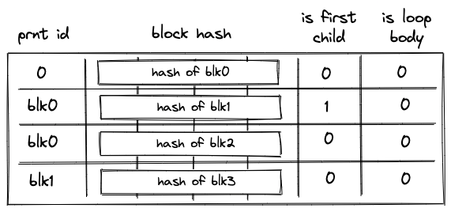

where:
* The first column ($t_0$) contains the ID of the block's parent. For program root, parent ID is $0$.
* The next $4$ columns ($t_1, ..., t_4$) contain the hash of the block.
* The next column ($t_5$) contains a binary value which is set to $1$ if the block is the first child of a *join* block, and to $0$ otherwise.
* The last column ($t_6$) contains a binary value which is set to $1$ if the block is a body of a loop, and to $0$ otherwise.

Running product column $p_2$ is used to keep track of the state of the table. At any step of the computation, the current value of $p_2$ defines which rows are present in the table.

To reduce a row in the block hash table to a single value, we compute the following.

$$
row = \alpha_0 + \sum_{i=0}^6 (\alpha_{i+1} \cdot t_i)
$$

Where $\alpha_0, ..., \alpha_7$ are the random values provided by the verifier.

Unlike other virtual tables, block hash table does not start out in an empty state. Specifically, it is initialized with a single row containing the hash of the program's root block. This needs to be done because the root block does not have a parent and, thus, otherwise it would never be added to the block hash table.

Initialization of the block hash table is done by setting the initial value of $p_2$ to the value of the row containing the hash of a program's root block.

#### Op group table
*Op group* table is used in decoding of *span* blocks, which are leaves in a program's MAST. As described [here](../programs.md#span-block), a *span* block can contain one or more operation batches, each batch containing up to $8$ operation groups.

When the VM starts executing a new batch of operations, it adds all operation groups within a batch, except for the first one, to the *op group* table. Then, as the VM starts executing an operation group, it removes the group from the table. Thus, by the time all operation groups in a batch have been executed, the *op group* table must be empty.

The table can be thought of as consisting of $3$ columns as shown below:

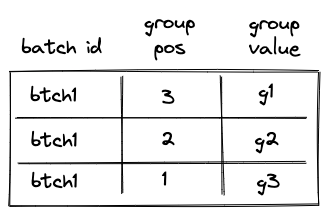

The meaning of the columns is as follows:

* The first column ($t_0$) contains operation batch ID. During the execution of the program, each operation batch is assigned a unique ID.
* The second column ($t_1$) contains the position of the group in the *span* block (not just in the current batch). The position is $1$-based and is counted from the end. Thus, for example, if a *span* block consists of a single batch with $4$ groups, the position of the first group would be $4$, the position of the second group would be $3$ etc. (the reason for this is explained in [this](#single-batch-span) section). Note that the group with position $4$ is not added to the table, because it is the first group in the batch, so the first row of the table will be for the group with position $3$.
* The third column ($t_2$) contains the actual values of operation groups (this could include up to $9$ opcodes or a single immediate value).

Permutation column $p_3$ is used to keep track of the state of the table. At any step of the computation, the current value of $p_3$ defines which rows are present in the table.

To reduce a row in the op group table to a single value, we compute the following.

$$
row = \alpha_0 + \sum_{i=0}^2 (\alpha_{i+1} \cdot t_i)
$$

Where $\alpha_0, ..., \alpha_3$ are the random values provided by the verifier.

### Control flow operation semantics

In this section we describe high-level semantics of executing all control flow operations. The descriptions are not meant to be complete and omit some low-level details. However, they provide good intuition on how these operations work.

#### JOIN operation

Before a `JOIN` operation is executed by the VM, the prover populates $h_0, ..., h_7$ registers with hashes of left and right children of the *join* program block as shown in the diagram below.


In the above diagram, `blk` is the ID of the *join* block which is about to be executed. `blk` is also the address of the hasher row in the auxiliary hasher table. `prnt` is the ID of the block's parent.

When the VM executes a `JOIN` operation, it does the following:

1. Adds a tuple `(blk, prnt, 0)` to the block stack table.
2. Adds tuples `(blk, left_child_hash, 1, 0)` and `(blk, right_child_hash, 0, 0)` to the block hash table.
3. Initiates a 2-to-1 hash computation in the hash chiplet (as described [here](#simple-2-to-1-hash)) using `blk` as row address in the auxiliary hashing table and $h_0, ..., h_7$ as input values.

#### SPLIT operation

Before a `SPLIT` operation is executed by the VM, the prover populates $h_0, ..., h_7$ registers with hashes of true and false branches of the *split* program block as shown in the diagram below.


In the above diagram, `blk` is the ID of the *split* block which is about to be executed. `blk` is also the address of the hasher row in the auxiliary hasher table. `prnt` is the ID of the block's parent.

When the VM executes a `SPLIT` operation, it does the following:

1. Adds a tuple `(blk, prnt, 0)` to the block stack table.
2. Pops the stack and:
   a. If the popped value is $1$, adds a tuple `(blk, true_branch_hash, 0, 0)` to the block hash table.
   b. If the popped value is $0$, adds a tuple `(blk, false_branch_hash, 0, 0)` to the block hash table.
   c. If the popped value is neither $1$ nor $0$, the execution fails.
3. Initiates a 2-to-1 hash computation in the hash chiplet (as described [here](#simple-2-to-1-hash)) using `blk` as row address in the auxiliary hashing table and $h_0, ..., h_7$ as input values.

#### LOOP operation

Before a `LOOP` operation is executed by the VM, the prover populates $h_0, ..., h_3$ registers with hash of the loop's body as shown in the diagram below.


In the above diagram, `blk` is the ID of the *loop* block which is about to be executed. `blk` is also the address of the hasher row in the auxiliary hasher table. `prnt` is the ID of the block's parent.

When the VM executes a `LOOP` operation, it does the following:

1. Pops the stack and:
   a. If the popped value is $1$ adds a tuple `(blk, prnt, 1)` to the block stack table (the `1` indicates that the loop's body is expected to be executed). Then, adds a tuple `(blk, loop_body_hash, 0, 1)` to the block hash table.
   b. If the popped value is $0$, adds `(blk, prnt, 0)` to the block stack table. In this case, nothing is added to the block hash table.
   c. If the popped value is neither $1$ nor $0$, the execution fails.
2. Initiates a 2-to-1 hash computation in the hash chiplet (as described [here](#simple-2-to-1-hash)) using `blk` as row address in the auxiliary hashing table and $h_0, ..., h_3$ as input values.

#### SPAN operation

Before a `SPAN` operation is executed by the VM, the prover populates $h_0, ..., h_7$ registers with contents of the first operation batch of the span block as shown in the diagram below. The prover also sets the group count register $gc$ to the total number of operation groups in the span block.


In the above diagram, `blk` is the ID of the *span* block which is about to be executed. `blk` is also the address of the hasher row in the auxiliary hasher table. `prnt` is the ID of the block's parent. `g0_op0` is the first operation of the batch, and `g_0'` is the first operation group of the batch with the first operation removed.

When the VM executes a `SPAN` operation, it does the following:

1. Adds a tuple `(blk, prnt, 0)` to the block stack table.
2. Adds groups of the operation batch, as specified by op batch flags (see [here](#operation-batch-flags)) to the op group table.
3. Initiates a sequential hash computation in the hash chiplet (as described [here](#sequential-hash)) using `blk` as row address in the auxiliary hashing table and $h_0, ..., h_7$ as input values.
4. Sets the `in_span` register to $1$.
5. Decrements `group_count` register by $1$.
6. Sets the `op_index` register to $0$.

#### END operation

Before an `END` operation is executed by the VM, the prover populates $h_0, ..., h_3$ registers with the hash of the block which is about to end. The prover also sets values in $h_4$ and $h_5$ registers as follows:
* $h_4$ is set to $1$ if the block is a body of a *loop* block. We denote this value as `f0`.
* $h_5$ is set to $1$ if the block is a *loop* block. We denote this value as `f1`.


In the above diagram, `blk` is the ID of the block which is about to finish executing. `prnt` is the ID of the block's parent.

When the VM executes an `END` operation, it does the following:

1. Removes a tuple `(blk, prnt, f1)` from the block stack table.
2. Removes a tuple `(prnt, current_block_hash, nxt, f0)` from the block hash table, where $nxt=0$ if the next operation is either `END` or `REPEAT`, and $1$ otherwise.
3. Reads the hash result from the hash chiplet (as described [here](#program-block-hashing)) using `blk + 7` as row address in the auxiliary hashing table.
4. If $h_5 = 1$ (i.e., we are exiting a *loop* block), pops the value off the top of the stack and verifies that the value is $0$.
5. Verifies that `group_count` register is set to $0$.

#### HALT operation

Before a `HALT` operation is executed by the VM, the VM copies values in $h_0, ..., h_3$ registers to the next row as illustrated in the diagram below:


In the above diagram, `blk` is the ID of the block which is about to finish executing.

When the VM executes a `HALT` operation, it does the following:

1. Verifies that block address register is set to $0$.
2. If we are not at the last row of the trace, verifies that the next operation is `HALT`.
3. Copies values of $h_0, ..., h_3$ registers to the next row.
4. Populates all other decoder registers with $0$'s in the next row.

#### REPEAT operation

Before a `REPEAT` operation is executed by the VM, the VM copies values in registers $h_0, ..., h_4$ to the next row as shown in the diagram below.


In the above diagram, `blk` is the ID of the loop's body and `prnt` is the ID of the loop.

When the VM executes a `REPEAT` operation, it does the following:

1. Checks whether register $h_4$ is set to $1$. If it isn't (i.e., we are not in a loop), the execution fails.
2. Pops the stack and if the popped value is $1$, adds a tuple `(prnt, loop_body_loop 0, 1)` to the block hash table. If the popped value is not $1$, the execution fails.

The effect of the above is that the VM needs to execute the loop's body again to clear the block hash table.

#### RESPAN operation

Before a `RESPAN` operation is executed by the VM, the VM copies the ID of the current block `blk` and the number of remaining operation groups in the span to the next row, and sets the value of `in_span` column to $0$. The prover also sets the value of $h_1$ register for the next row to the ID of the current block's parent `prnt` as shown in the diagram below:


In the above diagram, `g0_op0` is the first operation of the new operation batch, and `g0'` is the first operation group of the batch with `g0_op0` operation removed.

When the VM executes a `RESPAN` operation, it does the following:

1. Increments block address by $8$.
2. Removes the tuple `(blk, prnt, 0)` from the block stack table.
3. Adds the tuple `(blk+8, prnt, 0)` to the block stack table.
4. Absorbs values in registers $h_0, ..., h_7$ into the hasher state of the hash chiplet (as described [here](#sequential-hash)).
5. Sets the `in_span` register to $1$.
6. Adds groups of the operation batch, as specified by op batch flags (see [here](#operation-batch-flags)) to the op group table using `blk+8` as batch ID.

The net result of the above is that we incremented the ID of the current block by $8$ and added the next set of operation groups to the op group table.

## Program decoding

When decoding a program, we start at the root block of the program. We can compute the hash of the root block directly from hashes of its children. The prover provides hashes of the child blocks non-deterministically, and we use them to compute the program's hash (here we rely on the hash chiplet). We then verify the program hash via boundary constraints. Thus, if the prover provided valid hashes for the child blocks, we will get the expected program hash.

Now, we need to verify that the VM executed the child blocks correctly. We do this recursively similar to what is described above: for each of the blocks, the prover provides hashes of its children non-deterministically and we verify that the hash has been computed correctly. We do this until we get to the leaf nodes (i.e., *span* blocks). Hashes of *span* blocks are computed sequentially from the instructions executed by the VM.

The sections below illustrate how different types of code blocks are decoded by the VM.

### JOIN block decoding

When decoding a *join* bock, the VM first executes a `JOIN` operation, then executes the first child block, followed by the second child block. Once the children of the *join* block are executed, the VM executes an `END` operation. This is illustrated in the diagram below.

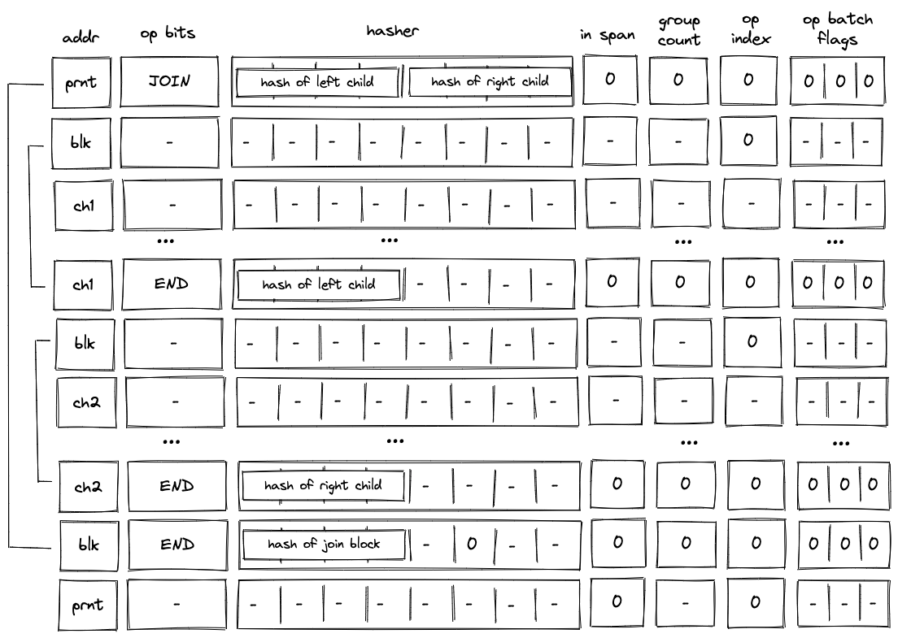

As described previously, when the VM executes a `JOIN` operation, hashes of both children are added to the block hash table. These hashes are removed only when the `END` operations for the child blocks are executed. Thus, until both child blocks are executed, the block hash table is not cleared.

### SPLIT block decoding

When decoding a *split* block, the decoder pops an element off the top of the stack, and if the popped element is $1$, executes the block corresponding to the `true branch`. If the popped element is $0$, the decoder executes the block corresponding to the `false branch`. This is illustrated on the diagram below.

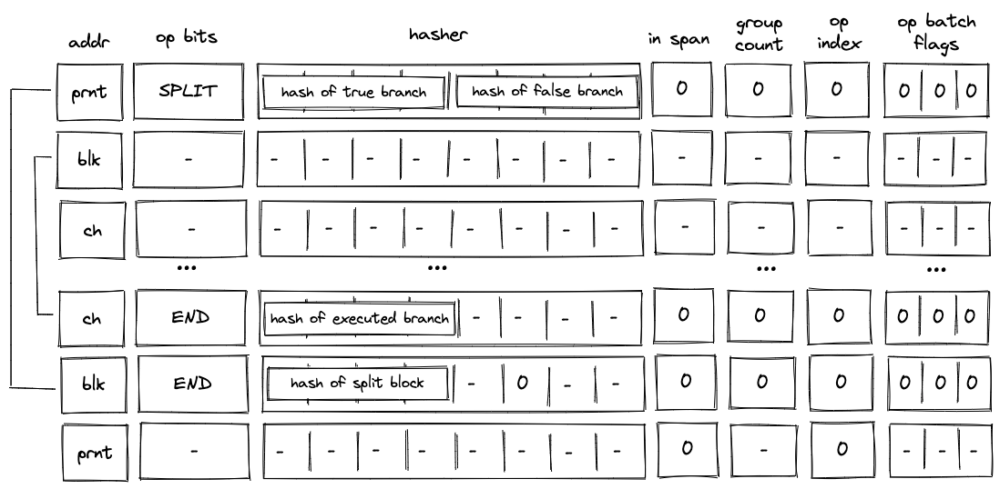

As described previously, when the VM executes a `SPLIT` operation, only the hash of the branch to be executed is added to the block hash table. Thus, until the child block corresponding to the required branch is executed, the block hash table is not cleared.

### LOOP block decoding

When decoding a *loop* bock, we need to consider two possible scenarios:

* When the top of the stack is $1$, we need to enter the loop and execute loop body at least once.
* When the top of the stack is, $0$ we need to skip the loop.

In both cases, we need to pop an element off the top of the stack.

#### Executing the loop

If the top of the stack is $1$, the VM executes a `LOOP` operation. This removes the top element from the stack and adds the hash of the loop's body to the block hash table. It also adds a row to the block stack table setting the `is_loop` value to $1$.

To clear the block hash table, the VM needs to execute the loop body (executing the `END` operation for the loop body block will remove the corresponding row from the block hash table). After loop body is executed, if the top of the stack is $1$, the VM executes a `REPEAT` operation (executing `REPEAT` operation when the top of the stack is $0$ will result in an error). This operation again adds the hash of the loop's body to the block hash table. Thus, the VM needs to execute the loop body again to clear the block hash table.

This process is illustrated on the diagram below.

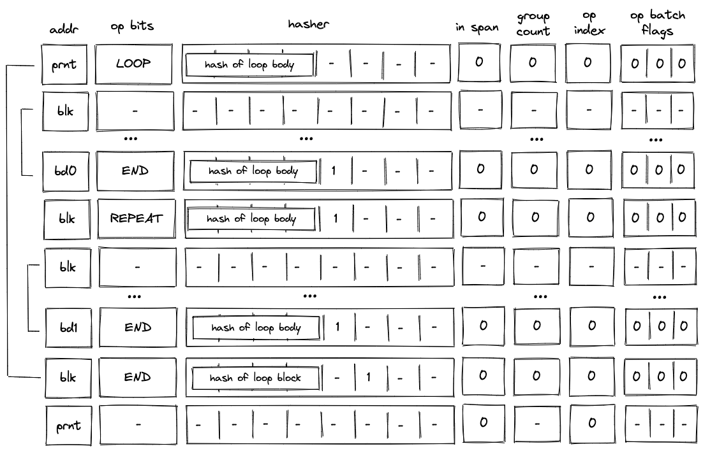

The above steps are repeated until the top of the stack becomes $0$, at which point the VM executes the `END` operation. Since in the beginning we set `is_loop` column in the block stack table to $1$, $h_6$ column will be set to $1$ when the `END` operation is executed. Thus, executing the `END` operation will also remove the top value from the stack. If the removed value is not $0$, the operation will fail. Thus, the VM can exit the loop block only when the top of the stack is $0$.

#### Skipping the loop

If the top of the stack is $0$, the VM still executes the `LOOP` operation. But unlike in the case when we need to entre the loop, the VM sets `is_loop` flag to $0$ in the block stack table, and does not add any rows to the block hash table. The last point means that the only possible operation to be executed after the `LOOP` operation is the `END` operation. This is illustrated in the diagram below.


Moreover, since we've set the `is_loop` flag to $0$, executing the `END` operation does not remove any items from the stack.

### SPAN block decoding

As described [here](../programs.md#span-block), a *span* block can contain one or more operation batches, each batch containing up to $8$ operation groups. At the high level, decoding of a span block is done as follows:

1. At the beginning of the block, we make a request to the hash chiplet which initiates the hasher, absorbs the first operation batch ($8$ field elements) into the hasher, and returns the row address of the hasher, which we use as the unique ID for the *span* block (see [here](#sequential-hash)).
2. We then add groups of the operation batch, as specified by op batch flags (but always skipping the first one) to the op group table.
3. We then remove operation groups from the op group table in the FIFO order one by one, and decode them in the manner similar to the one described [here](#operation-group-decoding).
4. Once all operation groups in a batch have been decoded, we absorb the next batch into the hasher and repeat the process described above.
5. Once all batches have been decoded, we return the hash of the span block from the hasher.

Overall, three control flow operations are used when decoding a *span* block:

1. `SPAN` operation is used to initialize a hasher and absorbs the first operation batch into it.
2. `RESPAN` operation is used to absorb any additional batches in the span block.
3. `END` operation is used to end the decoding of a span block and retrieve its hash from the hash chiplet.

#### Operation group decoding

As described [here](../programs.md#span-block), an operation group is a sequence of operations which can be encoded into a single field element. For a field element of $64$ bits, we can fit up to $9$ operations into a group. We do this by concatenating binary representations of opcodes together with the first operation located in the least significant position.

We can read opcodes from the group by simply subtracting them from the op group value and then dividing the result by $2^7$. Once the value of the op group reaches $0$, we know that all opcodes have been read. Graphically, this can be illustrated like so:

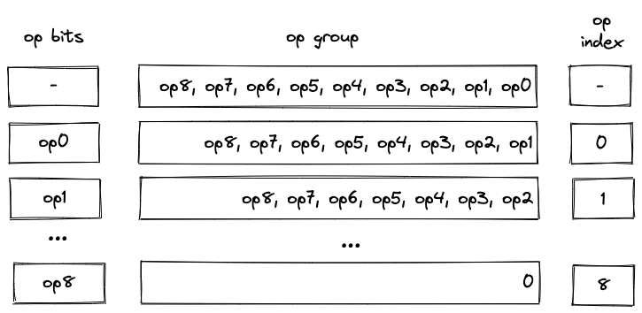

Notice that despite their appearance, `op bits` is actually $7$ separate registers, while `op group` is just a single register.

We also need to make sure that at most $9$ operations are executed as a part of a single group. For this purpose we use the `op_index` column. Values in this column start out at $0$ for each operation group, and are incremented by $1$ for each executed operation. To make sure that at most $9$ operations can be executed in a group, the value of the `op_index` column is not allowed to exceed $8$.

#### Operation batch flags

Operation batch flags are used to specify how many operation groups comprise in a given operation batch. For most batches, the number of groups will be equal to $8$. However, for the last batch in a block (or for the first batch, if the block consists of only a single batch), the number of groups may be less than $8$. Since processing of new batches starts only on `SPAN` and `RESPAN` operations, only for these operations the flags can be set to non-zero values.

To simplify the constraint system, number of groups in a batch can be only one of the following values: $1$, $2$, $4$, and $8$. If number of groups in a batch does not match one of these values, the batch is simply padded with `NOOP`'s (one `NOOP` per added group). Consider the diagram below.


In the above, the batch contains $3$ operation groups. To bring the count up to $4$, we consider the $4$-th group (i.e., $0$) to be a part of the batch. Since a numeric value for `NOOP` operation is $0$, op group value of $0$ can be interpreted as a single `NOOP`.

Operation batch flags (denoted as $c_0, c_1, c_2$), encode the number of groups and define how many groups are added to the op group table as follows:

* `(1, 0, 0)` - $8$ groups. Groups in $h_1, ... h_7$ are added to the op group table.
* `(0, 1, 0)` - $4$ groups. Groups in $h_1, ... h_3$ are added to the op group table
* `(0, 0, 1)` - $2$ groups. Groups in $h_1, h_2$ are added to the op group table.
* `(0, 1, 1)` - $1$ group. Nothing is added to the op group table
* `(0, 0, 0)` - not a `SPAN` or `RESPAN` operation.

#### Single-batch span

The simplest example of a *span* block is a block with a single batch. This batch may contain up to $8$ operation groups (e.g., $g_0, ..., g_7$). Decoding of such a block is illustrated in the diagram below.

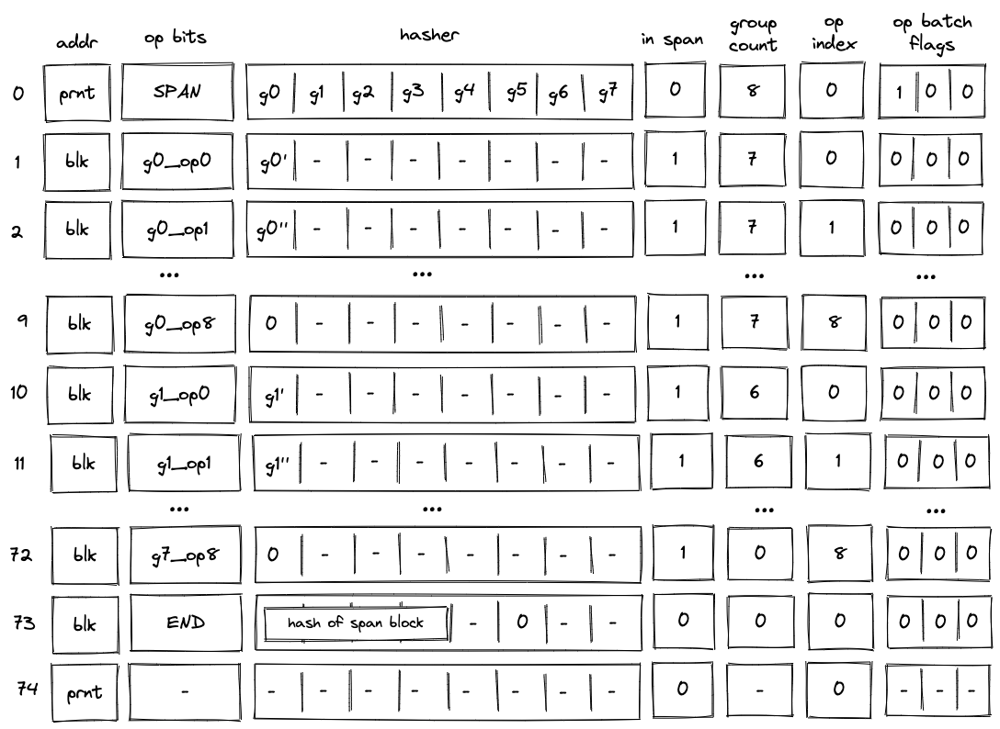

Before the VM starts processing this *span* block, the prover populates registers $h_0, ..., h_7$ with operation groups $g_0, ..., g_7$. The prover also puts the total number of groups into the `group count` register $gc$. In this case, the total number of groups is $8$.

When the VM executes a `SPAN` operation, it does the following:

1. Initiates hashing of elements $g_0, ..., g_7$ using hash chiplet. The hasher address is used as the block ID `blk`, and it is inserted into `addr` register in the next row.
2. Adds a tuple `(blk, prnt, 0)` to the block stack table.
3. Sets the `is_span` register to $1$ in the next row.
4. Sets the `op_index` register to $0$ in the next row.
5. Decrements `group_count` register by $1$.
6. Sets `op bits` registers at the next step to the first operation of $g_0$, and also copies $g_0$ with the first operation removed (denoted as $g_0'$) to the next row.
7. Adds groups $g_1, ..., g_7$ to the op group table. Thus, after the `SPAN` operation is executed, op group table looks as shown below.

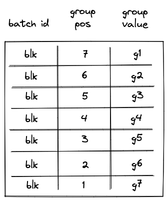

Then, with every step the next operation is removed from $g_0$, and by step $9$, value of $g_0$ is $0$. Once this happens, the VM does the following:

1. Decrements `group_count` register by $1$.
2. Sets `op bits` registers at the next step to the first operation of $g_1$.
3. Sets `hasher` register $h_0$ to the value of $g_1$ with the first operation removed (denoted as $g_1'$).
4. Removes row `(blk, 7, g1)` from the op group table. This row can be obtained by taking values from registers: `addr`, `group_count`, and $h_0' + \sum_{i=0}^6(2^i \cdot b_i')$ for $i \in 0..6$, where $h_0'$ and $b_i'$ refer to values in the next row for the first hasher column and `op_bits` columns respectively.

Note that we rely on the `group_count` column to construct the row to be removed from the op group table. Since group count is decremented from the total number of groups to $0$, to remove groups from the op group table in correct order, we need to assign group position to groups in the op group table in the reverse order. For example, the first group to be removed should have position $7$, the second group to be removed should have position $6$ etc.

Decoding of $g_1$ is performed in the same manner as decoding of $g_0$: with every subsequent step the next operation is removed from $g_1$ until its value reaches $0$, at which point, decoding of group $g_2$ begins.

The above steps are executed until value of `group_count` reaches $0$. Once `group_count` reaches $0$ and the last operation group $g_7$ is executed, the VM executed the `END` operation. Semantics of the `END` operation are described [here](#end-operation).

Notice that by the time we get to the `END` operation, all rows are removed from the op group table.

#### Multi-batch span

A *span* block may contain an unlimited number of operation batches. As mentioned previously, to absorb a new batch into the hasher, the VM executes a `RESPAN` operation. The diagram below illustrates decoding of a *span* block consisting of two operation batches.

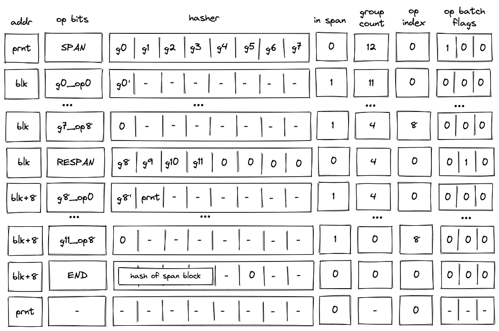

Decoding of such a block will look very similar to decoding of the single-span block described previously, but there also will be some differences.

First, after the `SPAN` operation is executed, the op group table will look as follows:

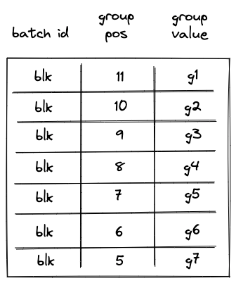

Notice that while the same groups ($g_1, ..., g_7$) are added to the table, their positions now reflect the total number of groups in the *span* block.

Second, executing a `RESPAN` operation increments hasher address by $8$. This is done because absorbing additional $8$ elements into the hasher state requires $8$ more rows in the auxiliary hasher table.

Incrementing value of `addr` register actually changes the ID of the *span* block (though, for a *span* block, it may be more appropriate to view values in this column as IDs of individual operation batches). This means that we also need to update the block stack table. Specifically, we need to remove row `(blk, prnt, 0)` from it, and replace it with row `(blk + 8, prnt, 0)`. To perform this operation, the prover sets the value of $h_1$ in the next row to `prnt`.

Executing a `RESPAN` operation also adds groups $g_9, g_{10}, g_{11}$ to the op group table, which now would look as follows:

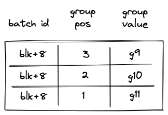

Then, the execution of the second batch proceeds in the manner similar to the first batch: we remove operations from the current op group, execute them, and when the value of the op group reaches $0$, we start executing the next group in the batch. Thus, by the time we get to the `END` operation, the op group table should be empty.

When executing the `END` operation, the hash of the *span* block will be read from hasher row at address `addr + 7`, which, in our example, will be equal to `blk + 15`.

#### Handling immediate values

Miden VM operations can carry immediate values. Currently, the only such operation is a `PUSH` operation. Since immediate values can be thought of as constants embedded into program code, we need to make sure that changing immediate values affects program hash.

To achieve this, we treat immediate values in a manner similar to how we treat operation groups. Specifically, when computing hash of a *span* block, immediate values are absorbed into the hasher state in the same way as operation groups are. As mentioned previously, an immediate value is represented by a single field element, and thus, an immediate value takes place of a single operation group.

The diagram below illustrates decoding of a *span* block with $9$ operations one of which is a `PUSH` operation.

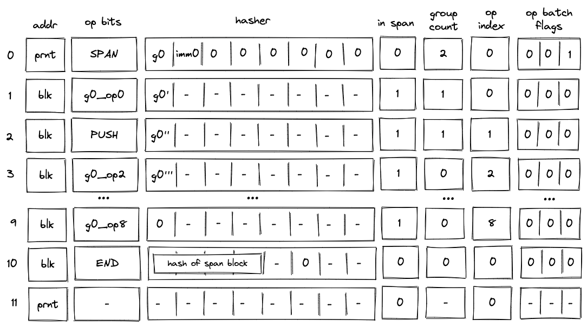

In the above, when the `SPAN` operation is executed, immediate value `imm0` will be added to the op group table, which will look as follows:

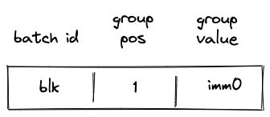

Then, when the `PUSH` operation is executed, the VM will do the following:

1. Decrement `group_count` by $1$.
2. Remove a row from the op group table equal to `(addr, group_count, s0')`, where $s_0'$ is the value of the top of the stack at the next row (i.e., it is the value that is pushed onto the stack).

Thus, after the `PUSH` operation is executed, the op group table is cleared, and group count decreases to $0$ (which means that there are no more op groups to execute). Decoding of the rest of the op group proceeds as described in the previous sections.

## Program decoding example

Let's run through an example of decoding a simple program shown previously:

```
begin
    <operations1>
    if.true
        <operations2>
    else
        <operations3>
    end
end
```

Translating this into code blocks with IDs assigned, we get the following:

```
b0: JOIN
    b1: SPAN
        <operations1>
    b1: END
    b2: SPLIT
        b3: SPAN
            <operations2>
        b3: END
        b4: SPAN
            <operations3>
        b4: END
    b2: END
b0: END
```

The root of the program is a *join* block $b_0$. This block contains two children: a *span* bock $b_1$ and a *split* block $b_2$. In turn, the *split* block $b_2$ contains two children: a *span* block $b_3$ and a *span* block $b_4$.

When this program is executed on the VM, the following happens:

1. Before the program starts executing, block hash table is initialized with a single row containing the hash of $b_0$.
2. Then, `JOIN` operation for $b_0$ is executed. It adds hashes of $b_1$ and $b_2$ to the block hash table. It also adds an entry for $b_0$ to the block stack table. States of both tables after this step are illustrated below.
3. Then, *span* $b_1$ is executed and a sequential hash of its operations is computed. Also, when `SPAN` operation for $b_1$ is executed, an entry for $b_1$ is added to the block stack table. At the end of $b_1$ (when `END` is executed), entries for $b_1$ are removed from both the block hash and block stack tables.
4. Then, `SPLIT` operation for $b_2$ is executed. It adds an entry for $b_2$ to the block stack table. Also, depending on whether the top of the stack is $1$ or $0$, either hash of $b_3$ or hash of $b_4$ is added to the block hash table. Let's say the top of the stack is $1$. Then, at this point, the block hash and block stack tables will look like in the second picture below.
5. Then, *span* $b_3$ is executed and a sequential hash of its instructions is computed. Also, when `SPAN` operation for $b_3$ is executed, an entry for $b_3$ is added to the block stack table. At the end of $b_3$ (when `END` is executed), entries for $b_3$ are removed from both the block hash and block stack tables.
6. Then, `END` operation for $b_2$ is executed. It removes the hash of $b_2$ from the block hash table, and also removes the entry for $b_2$ from the block stack table. The third picture below illustrates the states of block stack and block hash tables after this step.
7. Then, `END` for $b_0$ is executed, which removes entries for $b_0$ from the block stack and block hash tables. At this point both tables are empty.
8. Finally, a sequence of `HALT` operations is executed until the length of the trace reaches a power of two.

States of block hash and block stack tables after step 2:


States of block hash and block stack tables after step 4:


States of block hash and block stack tables after step 6:

