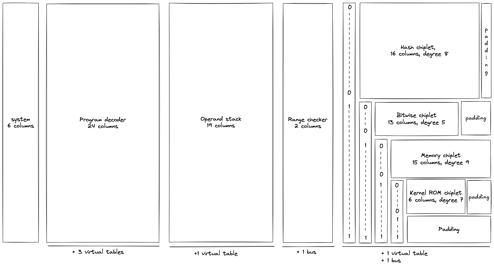

# Design
In the following sections, we provide in-depth descriptions of Miden VM internals, including all AIR constraints for the proving system. We also provide rationale for making specific design choices.

Throughout these sections we adopt the following notations and assumptions:
* All arithmetic operations, unless noted otherwise, are assumed to be in a prime field with modulus $p = 2^{64} - 2^{32} + 1$.
* A _binary_ value means a field element which is either $0$ or $1$.
* We use lowercase letters to refer to individual field elements (e.g., $a$), and uppercase letters to refer to groups of $4$ elements, also referred to as words (e.g., $A$). To refer to individual elements within a word, we use numerical subscripts. For example, $a_0$ is the first element of word $A$, $b_3$ is the last element of word $B$, etc.
* When describing AIR constraints:
  - For a column $x$, we denote the value in the current row simply as $x$, and the value in the next row of the column as $x'$. Thus, all transition constraints for Miden VM work with two consecutive rows of the execution trace.
  - For multiset equality constraints, we denote random values sent by the verifier after the prover commits to the main execution trace as $\alpha_0, \alpha_1, \alpha_2$ etc.
  - To differentiate constraints from other formulas, we frequently use the following format for constraint equations.

$$
x' - (x + y) = 0 \text{ | degree} = 1
$$

In the above, the constraint equation is followed by the implied algebraic degree of the constraint. This degree is determined by the number of multiplications between trace columns. If a constraint does not involve any multiplications between columns, its degree is $1$. If a constraint involves multiplication between two columns, its degree is $2$. If we need to multiply three columns together, the degree is $3$ ect.

The maximum allowed constraint degree in Miden VM is $9$. If a constraint degree grows beyond that, we frequently need to introduce additional columns to reduce the degree.

## VM components
Miden VM consists of several interconnected components, each providing a specific set of functionality. These components are:

* **System**, which is responsible for managing system data, including the current VM cycle (`clk`), and the current and parent execution contexts.
* **Program decoder**, which is responsible for computing a commitment to the executing program and converting the program into a sequence of operations executed by the VM.
* **Operand stack**, which is a push-down stack which provides operands for all operations executed by the VM.
* **Range checker**, which is responsible for providing 16-bit range checks needed by other components.
* **Chiplets**, which is a set of specialized circuits used to accelerate commonly-used complex computations. Currently, the VM relies on 4 chiplets:
  - Hash chiplet, used to compute Rescue Prime Optimized hashes both for sequential hashing and for Merkle tree hashing.
  - Bitwise chiplet, used to compute bitwise operations (e.g., `AND`, `XOR`) over 32-bit integers.
  - Memory chiplet, used to support random-access memory in the VM.
  - Kernel ROM chiplet, used to enable calling predefined kernel procedures which are provided before execution begins.

The above components are connected via **buses**, which are implemented using [lookup arguments](./lookups/index.md). We also use [multiset check lookups](./lookups/multiset.md) internally within components to describe **virtual tables**.

## VM execution trace
The execution trace of Miden VM consists of $73$ main trace columns, $2$ buses, and $5$ virtual tables, as shown in the diagram below.

As can be seen from the above, the system, decoder, stack, and range checker components use dedicated sets of columns, while all chiplets share the same $18$ columns. To differentiate between chiplets, we use a set of binary selector columns, a combination of which uniquely identifies each chiplet.

The system component does not yet have a dedicated documentation section, since the design is likely to change. However, the following column is not expected to change:

* `clk` which is used to keep track of the current VM cycle. Values in this column start out at $0$ and are incremented by $1$ with each cycle.

For the `clk` column, the constraints are straightforward:

$$
clk' - (clk + 1) = 0 \text{ | degree} = 1
$$
