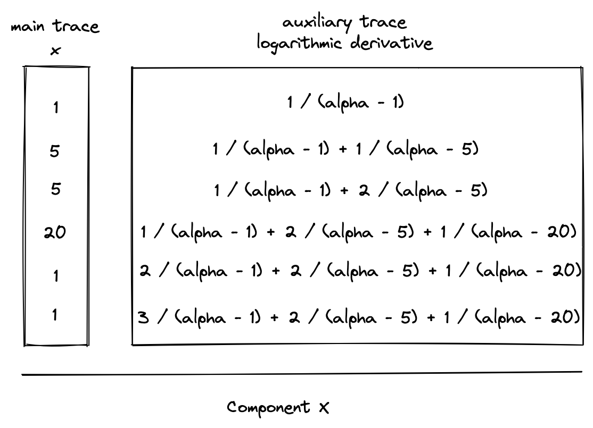
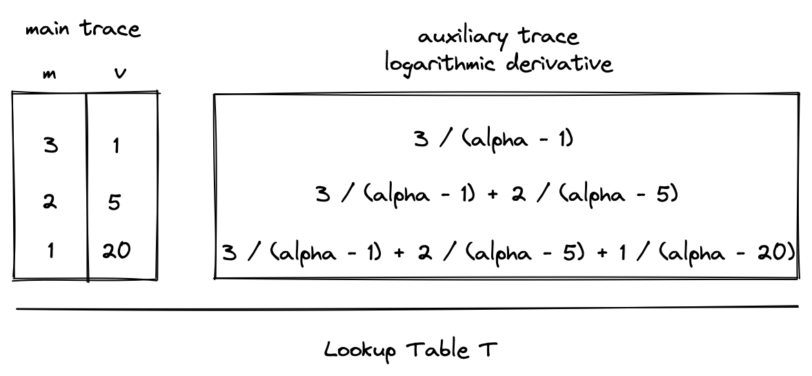

# LogUp: multivariate lookups with logarithmic derivatives

[LogUp](https://eprint.iacr.org/2022/1530.pdf) proves multiset equality through logarithmic
derivatives. Given a column $a$ of lookup requests and a table column $b$ with multiplicities $m$,
the basic identity is:

$$
\sum_{i=0}^{l-1} \frac{1}{(\alpha - a_i)} =
\sum_{i=0}^{n-1} \frac{m_i}{(\alpha - b_i)}
$$

In the above:
- $l$ is the number of values in $a$, which must be smaller than the size of the field. The Miden
  base field has modulus $p = 2^{64} - 2^{32} + 1$, so $l < p$.
- $n$ is the number of values in $b$, which must also satisfy $n < p$.
- $m_i$ is the multiplicity of $b_i$, which is expected to match the number of times $b_i$ occurs
  in $a$.
- $\alpha$ is a random value sent to the prover after it commits to the execution trace.

The equality of these rational sums implies equality of the encoded multisets except with the
standard challenge-collision and zero-denominator probability.

## Usage in Miden VM

Miden VM uses LogUp for both [virtual tables](./index.md#virtual-tables-in-miden-vm) and
[communication buses](./index.md#communication-buses-in-miden-vm). The diagrams below illustrate
the basic request-and-table construction, where component $X$ requests values supplied by table
$T$.

### Typed message encoding

Every interaction has a `BusId` and payload values assigned to fixed positions within a width-$W$
message. After the prover commits to the main traces, the verifier samples extension-field
challenges $\alpha$ and $\beta$. For zero-based bus identifier $b$, let $v_j$ be the value in
payload position $j$, or zero when that position is unused. The denominator is

$$
d(b, v) = \underbrace{\alpha + (b + 1)\beta^W}_{\mathtt{bus\_prefix}[b]}
    + \sum_{j=0}^{W-1} \beta^j v_j.
$$

The bus prefix domain-separates message types, while each message schema assigns its fields to
fixed payload positions. Contributions with the same encoded denominator balance when their
signed multiplicities sum to zero, except with the standard challenge-collision probability.

### Signed interactions

An interaction with signed multiplicity $m$ contributes $m/d$ to the LogUp sum. The native VM
execution proof assigns positive multiplicities to providers and virtual-table insertions, and
negative multiplicities to consumers and virtual-table removals. A table row may use a larger
multiplicity to provide the same encoded value several times.

The aggregate precompile proof fixes polarity per relation schema. Many arithmetic and storage
relations use positive consumers and negative providers, while Eidos owner/controller relations
use the native VM orientation. Globally negating every endpoint of any one relation is equivalent;
what matters is that its providers and consumers use opposite signs consistently.

For row $r$, let

$$
t(r) = \sum_j \frac{m_j(r)}{d_j(r)}
$$

be the sum of all interactions emitted on that row.

### Constraints

AIR constraints do not divide by encoded messages. For each packed set of row interactions, the
lookup builder derives a numerator $N_k$ and denominator $D_k$ such that $N_k/D_k$ is their
rational sum. Column 0 is the running accumulator; columns $k>0$ hold additional per-row fraction
sums when one accumulator cannot contain every interaction within the AIR's degree bound. The
fraction columns are constrained on every row by

$$
D_k a_k - N_k = 0 \qquad (k>0).
$$

The column-0 transition folds those values into the running accumulator. In the normalized cyclic
form described below, its cross-multiplied constraint is

$$
D_0 \left(a'_0 - \sum_{k=0}^{L-1} a_k + \sigma'\right) - N_0 = 0,
$$

where $L$ is the number of LogUp columns in the AIR.

### Normalized cyclic closure

For an AIR with $n$ rows, define

$$
\sigma = \sum_{r=0}^{n-1} t(r)
\qquad\text{and}\qquad
\sigma' = \frac{\sigma}{n}.
$$

The AIR commits to $\sigma'$ and constrains an accumulator anchored at $a(0)=0$ by

$$
a((r + 1) \bmod n) = a(r) + t(r) - \sigma'.
$$

The recurrence is enforced on every row, including the last-to-first edge. Summing the $n$
recurrence equations yields $n\sigma'=\sigma$.

The native VM execution proof contains four AIRs with independent trace lengths: Core, Chiplets,
Eidos compression, and the fixed `And8` table. Each uses the normalized cyclic form above. The
verifier closes their shared buses with

$$
\sum_i n_i\sigma'_i + c_{\mathrm{boundary}} = 0,
$$

where $n_i$ is AIR $i$'s trace length and $c_{\mathrm{boundary}}$ is the signed sum of
once-per-proof interactions derived from public statement data. Boundary contributions are added
once; they are not scaled by a trace length.

### Aggregate precompile proof

Every AIR in the aggregate precompile proof uses the same normalized cyclic form. Each AIR commits
$\sigma'_i = \sigma_i / n_i$, and the external closure reconstructs every raw sum by multiplying
the residue by that AIR's trace length:

$$
\sum_i n_i\sigma'_i + c_{\mathrm{boundary}} = 0.
$$

### Extending the construction to multiple components

The same bus may receive interactions from multiple components. Each interaction contributes its
own signed fraction to $t(r)$:

> $$
> t(r) = \frac{m}{d_T} - \frac{1}{d_X} - \frac{1}{d_Y}.
> $$

The lookup layout splits or packs these terms across auxiliary columns so that every
cross-multiplied constraint remains within the AIR's declared degree bound.

### Extending the construction with flags

Boolean flags determine whether an interaction is present. If $f_x$ and $f_y$ select requests from
$X$ and $Y$, their row contribution is

> $$
> t(r) = \frac{m}{d_T} - \frac{f_x}{d_X} - \frac{f_y}{d_Y}.
> $$

The selector degree contributes to the cross-multiplied constraint degree and therefore affects how
many interactions can share an auxiliary column.
