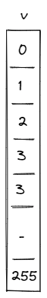
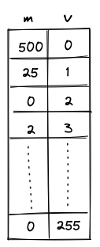

# Range Checker

Miden VM relies very heavily on 16-bit range-checks (checking if a field element is in $[0, 2^{16})$). For example, most of the [u32 operations](./stack/u32_ops.md) need to perform between two and four 16-bit range-checks per operation. Memory rows range-check both sorted-access deltas and word-address decomposition values.

Thus, it is very important for the VM to be able to perform a large number of 16-bit range checks very efficiently. In this note we describe how this can be achieved using the [LogUp](./lookups/logup.md) lookup argument.

## 8-bit range checks

First, let's define a construction for the simplest possible 8-bit range-check. This can be done with a single column as illustrated below.

For this to work as a range-check we need to enforce a few constraints on this column:

- The value in the first row must be $0$.
- The value in the last row must be $255$.
- As we move from one row to the next, we can either keep the value the same or increment it by $1$.

Denoting $v$ as the value of column $v$ in the current row, and $v'$ as the value of column $v$ in the next row, we can enforce the last condition as follows:

$$
(v' - v) \cdot (v' - v - 1) = 0
$$

Together, these constraints guarantee that all values in column $v$ are between $0$ and $255$ (inclusive).

We can then make use of the LogUp lookup argument by adding another column $b$ which will keep a running sum that is the logarithmic derivative of the product of values in the $v$ column. The transition constraint for $b$ would look as follows:

$$
b' = b + \frac{1}{(\alpha - v)}
$$

Since constraints cannot include divisions, the constraint would actually be expressed as the following degree 2 constraint:

$$
b' \cdot (\alpha - v) = b \cdot (\alpha - v) + 1
$$

Using these two columns we can check if some other column in the execution trace is a permutation of values in $v$. Let's call this other column $x$. We can compute the logarithmic derivative for $x$ as a running sum in the same way as we compute it for $v$. Then, we can check that the last value in $b$ is the same as the final value for the running sum of $x$.

While this approach works, it has a couple of limitations:

- First, column $v$ must contain all values between $0$ and $255$. Thus, if column $x$ does not contain one of these values, we need to artificially add this value to $x$ somehow (i.e., we need to pad $x$ with extra values).
- Second, assuming $n$ is the length of execution trace, we can range-check at most $n$ values. Thus, if we wanted to range-check more than $n$ values, we'd need to introduce another column similar to $v$.

We can get rid of both requirements by including the _multiplicity_ of the value $v$ into the calculation of the logarithmic derivative for LogUp, which will allow us to specify exactly how many times each value needs to be range-checked.

### A better construction

Let's add one more column $m$ to our table to keep track of how many times each value should be range-checked.

The transition constraint for $b$ is now as follows:

$$
b' = b + \frac{m}{(\alpha - v)}
$$

This addresses the limitations we had as follows:
1. We no longer need to pad the column we want to range-check with extra values because we can skip the values we don't care about by setting the multiplicity to $0$.
2. We can range check as many unique values as there are rows in the trace, and there is essentially no limit to how many times each of these values can be range-checked. (The only restriction on the multiplicity value is that it must be less than the size of the set of lookup values. Therefore, for long traces where $n > 2^{16}$, $m < 2^{16}$ must hold, and for short traces $m < n$ must be true.)

Additionally, the constraint degree has not increased versus the naive approach, and the only additional cost is a single trace column.

## 16-bit range checks

The VM implements 16-bit range checks with a fixed byte-pair table. The table has one row for
each pair $(a, b) \in [0, 256)^2$ and interprets that row as the 16-bit value:

$$
v = 256 \cdot a + b
$$

The byte-pair table is also used for bytewise AND and BlakeG rotation-contribution lookups. Its
preprocessed columns hold the fixed byte pair and the derived values for those relations. The
range-check relation adds one dynamic multiplicity column $m_{range}$ to the same table.

### Requirements

- A fixed byte-pair table containing all $2^{16}$ possible 16-bit values.
- One dynamic multiplicity column $m_{range}$ in the byte-pair lookup AIR.
- One [LogUp bus](./lookups/index.md#communication-buses-in-miden-vm) domain for
  `RangeMsg { value }`.

### Execution trace

Range checks do not have a separate trace segment. During trace generation, the processor counts
every requested 16-bit range check by value. These counts are written into the range multiplicity
column of the byte-pair lookup AIR:

$$
m_{range}[v] = \text{number of range checks requested for } v
$$

The table row itself determines $v$ from the fixed byte pair, so no transition constraints are
needed to prove that the values cover the 16-bit range. The full range is provided by the
preprocessed table.

### Communication bus

Components which require 16-bit range checks remove `RangeMsg { value }` messages from the range
bus. The byte-pair lookup AIR inserts the same messages with multiplicity $m_{range}$.

Requests are emitted by:

- The Stack during some [`u32` operations](./stack/u32_ops.md#range-checks).
- The [Memory chiplet](./chiplets/memory.md), for address and clock-delta decompositions.
- The BlakeG compression AIR, for range checks routed out of its message schedule.

The byte-pair lookup side contributes the LogUp term:

> $$
> \frac{m_{range}}{\alpha - v} \text{ | degree} = 2
> $$

The LogUp accumulator enforces that the multiset of table inserts matches the multiset of requests
from the components above. If a prover omits a requested value or inserts a value with the wrong
multiplicity, the range bus does not balance.
