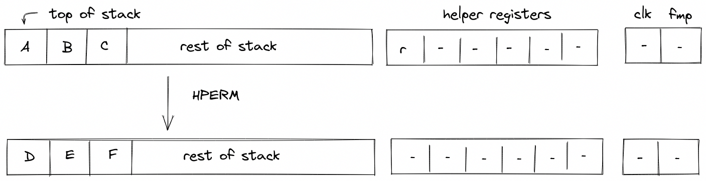
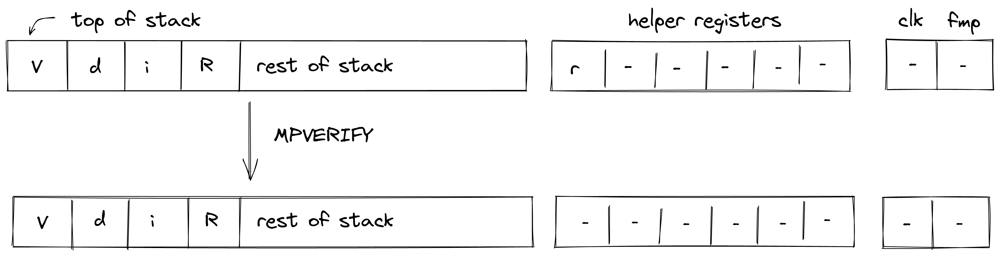
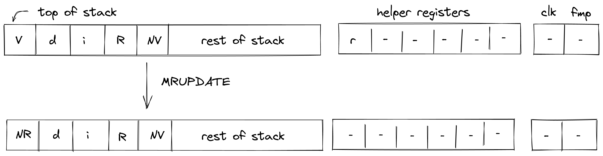
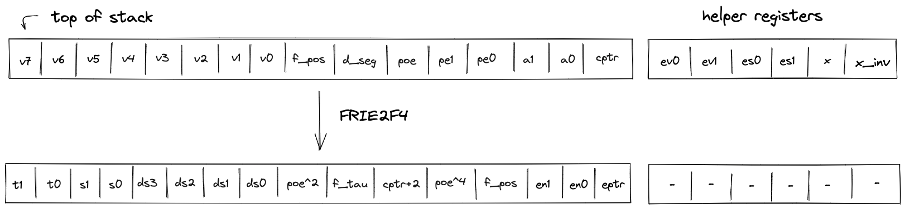
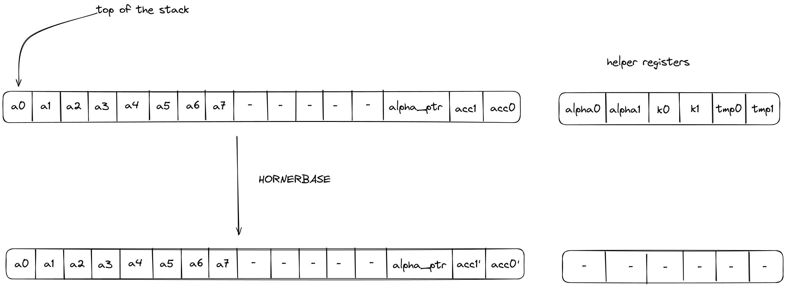
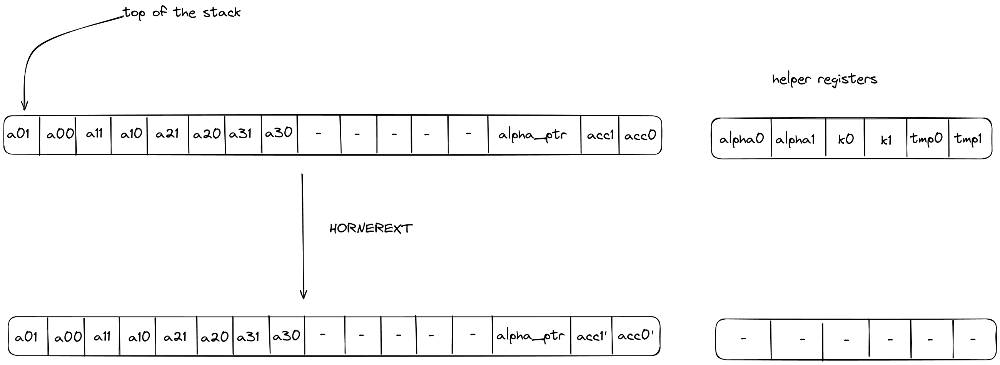
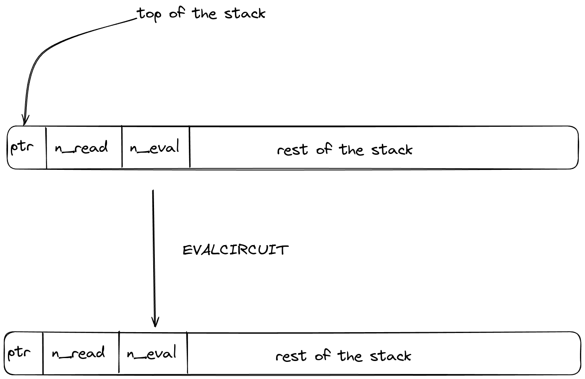

# Cryptographic operations
In this section we describe the AIR constraints for Miden VM cryptographic operations.

Hash and Merkle operations communicate with the hasher controller through LogUp messages.
The controller then links each compression request to `BlakeGCompressionAir`, which proves the
BlakeG rounds. `AEADSTREAM` also uses memory, BlakeG-XOF output, and AEAD stream rows in the
bitwise selector region.

Thus, to describe AIR constraints for the cryptographic operations, we need to define how to compute these input and output values within the stack. We do this in the following sections.

## BCOMPRESS
The `BCOMPRESS` operation applies one BlakeG compression to the top $12$ elements of the stack. The stack is arranged as `[BLOCK0, BLOCK1, CV]`, with $s_0$ at the top and mapping to the first block lane. The diagram below illustrates this graphically.



In the above, $r$ (located in the helper register $h_0$) is the row address from the hash chiplet set by the prover non-deterministically.

The stack removes two LogUp messages from the hasher-controller domains:

- `HasherLinearHashInit(h0, stack[0..12])`, carrying the block and input chaining word.
- `HasherReturnHash(h0 + 1, next.stack[8..12])`, carrying the returned chaining word.

The hasher controller inserts the matching messages on consecutive controller rows.

The controller input/output pair is then linked to the standalone BlakeG compression AIR by the
compression-link message `[block(8), cv_in(4), cv_out(4)]`. This binds the block preserved on the
stack, the input chaining word, and the returned chaining word to one BlakeG compression block.

The effect of this operation on the rest of the stack is:
* **No change** in positions $0..8$.
* **The output chaining word** is written to positions $8..12$.
* **No change** starting from position $12$.

## MPVERIFY
The `MPVERIFY` operation verifies that a Merkle path from the specified node resolves to the specified root. This operation can be used to prove that the prover knows a path in the specified Merkle tree which starts with the specified node.

Prior to the operation, the stack is expected to be arranged as follows (from the top):
- Value of the node, 4 elements ($V$ in the below image)
- Depth of the path, 1 element ($d$ in the below image)
- Index of the node, 1 element ($i$ in the below image)
- Root of the tree, 4 elements ($R$ in the below image)

The Merkle path itself is expected to be provided by the prover non-deterministically (via the advice provider). If the prover is not able to provide the required path, the operation fails. Otherwise, the state of the stack does not change. The diagram below illustrates this graphically.



In the above, $r$ (located in the helper register $h_0$) is the controller row address set by
the prover non-deterministically.

The stack removes:

- `HasherMerkleVerifyInit(h0, index, leaf)`, where `index = s5` and `leaf = stack[0..4]`.
- `HasherReturnHash(h0 + 2 * depth - 1, root)`, where `depth = s4` and `root = stack[6..10]`.

The hasher controller inserts the matching messages. Each Merkle level contributes two
controller rows, so the returned root is at offset `2 * depth - 1` from the input row.

The effect of this operation on the rest of the stack is:
* **No change** starting from position $0$.

## MRUPDATE
The `MRUPDATE` operation computes a new root of a Merkle tree where a node at the specified position is updated to the specified value.

The stack is expected to be arranged as follows (from the top):
- old value of the node, 4 element ($V$ in the below image)
- depth of the node, 1 element ($d$ in the below image)
- index of the node, 1 element ($i$ in the below image)
- current root of the tree, 4 elements ($R$ in the below image)
- new value of the node, 4 element ($NV$ in the below image)

The Merkle path for the node is expected to be provided by the prover non-deterministically (via merkle sets). At the end of the operation, the old node value is replaced with the new root value computed based on the provided path. Everything else on the stack remains the same. The diagram below illustrates this graphically.



In the above, $r$ (located in the helper register $h_0$) is the controller row address set by
the prover non-deterministically.

The stack removes four hasher-controller messages:

- `HasherMerkleOldInit(h0, index, old_value)`.
- `HasherReturnHash(h0 + 2 * depth - 1, old_root)`.
- `HasherMerkleNewInit(h0 + 2 * depth, index, new_value)`.
- `HasherReturnHash(h0 + 4 * depth - 1, new_root)`.

The first pair verifies the path from the old node value to the old root. The second pair updates
the same path with the new node value and returns the new root. The hasher controller and sibling
table constraints bind both paths to the same sibling sequence.

The effect of this operation on the rest of the stack is:
* **No change** for positions starting from $4$.

## AEADSTREAM
The `AEADSTREAM` operation encrypts two memory words with a BlakeG-XOF
keystream derived from the AEAD CTR chaining word and block counter. It reads
8 packed plaintext felts from memory, writes 16 ciphertext-limb felts, and
advances the stream state.

The stack layout is:

$$
[K_{CTR,0}, K_{CTR,1}, K_{CTR,2}, K_{CTR,3}, ctr, src, dst, rem, ...]
$$

After the operation:

$$
s_4' = s_4 + 1
$$

$$
s_5' = s_5 + 8
$$

$$
s_6' = s_6 + 16
$$

$$
s_7' = s_7 - 1
$$

The CTR chaining word and stack tail are unchanged.

The operation emits:

- one BlakeG-XOF request for `[ctr, 0, 0, 0, 0, 0, 0, 0, K_CTR]`;
- two memory reads at `src` and `src + 4`;
- four memory writes at `dst`, `dst + 4`, `dst + 8`, and `dst + 12`;
- two 8-row AEAD stream lookups binding plaintext, keystream, and ciphertext bytes.

The source range `[src, src + 8)` and destination range `[dst, dst + 16)` must
be word-aligned, in bounds, and non-overlapping.

## FRIE2F4
The `FRIE2F4` operation performs FRI layer folding by a factor of 4 for FRI protocol executed in a degree 2 extension of the base field. It also performs several computations needed for checking correctness of the folding from the previous layer as well as simplifying folding of the next FRI layer.

The stack for the operation is expected to be arranged as follows:
- The first $8$ stack elements contain $4$ query points to be folded. Each point is represented by two field elements because points to be folded are in the extension field. We denote these points as $q_0 = (v_0, v_1)$, $q_1 = (v_2, v_3)$, $q_2 = (v_4, v_5)$, $q_3 = (v_6, v_7)$.
- The next element $f\_pos$ is the query position in the folded domain. It can be computed as $pos \mod n$, where $pos$ is the position in the source domain, and $n$ is size of the folded domain.
- The next element $d\_seg$ is a value indicating domain segment from which the position in the original domain was folded. It can be computed as $\lfloor \frac{pos}{n} \rfloor$. Since the size of the source domain is always $4$ times bigger than the size of the folded domain, possible domain segment values can be $0$, $1$, $2$, or $3$.
- The next element $poe$ is a power of initial domain generator which aids in a computation of the domain point $x$.
- The next two elements contain the result of the previous layer folding - a single element in the extension field denoted as $pe = (pe_0, pe_1)$.
- The next two elements specify a random verifier challenge $\alpha$ for the current layer defined as $\alpha = (a_0, a_1)$.
- The last element on the top of the stack ($cptr$) is expected to be a memory address of the layer currently being folded.

The diagram below illustrates stack transition for `FRIE2F4` operation.



At the high-level, the operation does the following:
- Computes the domain value $x$ based on values of $poe$ and $d\_seg$.
- Using $x$ and $\alpha$, folds the query values $q_0, ..., q_3$ into a single value $r$.
- Compares the previously folded value $pe$ to the appropriate value of $q_0, ..., q_3$ to verify that the folding of the previous layer was done correctly.
- Computes the new value of $poe$ as $poe' = poe^4$ (this is done in two steps to keep the constraint degree low).
- Increments the layer address pointer by $8$.
- Shifts the stack by $1$ to the left. This moves an element from the stack overflow table into the last position on the stack top.

To keep the degree of the constraints low, a number of intermediate values are used. Specifically, the operation relies on all $6$ helper registers, and also uses the first $10$ elements of the stack at the next state for degree reduction purposes. Thus, once the operation has been executed, the top $10$ elements of the stack can be considered to be "garbage".

> TODO: add detailed constraint descriptions. See discussion [here](https://github.com/0xMiden/miden-vm/issues/567#issuecomment-1398088792).

The effect on the rest of the stack is:
* **Left shift** starting from position $16$.

## HORNERBASE

The `HORNERBASE` operation performs $8$ steps of the Horner method for evaluating a polynomial with coefficients over the base field at a point in the quadratic extension field. More precisely, it performs the following updates to the accumulator on the stack:
$$
\begin{align*}
\mathsf{tmp0}    &= ((\mathsf{acc} \cdot \alpha + c_0) \cdot \alpha) + c_1 \\
\mathsf{tmp1}    &= ((((\mathsf{tmp0} \cdot \alpha) + c_2) \cdot \alpha + c_3) \cdot \alpha) + c_4 \\
\mathsf{acc}^{'} &= ((((\mathsf{tmp1} \cdot \alpha + c_5) \cdot \alpha + c_6) \cdot \alpha) + c_7)
\end{align*}
$$

where $c_i$ are the coefficients of the polynomial, $\alpha$ the evaluation point, $\mathsf{acc}$ the current accumulator value, $\mathsf{acc}^{'}$ the updated accumulator value, and $\mathsf{tmp0}$, $\mathsf{tmp1}$ are helper variables used for constraint degree reduction.

The stack for the operation is expected to be arranged as follows:
- The first $8$ stack elements (positions 0-7) are the $8$ base field elements representing the current 8-element batch of coefficients for the polynomial being evaluated, arranged as $[c_0, c_1, c_2, c_3, c_4, c_5, c_6, c_7]$ where $c_0$ is at position 0 (top of stack). Here $c_0$ is the highest-degree coefficient ($\alpha^7$ term) and $c_7$ is the constant term.
- The next $5$ stack elements are irrelevant for the operation and unaffected by it.
- The next stack element contains the memory address `alpha_ptr` pointing to the evaluation point $\alpha = (\alpha_0, \alpha_1)$. The operation reads $\alpha_0$ from `alpha_ptr` and $\alpha_1$ from `alpha_ptr + 1`.
- The next $2$ stack elements contain the value of the current accumulator $\textsf{acc} = (\textsf{acc}_0, \textsf{acc}_1)$.

The diagram below illustrates the stack transition for `HORNERBASE` operation.



After calling the operation:
- Helper registers $h_i$ will contain the values $[\alpha_0, \alpha_1, \mathsf{tmp1}_0, \mathsf{tmp1}_1, \mathsf{tmp0}_0, \mathsf{tmp0}_1]$.
- Stack elements $14$ and $15$ will contain the value of the updated accumulator i.e., $\mathsf{acc}^{'}$.

More specifically, the stack transition for this operation must satisfy the following constraints.
Here $\alpha = (\alpha_0, \alpha_1)$ is an element of $\mathbb{F}_{p^2}$ with $u^2 = 7$.
We write $c_0 = (c_{0,0}, c_{0,1})$, $c_1 = (c_{1,0}, c_{1,1})$, $c_2 = (c_{2,0}, c_{2,1})$, and $c_3 = (c_{3,0}, c_{3,1})$ for the extension-field coefficients.

$$
\begin{align*}
    \alpha^2 &= (\alpha^2_0, \alpha^2_1) = (\alpha_0^2 + 7 \alpha_1^2, 2 \alpha_0 \alpha_1) \\
    \alpha^3 &= (\alpha^3_0, \alpha^3_1) = (\alpha_0^3 + 21 \alpha_0 \alpha_1^2, 3 \alpha_0^2 \alpha_1 + 7 \alpha_1^3) \\
    \mathsf{tmp0}_0 &= \mathsf{acc}_0 \cdot \alpha^2_0 + \mathsf{acc}_1 \cdot (7 \alpha^2_1) + c_0 \alpha_0 + c_1 \\
    \mathsf{tmp0}_1 &= \mathsf{acc}_0 \cdot \alpha^2_1 + \mathsf{acc}_1 \cdot \alpha^2_0 + c_0 \alpha_1 \\
    \\
    \mathsf{tmp1}_0 &= \mathsf{tmp0}_0 \cdot \alpha^3_0 + \mathsf{tmp0}_1 \cdot (7 \alpha^3_1)
        + c_2 \alpha^2_0 + c_3 \alpha_0 + c_4 \\
    \mathsf{tmp1}_1 &= \mathsf{tmp0}_0 \cdot \alpha^3_1 + \mathsf{tmp0}_1 \cdot \alpha^3_0
        + c_2 \alpha^2_1 + c_3 \alpha_1 \\
    \\
    \mathsf{acc}_0^{'} &= \mathsf{tmp1}_0 \cdot \alpha^3_0 + \mathsf{tmp1}_1 \cdot (7 \alpha^3_1)
        + c_5 \alpha^2_0 + c_6 \alpha_0 + c_7 \\
    \mathsf{acc}_1^{'} &= \mathsf{tmp1}_0 \cdot \alpha^3_1 + \mathsf{tmp1}_1 \cdot \alpha^3_0
        + c_5 \alpha^2_1 + c_6 \alpha_1
\end{align*}
$$

`HORNERBASE` removes two memory-read LogUp messages: one for `alpha_ptr` carrying `h0`, and
one for `alpha_ptr + 1` carrying `h1`.

The effect on the rest of the stack is:
* **No change.**

## HORNEREXT
The `HORNEREXT` operation performs $4$ steps of the Horner method for evaluating a polynomial with coefficients over the quadratic extension field at a point in the quadratic extension field. More precisely, it performs the following update to the accumulator on the stack
    $$\mathsf{tmp} = (\mathsf{acc} \cdot \alpha + c_3) \cdot \alpha + c_2$$
$$\mathsf{acc}^{'} = (\mathsf{tmp} \cdot \alpha + c_1) \cdot \alpha + c_0$$

where $c_i$ are the coefficients of the polynomial, $\alpha$ the evaluation point, $\mathsf{acc}$ the current accumulator value, $\mathsf{acc}^{'}$ the updated accumulator value, and $\mathsf{tmp}$ is a helper variable used for constraint degree reduction.

The stack for the operation is expected to be arranged as follows:
- The first $8$ stack elements contain $8$ base field elements that make up the current 4-element batch of coefficients, in the quadratic extension field, for the polynomial being evaluated. We interpret these coefficients as $c_0 = (s_0, s_1)$, $c_1 = (s_2, s_3)$, $c_2 = (s_4, s_5)$, and $c_3 = (s_6, s_7)$.
- The next $5$ stack elements are irrelevant for the operation and unaffected by it.
- The next stack element contains the value of the memory pointer `alpha_ptr` to the evaluation point $\alpha$. The word address containing $\alpha = (\alpha_0, \alpha_1)$ is expected to have layout $[\alpha_0, \alpha_1, k_0, k_1]$ where $[k_0, k_1]$ is the second half of the memory word containing $\alpha$. Note that, in the context of the above expressions, we only care about the first half i.e., $[\alpha_0, \alpha_1]$, but providing the second half of the word in order to be able to do a one word memory read is more optimal than doing two element memory reads.
- The next $2$ stack elements contain the value of the current accumulator $\textsf{acc} = (\textsf{acc}_0, \textsf{acc}_1)$.

The diagram below illustrates the stack transition for `HORNEREXT` operation.



After calling the operation:
- Helper registers $h_i$ will contain the values $[\alpha_0, \alpha_1, k_0, k_1, \mathsf{tmp}_0, \mathsf{tmp}_1]$.
- Stack elements $14$ and $15$ will contain the value of the updated accumulator i.e., $\mathsf{acc}^{'}$.

More specifically, the stack transition for this operation must satisfy the following constraints.
Here $\alpha = (\alpha_0, \alpha_1)$ is an element of $\mathbb{F}_{p^2}$ with $u^2 = 7$.

$$
\begin{align*}
\alpha^2 &= (\alpha^2_0, \alpha^2_1) = (\alpha_0^2 + 7 \alpha_1^2, 2 \alpha_0 \alpha_1) \\
\mathsf{tmp}_0 &= \mathsf{acc}_0 \cdot \alpha^2_0 + \mathsf{acc}_1 \cdot (7 \alpha^2_1)
    + c_{0,0} \alpha_0 + 7 c_{0,1} \alpha_1 + c_{1,0} \\
\mathsf{tmp}_1 &= \mathsf{acc}_0 \cdot \alpha^2_1 + \mathsf{acc}_1 \cdot \alpha^2_0
    + c_{0,0} \alpha_1 + c_{0,1} \alpha_0 + c_{1,1} \\
\\
\mathsf{acc}_0^{'} &= \mathsf{tmp}_0 \cdot \alpha^2_0 + \mathsf{tmp}_1 \cdot (7 \alpha^2_1)
    + c_{2,0} \alpha_0 + 7 c_{2,1} \alpha_1 + c_{3,0} \\
\mathsf{acc}_1^{'} &= \mathsf{tmp}_0 \cdot \alpha^2_1 + \mathsf{tmp}_1 \cdot \alpha^2_0
    + c_{2,0} \alpha_1 + c_{2,1} \alpha_0 + c_{3,1}
\end{align*}
$$

The effect on the rest of the stack is:
* **No change.**

`HORNEREXT` removes one memory-word LogUp message for `alpha_ptr`, carrying
`[h0, h1, h2, h3]`.

## EVALCIRCUIT

The `EVALCIRCUIT` operation evaluates an arithmetic circuit, given its circuit description and a set of input values, using the [ACE](../chiplets/ace.md) chiplet and asserts that the evaluation is equal to zero.

The stack is expected to be arranged as follows (from the top):
- A pointer to the circuit description with the [expected](../chiplets/ace.md#memory-layout) layout by the ACE chiplet.
- The number of quadratic extension field elements that are read during the `READ` [phase](../chiplets/ace.md#circuit-evaluation) of circuit evaluation.
- The number of base field elements representing the encodings of instructions that make up the circuit being evaluated during the `EVAL` [phase](../chiplets/ace.md#circuit-evaluation) of circuit evaluation.

The diagram below illustrates this graphically.



Calling the operation has no effect on the stack or on helper registers. Instead, the operation
removes an ACE initialization LogUp message carrying `[clk, ctx, ptr, num_read, num_eval]`.
The ACE chiplet inserts the matching message on its start row.

## LOG_PRECOMPILE

The `log_precompile` operation folds a precomputed per-call statement word `STMNT` into the
rolling precompile-transcript state. The transcript is a linear hash tree over the native VM hash:
`STATE_NEW = hash(STATE_PREV, STMNT)`. Initialization and boundary enforcement are
handled via variable‑length public inputs; see [Precompile flow](./precompiles.md) for a
high‑level overview. This section concentrates on the stack interaction and bus messages.

### Operation Overview

The stack is expected to be arranged as `[_, STMNT, _, ...]`, where `STMNT` sits at offsets
4..8 (the second BCOMPRESS block word). Stack slots 0..4 and 8..12 are unreferenced by any constraint on
opcode entry. Callers normally produce `STMNT` via the `sys::log_precompile_request` helper,
which computes `STMNT = hmerge(COMM, TAG)` from the user-provided commitment halves
and seats it at stack[4..8] before invoking the opcode (see
[Precompiles](./precompiles.md#core-data) for the commitment model).

Additionally, the processor maintains a persistent rolling transcript state word that is updated
with each `LOG_PRECOMPILE` invocation. The previous state is provided non‑deterministically via
helper registers and is denoted `STATE_PREV`. The virtual-table bus links each removal to a
matching insertion, ensuring a single, consistent state sequence.

The operation evaluates a BlakeG compression with block `[STATE_PREV, STMNT]`
and the constant Eidos two-to-one chaining word:

```
Before:  [_,         STMNT, ...]
After:   [STATE_NEW, STMNT, ...]
```

`STMNT` placement on the second block word lets the hasher-controller message terms share the
same coefficient positions as BCOMPRESS's second block, so they share gates after circuit
memoization. Only the top word is overwritten with `STATE_NEW`; `STMNT` remains in stack slots
4..8.

The operation uses the following helper registers:
- $h_0$: Hasher chiplet row address
- $h_1, h_2, h_3, h_4$: Previous transcript state `STATE_PREV`

Note: helper registers expose `STATE_PREV` for bus constraints only; the VM maintains the
transcript state internally between invocations.

### Bus Communication

#### Hasher chiplet

The following two messages are sent to the hasher chiplet, ensuring the validity of the resulting
compression. Let $s_i$ denote the $i$-th stack column at that row (top of stack is $s_0$). The
elements appearing on the bus are:

$$
\begin{aligned}
\mathsf{STATE}^{\text{prev}}_i &= h_{i+1}     &&\text{(first block word)}\\
\mathsf{STMNT}_i               &= s_{4+i}     &&\text{(second block word)}\\
\mathsf{CV}_i                  &= \mathsf{two\_to\_one\_cv}(0)_i
                                                     &&\text{(constant Eidos chaining word)}
\end{aligned}
\qquad i \in \{0,1,2,3\}.
$$

The input message records the BlakeG compression input `[STATE_PREV, STMNT, CV]`, where
`CV = two_to_one_chaining_word(0)`.
One controller row later, the returned hash message provides the new transcript state. Denote the
stack after the instruction by $s'_i$; the new state is in the top word:

$$
\begin{aligned}
\mathsf{STATE}^{\text{new}}_i &= s'_{i},
\end{aligned}
\qquad i \in \{0,1,2,3\},
$$

The stack removes two hasher-controller messages: the input message at `h0` and the returned hash
message at `h0 + 1`. The hasher controller inserts the matching messages on consecutive rows.

The BCOMPRESS and `log_precompile` messages share the same hasher-controller shape, so their
bus constraints can share gates after circuit memoization.

### Transcript-state Initialization

Inside the VM, the transcript state is tracked via the virtual-table bus: each update removes the
previous entry before inserting the next one.

We denote the messages for removing and inserting the message as

$$
v_{rem} = \alpha_0 + \alpha_1 \cdot op_{log\_precompile} + \sum_{j=0}^{3} \alpha_{j+2} \cdot \mathsf{STATE\_PREV}_j
$$

$$
v_{ins} = \alpha_0 + \alpha_1 \cdot op_{log\_precompile} + \sum_{j=0}^{3} \alpha_{j+2} \cdot \mathsf{STATE\_NEW}_j
$$

The bus constraint is applied to the virtual table column as follows.

$$
b_{vtable}' \cdot v_{rem} = b_{vtable} \cdot v_{ins}
$$

To ensure the column accounts for the initial and final transcript state, the verifier initializes
the bus with variable‑length public inputs (see kernel ROM chiplet). More specifically, it
constrains the first value of the bus to be equal to

$$
b_{vtable,0} = \frac{v_{ins, init}}{v_{rem, last}}
$$

Usually, we initialize the transcript state to the empty word `[0,0,0,0]`, though it may also be
used to extend an existing running state from a previous execution. The final transcript state is
provided to the verifier (as a variable‑length public input) and enforced via the boundary
constraint. The messages $v_{ins, init}$ and $v_{rem, last}$ are given by

$$
v_{ins,init} = \alpha_0 + \alpha_1 \cdot op_{log\_precompile},
$$

$$
v_{rem,last} = \alpha_0 + \alpha_1 \cdot op_{log\_precompile} + \sum_{j=0}^{3} \alpha_{j+2} \cdot \mathsf{STATE\_FINAL}_j.
$$

Because the fold is a 2‑to‑1 hash (`merge(STATE_PREV, STMNT)`), the state is itself a complete
digest at every step. The transcript digest is just the final state — no extra finalization step
is required.
