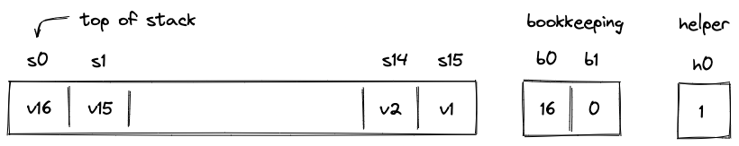
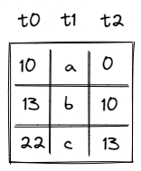
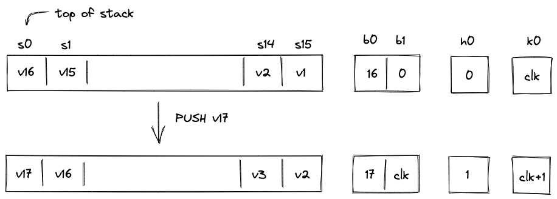
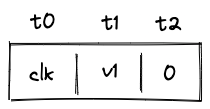
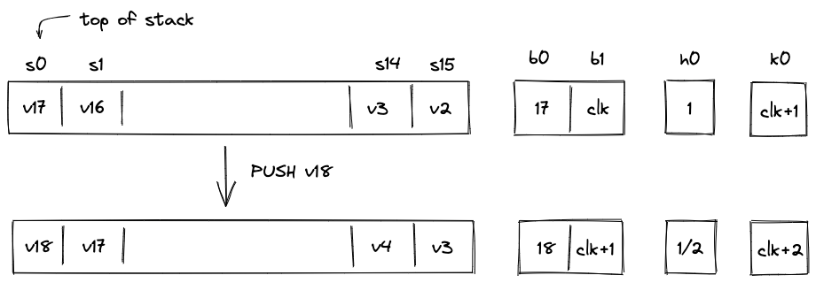
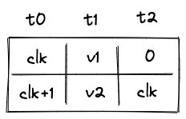
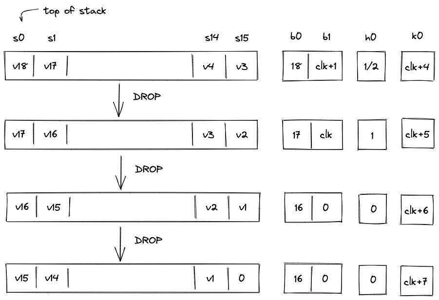

# Operand stack

Miden VM is a stack machine. The stack is a push-down stack of practically unlimited depth (in practical terms, the depth will never exceed $2^{32}$), but only the top $16$ items are directly accessible to the VM. Items on the stack are elements in a prime field with modulus $2^{64}-2^{32} + 1$.

To keep the constraint system for the stack manageable, we impose the following rules:

1. All operations executed on the VM can shift the stack by at most one item. That is, the end result of an operation must be that the stack shrinks by one item, grows by one item, or the number of items on the stack stays the same.
2. Stack depth must always be greater than or equal to $16$. At the start of program execution, the stack is initialized with exactly $16$ input values, all of which could be $0$'s.
3. By the end of program execution, exactly $16$ items must remain on the stack (again, all of them could be $0$'s). These items comprise the output of the program.

To ensure that managing stack depth does not impose significant burden, we adopt the following rule:

* When the stack depth is $16$, removing additional items from the stack does not change its depth. To keep the depth at $16$, $0$'s are inserted into the deep end of the stack for each removed item.

## Stack representation

The VM allocates $19$ trace columns for the stack. The layout of the columns is illustrated below.

The meaning of the above columns is as follows:

* $s_0 ... s_{15}$ are the columns representing the top $16$ slots of the stack.
* Column $b_0$ contains the number of items on the stack (i.e., the stack depth). In the above picture, there are 16 items on the stacks, so $b_0 = 16$.
* Column $b_1$ contains the address of the top row in the overflow table, which stores data beyond
  the directly accessible $16$ stack slots. A zero value indicates an empty overflow table.
* Helper column $h_0$ is used to ensure that stack depth does not drop below $16$. Values in this column are set by the prover non-deterministically to $\frac{1}{b_0-16}$ when $b_0 \neq 16$, and to any other value otherwise.

### Overflow table

The overflow table stores operand-stack values beyond the $16$ directly accessible slots. It is a
virtual table implemented by typed [LogUp](../lookups/logup.md) messages. An insertion contributes
multiplicity $+1$ and a removal contributes multiplicity $-1$; lookup closure requires the two
multisets to match.

The table itself can be thought of as having 3 columns as illustrated below.

The meaning of the columns is as follows:

* Column $t_0$ contains row address. Every address in the table must be unique.
* Column $t_1$ contains the value that overflowed the stack.
* Column $t_2$ contains the address of the row containing the value that overflowed the stack right before the value in the current row. For example, in the picture above, first value $a$ overflowed the stack, then $b$ overflowed the stack, and then value $c$ overflowed the stack. Thus, row with value $b$ points back to the row with value $a$, and row with value $c$ points back to the row with value $b$.

Each row is encoded as a domain-separated `StackOverflowTable` message with payload
$(t_0,t_1,t_2)$:

$$
S(t_0,t_1,t_2) = P_{stack\_overflow} + t_0 + \beta t_1 + \beta^2 t_2.
$$

Here $P_{stack\_overflow}$ is the fixed bus prefix for this relation. The table satisfies two
invariants:

* A row is removed only after it has been inserted.
* Each insertion uses a distinct row address.

The [overflow-table constraints](#overflow-table-constraints) assign the current VM clock as each
inserted row's address and carry its predecessor through $b_1$; the shared LogUp argument binds
each removal to the corresponding inserted row.

## Right shift

If an operation adds data to the stack, we say that the operation caused a right shift. For example, `PUSH` and `DUP` operations cause a right shift. Graphically, this looks like so:

Here, we pushed value $v_{17}$ onto the stack. All other values on the stack are shifted by one slot to the right and the stack depth increases by $1$. There is not enough space at the top of the stack for all $17$ values, thus, $v_1$ needs to be moved to the overflow table.

To do this, we need to rely on another column: $clk$. This is a system column which keeps track of the current VM cycle. The value in this column is simply incremented by $1$ with every step.

The row we want to add to the overflow table is defined by tuple $(clk, v1, 0)$, and after it is added, the table would look like so:

The reason we use VM clock cycle as row address is that the clock cycle is guaranteed to be unique, and thus, the same row can not be added to the table twice.

Let's push another item onto the stack:

Again, as we push $v_{18}$ onto the stack, all items on the stack are shifted to the right, and now $v_2$ needs to be moved to the overflow table. The tuple we want to insert into the table now is $(clk+1, v2, clk)$. After the operation, the overflow table will look like so:

Notice that $t_2$ for row which contains value $v_2$ points back to the row with address $clk$.

Overall, during a right shift we do the following:

* Increment stack depth by $1$.
* Shift stack columns $s_0, ..., s_{14}$ right by $1$ slot.
* Add a row to the overflow table described by tuple $(clk, s_{15}, b_1)$.
* Set the next value of $b_1$ to the current value of $clk$.

Also, as mentioned previously, the prover sets values in $h_0$ non-deterministically to $\frac{1}{b_0-16}$.

## Left shift

If an operation removes an item from the stack, we say that the operation caused a left shift. For example, a `DROP` operation causes a left shift. Assuming the stack is in the state we left it at the end of the previous section, graphically, this looks like so:

Overall, during the left shift we do the following:

* When stack depth is greater than $16$:
  * Decrement stack depth by $1$.
  * Shift stack columns $s_1, ..., s_{15}$ left by $1$ slot.
  * Remove a row from the overflow table with $t_0$ equal to the current value of $b_1$.
  * Set the next value of $s_{15}$ to the value in $t_1$ of the removed overflow table row.
  * Set the next value of $b_1$ to the value in $t_2$ of the removed overflow table row.
* When the stack depth is equal to $16$:
  * Keep the stack depth the same.
  * Shift stack columns $s_1, ..., s_{15}$ left by $1$ slot.
  * Set the value of $s_{15}$ to $0$.
  * Set the value to $h_0$ to $0$ (or any other value).

If the stack depth becomes (or remains) $16$, the prover can set $h_0$ to any value (e.g., $0$). But if the depth is greater than $16$ the prover sets $h_0$ to $\frac{1}{b_0-16}$.

## AIR Constraints

To simplify constraint descriptions, we'll assume that the VM exposes two binary flag values described below.

| Flag      | Degree | Description                                                                                      |
| --------- | ------ | ------------------------------------------------------------------------------------------------ |
| $f_{shr}$ | 6      | When this flag is set to $1$, the instruction executing on the VM is performing a "right shift". |
| $f_{shl}$ | 5      | When this flag is set to $1$, the instruction executing on the VM is performing a "left shift".  |

These flags are mutually exclusive. That is, if $f_{shl}=1$, then $f_{shr}=0$ and vice versa. However, both flags can be set to $0$ simultaneously. This happens when the executed instruction does not shift the stack. How these flags are computed is described [here](./op_constraints.md).

We also use a combined call-entry flag $f_{enter}$ to denote entry into a new execution context.
Here, $f_{enter} = f_{call} + f_{dyncall} + f_{syscall}$. The END-of-call transition is
validated by the block stack table constraints and is not handled by the stack depth rule below.

### Stack overflow flag

Additionally, we'll define a flag to indicate whether the overflow table contains values. This flag will be set to $0$ when the overflow table is empty, and to $1$ otherwise (i.e., when stack depth $>16$). This flag can be computed as follows:

$$
f_{ov} = (b_0-16) \cdot h_0 \text{ | degree} = 2
$$

To ensure that this flag is set correctly, we need to impose the following constraint:

$$
(1-f_{ov}) \cdot (b_0-16) = 0 \text{ | degree} = 3
$$

The above constraint can be satisfied only when either of the following holds:

* $b_0 = 16$, in which case $f_{ov}$ evaluates to $0$, regardless of the value of $h_0$.
* $f_{ov} = 1$, in which case $b_0$ cannot be equal to $16$ (and $h_0$ must be set to $\frac{1}{b_0-16}$).

### Stack depth constraints
To make sure stack depth column $b_0$ is updated correctly, we need to impose the following constraints:

| Condition                   | Constraint__     | Description                                                                                                          |
| --------------------------- | ---------------- | -------------------------------------------------------------------------------------------------------------------- |
| $f_{shr}=1$                 | $b'_0 = b_0 + 1$ | When the stack is shifted to the right, stack depth should be incremented by $1$.                                    |
| $f_{shl}=1$   $f_{ov}=1$ | $b'_0 = b_0-1$ | When the stack is shifted to the left and the overflow table is not empty, stack depth should be decremented by $1$. |
| $f_{enter}=1$               | $b'_0 = 16$      | On CALL/SYSCALL/DYNCALL entry, the stack depth resets to the accessible top 16 positions.                          |
| otherwise                   | $b'_0 = b_0$     | In all other cases, stack depth should not change.                                                                   |

For non-call rows (no CALL/SYSCALL/DYNCALL entry and no END-of-call), we can combine the shift
constraints into a single expression as follows:

$$
b'_0-b_0 + f_{shl} \cdot f_{ov}-f_{shr} = 0 \text{ | degree} = 7
$$

On CALL/SYSCALL/DYNCALL entry, we instead enforce $b'_0 = 16$ via a dedicated term. END-of-call
depth updates are handled by the block stack table constraints.

### Overflow table constraints

When the stack is shifted to the right, the message $S(clk,s_{15},b_1)$ is added to the overflow
table with multiplicity $+1$.

When the stack is shifted to the left and the overflow table is non-empty,
$S(b_1,s'_{15},b'_1)$ is removed with multiplicity $-1$. A `DYNCALL` with a non-empty overflow
table instead removes $S(b_1,s'_{15},h_5)$, because the restored predecessor is staged in decoder
hasher register $h_5$ while $b'_1$ is reset for the new context. Operations that do not add or
remove an overflow entry make no `StackOverflowTable` interaction.

For a left shift, the lookup relation binds the next values of $s_{15}$ and $b_1$ to $t_1$ and
$t_2$ of the removed overflow-table row.

In case of a right shift, we also need to make sure that the next value of $b_1$ is set to the current value of $clk$. This can be done with the following constraint:

$$
f_{shr} \cdot (b'_1-clk) = 0 \text{ | degree} = 7
$$

Entering a CALL, DYNCALL, or SYSCALL context starts with an empty overflow table, so we also
enforce:

$$
f_{enter} \cdot b'_1 = 0
$$

All other operations must preserve $b_1$, except for a non-empty left shift or the end of a CALL,
DYNCALL, or SYSCALL context. Those transitions restore $b_1$ through the overflow-table or
block-stack lookup. Let $f_{exit}$ select the latter three END variants and define:

$$
f_{update} = f_{enter} + f_{exit} + f_{shr} + f_{shl} \cdot f_{ov}
$$

The direct preservation constraint is:

$$
(1-f_{update}) \cdot (b'_1-b_1) = 0
$$

In case of a left shift, when the overflow table is empty, we need to make sure that a $0$ is "shifted in" from the right (i.e., $s_{15}$ is set to $0$). This can be done with the following constraint:

$$
f_{shl} \cdot (1-f_{ov}) \cdot s_{15}' = 0 \text{ | degree} = 8
$$

### Boundary constraints
In addition to the constraints described above, we also need to enforce the following boundary constraints:
* $b_0 = 16$ at the first and at the last row of execution trace.
* $b_1 = 0$ at the first and at the last row of execution trace.

The LogUp closure additionally requires every inserted overflow message to have a matching
removal.
