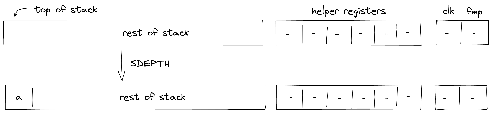
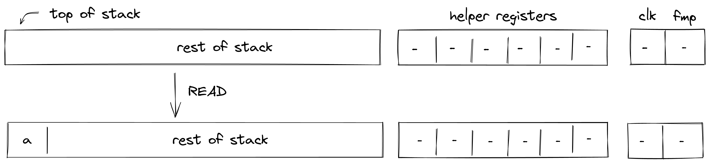
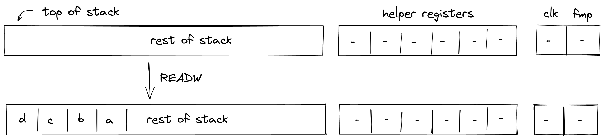
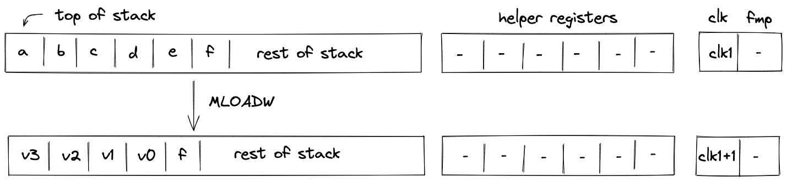
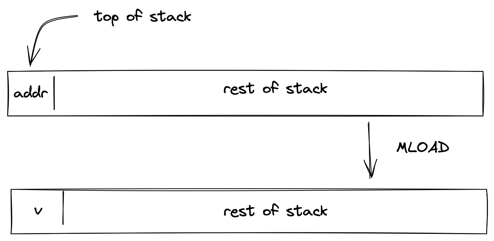
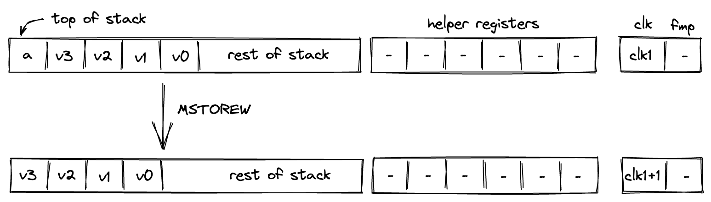
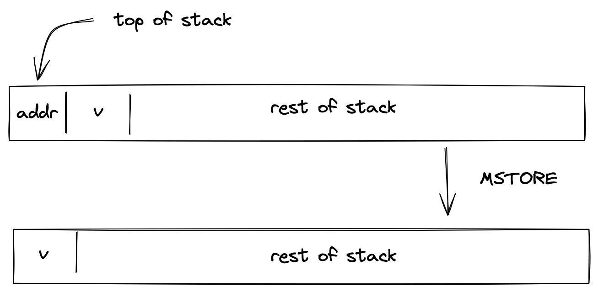
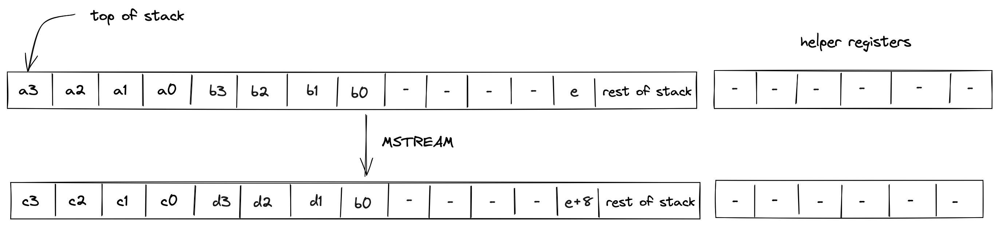

# Input / output operations
In this section we describe the AIR constraints for Miden VM input / output operations. These operations move values between the stack and other components of the VM such as program code (i.e., decoder), memory, and advice provider.

### PUSH
The `PUSH` operation pushes the provided immediate value onto the stack non-deterministically (i.e., sets the value of $s_0$ register); it is the responsibility of the [Op Group Table](../decoder/index.md#op-group-table) to ensure that the correct value was pushed on the stack. The semantics of this operation are explained in the [decoder section](../decoder/index.md#handling-immediate-values).

The effect of this operation on the rest of the stack is:
* **Right shift** starting from position $0$.

### SDEPTH
Assume $a$ is the current depth of the stack stored in the stack bookkeeping register $b_0$ (as described [here](./index.md#stack-representation)). The `SDEPTH` pushes $a$ onto the stack. The diagram below illustrates this graphically.

Stack transition for this operation must satisfy the following constraints:

$$
s_0' - b_0 = 0 \text{ | degree} = 1
$$

The effect of this operation on the rest of the stack is:
* **Right shift** starting from position $0$.

### ADVPOP
Assume $a$ is an element at the top of the advice stack. The `ADVPOP` operation removes $a$ from the advice stack and pushes it onto the operand stack. The diagram below illustrates this graphically.

The `ADVPOP` operation does not impose any constraints against the first element of the operand stack.

The effect of this operation on the rest of the operand stack is:
* **Right shift** starting from position $0$.

### ADVPOPW
Assume $a$, $b$, $c$, and $d$, are the elements at the top of the advice stack (with $a$ being on top). The `ADVPOPW` operation removes these elements from the advice stack and puts them onto the operand stack by overwriting the top $4$ stack elements. The diagram below illustrates this graphically.

The `ADVPOPW` operation does not impose any constraints against the top $4$ elements of the operand stack.

The effect of this operation on the rest of the operand stack is:
* **No change** starting from position $4$.

## Memory access operations
Miden VM exposes several operations for reading from and writing to random access memory. Memory in Miden VM is managed by the [Memory chiplet](../chiplets/memory.md).

Memory accesses use domain-separated typed messages in the VM's
[LogUp argument](../lookups/logup.md). For access kind $k$, define

$$
M_k(ctx,addr,clk,p) = P_k + ctx + \beta addr + \beta^2 clk
+ \sum_{i=0}^{|p|-1}\beta^{i+3}p_i,
$$

where $P_k$ distinguishes element and word reads and writes. Each stack operation removes its
request with multiplicity $-1$; the memory chiplet adds the matching response with multiplicity
$+1$. The shared LogUp constraints and closure are described in the linked overview.

### MLOADW
Assume that the word with elements $v_0, v_1, v_2, v_3$ is located in memory starting at address $a$. The `MLOADW` operation pops an element off the stack, interprets it as a memory address, and replaces the remaining 4 elements at the top of the stack with values located at the specified address. The diagram below illustrates this graphically.

The operation removes the following typed word-read message:

$$
M_{read\_word}(ctx,s_0,clk,[s'_0,s'_1,s'_2,s'_3]).
$$

In the above:
- $ctx$ is the identifier of the current memory context.
- $s_0$ is the memory address from which the values are to be loaded onto the stack.
- $clk$ is the current clock cycle of the VM.

The effect of this operation on the rest of the stack is:
* **Left shift** starting from position $5$.

### MLOAD
Assume that the element $v$ is located in memory at address $a$. The `MLOAD` operation pops an element off the stack, interprets it as a memory address, and pushes the element located at the specified address to the stack. The diagram below illustrates this graphically.

The operation removes the following typed element-read message:

$$
M_{read\_element}(ctx,s_0,clk,[s'_0]).
$$

In the above:
- $ctx$ is the identifier of the current memory context.
- $s_0$ is the memory address from which the value is to be loaded onto the stack.
- $clk$ is the current clock cycle of the VM.

The effect of this operation on the rest of the stack is:
* **No change** starting from position $1$.

### MSTOREW
The `MSTOREW` operation pops an element off the stack, interprets it as a memory address, and writes the remaining $4$ elements at the top of the stack into memory starting at the specified address. The stored elements are not removed from the stack. The diagram below illustrates this graphically.

After the operation the contents of memory at addresses $a$, $a+1$, $a+2$, $a+3$ would be set to $v_0, v_1, v_2, v_3$, respectively.

The operation removes the following typed word-write message:

$$
M_{write\_word}(ctx,s_0,clk,[s_1,s_2,s_3,s_4]).
$$

In the above:
- $ctx$ is the identifier of the current memory context.
- $s_0$ is the memory address into which the values from the stack are to be saved.
- $clk$ is the current clock cycle of the VM.

The effect of this operation on the rest of the stack is:
* **Left shift** starting from position $1$.

### MSTORE
The `MSTORE` operation pops an element off the stack, interprets it as a memory address, and writes the remaining element at the top of the stack into memory at the specified memory address. The diagram below illustrates this graphically.

After the operation the contents of memory at address $a$ would be set to $b$.

The operation removes the following typed element-write message:

$$
M_{write\_element}(ctx,s_0,clk,[s_1]).
$$

In the above:
- $ctx$ is the identifier of the current memory context.
- $s_0$ is the memory address into which the value from the stack is to be saved.
- $clk$ is the current clock cycle of the VM.

The effect of this operation on the rest of the stack is:
* **Left shift** starting from position $1$.

### MSTREAM

The `MSTREAM` operation loads two words from memory, and replaces the top 8 elements of the stack with them, element-wise, in stack order. The start memory address from which the words are loaded is stored in the 13th stack element (position 12). The diagram below illustrates this graphically.

After the operation, the memory address is incremented by 8.

$$
s_{12}' = s_{12} + 8
$$

The operation removes two typed word-read messages:

$$
M_{read\_word}(ctx,s_{12},clk,[s'_0,s'_1,s'_2,s'_3])
$$

$$
M_{read\_word}(ctx,s_{12}+4,clk,[s'_4,s'_5,s'_6,s'_7]).
$$

In the above:
- $ctx$ is the identifier of the current memory context.
- $s_{12}$ and $s_{12} + 4$ are the memory addresses from which the words are to be loaded onto the stack.
- $clk$ is the current clock cycle of the VM.

The effect of this operation on the rest of the stack is:
* **No change** starting from position $8$ except position $12$.

### PIPE
The `PIPE` operation (assembly instruction `adv_pipe`) pops two words from the
advice stack, writes them to memory, and overwrites the top 8 stack elements
with these words. The destination address for the first word is stored in stack
position $12$, and is incremented by 8.

$$
s_{12}' = s_{12} + 8
$$

The operation removes two typed word-write messages:

$$
M_{write\_word}(ctx,s_{12},clk,[s'_0,s'_1,s'_2,s'_3])
$$

$$
M_{write\_word}(ctx,s_{12}+4,clk,[s'_4,s'_5,s'_6,s'_7]).
$$

In the above:
- $ctx$ is the identifier of the current memory context.
- $s_{12}$ and $s_{12} + 4$ are the memory addresses for the two words.
- $clk$ is the current clock cycle of the VM.

The effect of this operation on the rest of the stack is:
* **No change** starting from position $8$ except position $12$.
