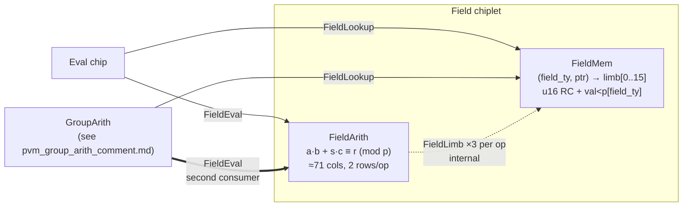

# PVM field chiplet internal decomposition — design notes

**Status:** design sketch, not yet a spec amendment. Will eventually become a reply to discussion #3005 and a patch to the published AIR spec (comment 1).
**Scope:** field side only. Group-side machinery is in a sibling document (`pvm_group_arith_comment.md`), cross-referenced here but not inlined.
**Source discussion:** https://github.com/0xMiden/miden-vm/discussions/3005

---

## 1. Motivation

Comment 1 §8.2 treats "the field chip" as a single chiplet that owns storage, u16 range checks, canonicality, and Add/Sub/Mul arithmetic. As we flesh out the arithmetic side, it becomes clear this should be **two AIRs** inside one chiplet:

- **`FieldMem`** — owns `(field_ty, ptr) → limb[0..15]` entries, range-checks u16 limbs, enforces `val < p[field_ty]` via AIR-constant modulus limbs selected by `field_ty`.
- **`FieldArith`** — proves `a·b + s·c ≡ r (mod p)` via a two-row packed convolution-and-carry AIR over linked limbs.

The two halves interact through an internal bus (`FieldLimb`, width 18). The split is invisible at the public bus level — `FieldLookup` and `FieldEval` retain their widths and shapes from the original spec.

The benefits:

1. **Separation of concerns.** Range-checking limbs and enforcing `val < p` are table-management jobs; proving a carry chain is an arithmetic job. Folding them into one chip either duplicates range checks or couples row layouts in ways that are painful to evolve.
2. **Quotient width tightening.** Because the arith chip consumes already-canonical operands from the memory chip, we know `a, b, c, r < p`, which bounds the quotient `q = (a·b + s·c − r)/p` to be less than `p`. Quotient fits in 16 limbs instead of 17, and the carry chain shrinks by one.
3. **No u32×u32 products.** Everything stays in u16 convolutions — no Goldilocks wraparound risk in the schoolbook multiplication terms.
4. **Phased ternary integration.** v1 ships binary-only. Phase 1 lights up fused `MulSub`/`MulAdd` for `GroupArith`'s internal curve-formula dispatch without DAG changes. Phase 2 (optional, measurement-driven) introduces user-facing ternary DAG nodes. Each phase builds cleanly on the previous one.

---

## 2. Chip interactions



- **Solid arrows:** public PVM buses from §7 of the original spec, widths unchanged in v1.
- **Double-weight arrow:** `GroupArith` is a second consumer of `FieldEval` alongside the eval chip. LogUp handles multi-consumer buses natively — just a multiplicity update.
- **Dashed arrow:** new internal `FieldLimb` bus carries raw u16 limbs from `FieldMem` to `FieldArith`. Internal to the field chiplet.

---

## 3. `FieldMem` — tentative AIR (v1)

One row per field element entry. Entries are appended to the table in whatever order the prover prefers; `ptr` is just the row index.

### 3.1 Row layout

```
┌────────────────────── FieldMem row (tentative) ──────────────────────────┐
│ is_real       1 col                boolean: real entry vs padding         │
│ field_ty_sel  4 cols               one-hot over {0..3}, all zero if pad   │
│ ptr           1 col                = row index, monotonically increasing │
│ limb[0..15]  16 cols    RC u16     canonical LE limbs                     │
│ canon_aux    ~5 cols               canonicality gadget (details TBD)     │
│                                                                           │
│ Total:       ≈27 cols                                                     │
└───────────────────────────────────────────────────────────────────────────┘
```

### 3.2 Pointer semantics

`ptr` is a monotone row index starting at 0 and incrementing. Uniqueness is guaranteed by construction — no permutation argument, no content addressing, no sort-and-check machinery.

**`FieldMem` does not enforce canonical pointer assignment.** A prover is free to insert the same value at multiple pointers. This is harmless for soundness: see §5 on how `Eq` works under this model.

### 3.3 Modulus access

`FieldMem` does not store `p` in the trace. The AIR holds compile-time constant limb vectors `p_0, p_1, p_2, p_3` (one per field type). Any constraint that needs "the modulus for this row" computes it on the fly via the one-hot `field_ty_sel`:

```
    p_selected[k]  =  Σ_{ty ∈ 0..3}  field_ty_sel[ty] · p_ty[k]
```

No periodic column, no lookup, no lookup bus traffic for the modulus.

### 3.4 Canonicality gadget

Prove `val < p_selected`. The recommended scheme is first-differing-limb: one-hot mask over the limb index where `val` first differs from the modulus limb (scanning top-down), a u16 difference witness at that limb position, and a cumulative indicator forcing strict equality on higher limbs. Approximately 5 auxiliary columns; the exact shape doesn't affect downstream design and is a local tuning decision.

### 3.5 Buses provided

| bus | width | recipients | tuple |
|---|---:|---|---|
| `FieldLookup` | 10 | eval chip, `GroupArith` | `(field_ty, val[8], ptr)` — `val[i] = limb[2i] + 2^16·limb[2i+1]` |
| `FieldLimb` | 18 | `FieldArith` only (internal) | `(field_ty, ptr, limb[0..15])` |

Width 18 is fine — LogUp tuples are reduced via a random challenge, so the aux-column cost scales linearly with width, not exponentially.

### 3.6 Range check

16 u16 limbs per row → 16 slots → ⌈16/7⌉ = **3 lookup groups** per entry row.

---

## 4. `FieldArith` — tentative AIR (v1)

### 4.1 Relation

$$a \cdot b \;+\; s \cdot c \;\equiv\; r \pmod{p_\text{selected}}$$

with `s ∈ {−1, +1}` a per-row sign derived from the op tag. Expanded as an integer equation:

$$a \cdot b \;+\; s \cdot c \;=\; q \cdot p_\text{selected} \;+\; r$$

where `a, b, c, r < p_selected` by linkage to `FieldMem`, and `q` is the auxiliary quotient witness.

### 4.2 Quotient bound

Since `a, b, c, r < p` by assumption:

$$q \;=\; \frac{a \cdot b + s \cdot c - r}{p}$$

is bounded in magnitude by roughly `p`, so `q` fits in **16 limbs** (not 17 as the generic design would require). The convolution `S_qp[k] = Σ_i q[i] · p[k−i]` now spans `k ∈ [0, 30]` symmetrically with `S_ab[k]`. The carry chain shrinks from 31 to **30 carries**, the constraint range is `k ∈ [0, 29]`, and we save one column.

### 4.3 Trace layout

Each operation occupies a 2-row block `(2t, 2t+1)`. Constraints fire on the even row with current/next-row access.

```
┌─────────────────────── EVEN ROW (s_even = 1) ───────────────────────────┐
│ X[ 0..15]    16   non-RC   a[0..15]          operand a (via FieldLimb)   │
│ X[16..23]     8   non-RC   c[0..7]           aux c low 8 limbs           │
│ Y[ 0..15]    16   RC u16   q[0..15]          quotient (16 limbs)         │
│ L[ 0..15]    16   RC u16   Clo[0..15]        low halves of carries 0..15 │
│ H[ 0..14]    15   RC u16   Chi[0..14]        high halves of carries 0..14│
└──────────────────────────────────────────────────────────────────────────┘

┌─────────────────────── ODD ROW  (s_even = 0) ───────────────────────────┐
│ X[ 0..15]    16   non-RC   b[0..15]          operand b (via FieldLimb)   │
│ X[16..23]     8   non-RC   c[8..15]          aux c high 8 limbs          │
│ Y[ 0..15]    16   RC u16   r[0..15]          result r (via FieldLimb)    │
│ L[ 0..13]    14   RC u16   Clo[16..29]       low halves of carries 16..29│
│ L[14..15]     2   RC u16   free / metadata                               │
│ H[ 0..14]    15   RC u16   Chi[15..29]       high halves of carries 15..29│
└──────────────────────────────────────────────────────────────────────────┘

Totals: 24 non-RC + 47 RC = 71 columns. 30 carries, 16 quotient limbs, 1 sign bit.
```

The sign bit `s` lives in a dedicated selector column (see §4.5) and doesn't inflate the main layout tally.

### 4.4 Per-limb constraint

For `k ∈ [0, 29]`, active only when `s_even = 1`:

```
    S_ab[k]  +  s · S_c[k]  −  S_qp[k]  −  r[k]  −  C[k−1]  −  2^16·C[k]   =   0

where  S_ab[k] = Σ_i  a[i] · b[k−i]          (schoolbook convolution)
       S_qp[k] = Σ_i  q[i] · p_sel[k−i]      (p_sel = Σ_ty field_ty_sel[ty] · p_ty)
       S_c[k]  = c[k]                        (c is not convolved, just added/subtracted)
       r[k] = 0 for k ≥ 16,   c[k] = 0 for k ≥ 16
       C[−1] := 0    (opening boundary)
       C[29] := 0    (closing boundary ⇒ Clo[29] = Chi[29] = 0)
       C[k]  = Clo[k] + 2^16·Chi[k]
```

Plus periodicity (`s_even' = 1 − s_even`), `s_even` booleanity, and pair-coherence on any metadata columns that must stay constant across a 2-row block.

### 4.5 Op dispatch

`FieldArith` does not use sentinel rows in `FieldMem` for v1. Instead, a small op-selector determines which operand slots are linked to `FieldMem` via `FieldLimb` and which are pinned to constants by in-row constraints. The sign `s` is also derived from the op tag.

| op | `a` | `b` | `c` | sign `s` | `FieldLimb` requires |
|---|---|---|---|:---:|:---:|
| `Mul(x, y)` | `x_ptr` linked | `y_ptr` linked | constrained `= 0` | either (c = 0) | **3** (a, b, r) |
| `Add(x, y)` | `x_ptr` linked | constrained `b[0]=1, b[k>0]=0` | `y_ptr` linked | `+1` | **3** (a, c, r) |
| `Sub(x, y)` | `x_ptr` linked | constrained `b[0]=1, b[k>0]=0` | `y_ptr` linked | `−1` | **3** (a, c, r) |

One-hot selectors `is_mul`, `is_add`, `is_sub` (plus phase-1 additions later) drive both the constraint activation and the `FieldLimb` require multiplicities:

- **When `is_mul = 1`:** constrain every `c[k] = 0`; activate `FieldLimb` requires for `a_ptr`, `b_ptr`, `r_ptr`.
- **When `is_add = 1` or `is_sub = 1`:** constrain `b[0] = 1` and `b[k>0] = 0`; activate `FieldLimb` requires for `a_ptr`, `c_ptr`, `r_ptr`. Set `s = +1` for Add, `s = −1` for Sub.

Every v1 op issues exactly 3 `FieldLimb` requires and exactly 1 `FieldEval` provide, so the bus accounting is uniform even though the operand wiring differs by op.

### 4.6 Phase 1 additions (fused ops)

Phase 1 adds `MulSub` and `MulAdd` as new op tags. Same row layout, different dispatch flag: all of `a`, `b`, `c` are linked to `FieldMem` simultaneously. Every fused op issues **4** `FieldLimb` requires (a, b, c, r) instead of 3. See §6 for the full phase-1 story.

### 4.7 Range check

47 u16 slots per op-block (spread across the even and odd rows) → ⌈47/7⌉ = **7 lookup groups** per op.

### 4.8 Buses

- **Consumes `FieldLimb`** from `FieldMem`: 3 requires per op in v1, 4 per op in phase 1. Multiplicities gated by op selectors.
- **Provides `FieldEval(op, field_ty, lhs_ptr, rhs_ptr, out_ptr)`** (width 5, §7.5 of comment 1, unchanged in v1). One provide per arith row-pair.

---

## 5. How `Eq` works

`Eq` is a scalar pointer-equality check at the eval chip. That's the whole thing.

Given two resolved sub-expression bindings `Binding(hash_lhs, Field(ty_l, lhs_ptr))` and `Binding(hash_rhs, Field(ty_r, rhs_ptr))`, the `FieldBinOp::Eq` arm asserts:

```
ty_l == ty_r          // scalar equality
lhs_ptr == rhs_ptr    // scalar equality
```

No `FieldLookup`, no `FieldEval`, no `FieldArith` row. Two scalar constraints at the eval chip.

### 5.1 Soundness

`FieldMem` is a functional mapping from `(field_ty, ptr)` to `limb[0..15]`. If the pointer-equality check passes, both sides resolve to the same `FieldMem` row, so the values are trivially equal. The direction `ptr1 == ptr2 ⇒ val1 == val2` is the only direction needed, and it holds for free.

### 5.2 Completeness

The AIR does not enforce the reverse direction `val1 == val2 ⇒ ptr1 == ptr2`. The prover is free to register equal values at multiple pointers — this is harmless and unavoidable under a row-index pointer scheme.

When the prover *wants* to prove `Eq(x, y)` and knows the values are equal, they arrange the DAG resolution so both sides land on the same `FieldMem` row:

- **Both sides are leaves of equal values.** Emit a single `FieldLookup` require during leaf resolution; both `Binding` tuples then reference the same row.
- **One side is the output of a `FieldBinOp`.** Choose `out_ptr` for that op to coincide with the pointer used by the other side — `out_ptr` is freely chosen by the prover.
- **Both sides are outputs of different `FieldBinOp`s that happen to compute the same value.** Use the same `out_ptr` for both; both `FieldArith` rows write through to the same `FieldMem` entry.

This is a prover-side discipline, not an AIR-enforced invariant. It costs nothing in the trace.

### 5.3 What this replaces

The original spec (§8.2, §6.4 of comment 1) justified pointer-equality-for-Eq by claiming the field chip enforces canonical pointer assignment (equal values share the same `ptr`). That claim is replaced: the check is still pointer equality, but the justification shifts from an AIR invariant to a prover obligation. No canonical pointer assignment machinery lives in `FieldMem` — no sorted auxiliary tables, no permutation arguments, no content-addressed pointer schemes.

---

## 6. Research — phase 1 ternary (`GroupArith`-initiated fusion)

**Goal.** Reduce intermediate `FieldMem` entries and `FieldArith` rows in curve operations without touching the DAG or any public bus width.

**Mechanism.** Add `MulSub` and `MulAdd` to the `FieldArith` op set. These are new op tags with their own dispatch flags; all four tuple slots `(a, b, c, r)` are live operands for fused ops, so every fused row issues 4 `FieldLimb` requires instead of 3.

Crucially, fused ops are **not dispatched by the eval chip** in phase 1 — only by `GroupArith`. The eval chip's `FieldBinOp` arm still emits `FieldEval(op, …)` tuples with `op ∈ {Add, Sub, Mul, Eq}`, identical to v1. `GroupArith` is the only chip that emits `FieldEval` tuples with a fused op tag.

This means one of two small wiring choices:

- **Option A.1** — widen `FieldEval` from width 5 to width 6 by adding an `aux_ptr` slot. `aux_ptr = 0` (or the sentinel pointer, if §7.1 wins) for binary ops, `aux_ptr = c_ptr` for fused ops. One bus change, same provider, same consumers.
- **Option A.2** — sibling bus `FieldFusedEval(op, field_ty, lhs_ptr, rhs_ptr, aux_ptr, out_ptr)` at width 6, consumed only by `GroupArith`. Two buses, clean separation.

Either works. A.2 is cleaner if we want the binary/fused distinction to be structural rather than a magic-zero convention.

**Savings on affine point addition.** See `pvm_group_arith_comment.md` for the expansion; roughly:

```
v1 baseline     10 FieldEval + 10 intermediate FieldMem entries per affine add
phase 1 fused    7 FieldEval +  7 intermediate entries
                 (λ² − x₁ → MulSub, λ·(x₁ − x₃) − y₁ → MulSub)
```

~30% reduction in `FieldMem` entry count and `FieldArith` row count for curve operations. Compounds over scalar-mul-style workloads.

**DAG impact.** Zero. `FieldBinOp` is untouched.

**Eval-chip impact.** Zero. Eval chip doesn't see fused ops.

**Complexity delta.** One new bus (or a width-6 widening of `FieldEval`); `GroupArith` learns to emit fused requires; `FieldArith` gets two new op selectors (`is_mulsub`, `is_muladd`). No compiler work, no DAG changes, no preimage layout changes.

---

## 7. Research — alternatives to op-dispatch for constant operands

The v1 approach (§4.5) handles constant `b = 1` and `c = 0` via per-op constraint dispatch inside `FieldArith`. Two alternative approaches are worth recording in case dispatch gets unwieldy as the op set grows, or if there's a cleaner uniform treatment we missed.

### 7.1 Alternative A — Sentinel rows in `FieldMem` via `is_zero` / `is_one` selectors

Add two new boolean columns to `FieldMem`: `is_zero_sentinel` and `is_one_sentinel`. When `is_zero_sentinel = 1`, the row's limb columns are constrained to `[0, 0, …, 0]`; when `is_one_sentinel = 1`, they're constrained to `[1, 0, …, 0]`. The canonicality gadget is bypassed on sentinel rows (0 and 1 are trivially canonical in any prime field ≥ 2).

`FieldArith` then uses regular `FieldLimb` requires for all four tuple slots — no special dispatch needed. The op's `c_ptr` points at the `is_zero` sentinel row when Mul is dispatched; `b_ptr` points at the `is_one` sentinel row for Add/Sub. Every op issues exactly 4 `FieldLimb` requires (even in v1), and `FieldArith` has a uniform relation with no per-op constraint branching.

**Cost:** 2 extra `FieldMem` columns, ~8 sentinel rows (4 field types × 2 sentinels), and v1 arith ops go from 3 to 4 `FieldLimb` requires each.

**When this wins:** if the op set grows past ~6 variants with various constant-operand patterns and the dispatch constraints in `FieldArith` start to crowd the trace.

### 7.2 Alternative B — Exploit `field_ty` for type-agnostic sentinels

The values `0` and `1` have the same u16-limb representation in every field type (`[0, 0, …, 0]` and `[1, 0, …, 0]`), so the per-field-type sentinel rows of Alternative A are redundant — a single pair of sentinel rows can serve all four field types. Leave the sentinel row's `field_ty` column wildcarded (or use a dedicated "any type" marker) and allow any `FieldArith` row to `FieldLimb`-require the sentinel regardless of the arith row's own `field_ty`.

**Cost:** 2 sentinel rows total (instead of 8), plus tricky `field_ty` wildcard semantics on the `FieldLimb` bus that need careful thought around the canonicality gadget and the `FieldLookup` bus (which does care about `field_ty`).

**When this wins:** only if Alternative A is already on the table and the field-type-independence of 0 and 1 feels clean enough to exploit. Speculative.

### 7.3 Comparison

| approach | main-path machinery | `FieldMem` sentinel rows | `FieldArith` uniformity | `FieldLimb` requires per op |
|---|---|:---:|---|:---:|
| §4.5 op-dispatch (v1) | dispatch selector + sign bit in `FieldArith` | 0 | per-op constraint branches | 3 (v1), 4 (phase 1) |
| Alt A (per-type sentinels) | sentinel selector in `FieldMem` | 8 | uniform relation | 4 always |
| Alt B (type-agnostic sentinels) | sentinel selector + `field_ty` wildcard | 2 | uniform relation | 4 always |

**Recommendation.** v1 ships with §4.5 op-dispatch. If the op set grows and dispatch branches become a tax, revisit Alternative A as a simplification pass. Alternative B is a speculative optimization of A and should only land if A lands first.

---

## 8. Research — phase 2 user-facing ternary DAG

**Goal.** Let user programs benefit from fused mul-sub / mul-add in the DAG itself, so field arithmetic outside the group chip (transcript-compiled expressions) gets the same compression as curve operations.

**Mechanism.** New DAG tag `8 = FieldTernaryOp` with preimage shape carrying three 4-felt child hashes (12 rate felts) plus `[tag, op, field_ty, version]` in capacity. The transcript compiler runs a pattern-match pass: `Sub(Mul(a, b), c)` with single-use Mul → rewrite to `MulSub(a, b, c)`. Similarly for `Add(Mul, c) → MulAdd`.

### 8.1 Hash cost analysis

The three child hashes (12 felts) exceed RPO's 8-felt rate, so a ternary node requires **two permutations** per hash — one to absorb the first two children, one to absorb the third with padding and produce the digest. Compared to the unfused baseline:

| form | permutations | `FieldArith` rows | `FieldMem` intermediates |
|---|:---:|:---:|:---:|
| two binary nodes (unfused) | 1 + 1 = 2 | 2 | 2 (intermediate + output) |
| one ternary node (fused) | 2 | 1 | 1 (output only) |

**Hash cost is identical at the 2→1 fusion depth** — this is a coincidence of the numbers (`2 × 12 = 24` felts for two binary preimages vs `1 × 16 = 16` felts for one ternary preimage, both rounding up to 2 permutations under an 8-felt rate). For deeper fusion (`3 binary → 1 quaternary`), the comparison shifts further in favor of fusion.

So phase 2 nets roughly **2× reduction** in `FieldArith` rows and `FieldMem` entries for any Mul+Sub / Mul+Add chain the compiler detects, with **zero hash-side overhead** relative to the unfused form.

### 8.2 Costs

- New eval-chip arm for tag 8 handling the 2-permutation absorption pattern. The Chunk / Keccak chips already do multi-permutation absorptions, so the AIR machinery exists.
- New `FieldTernaryEval` bus or widening of `FieldEval` to carry `aux_ptr`.
- Transcript-compiler pattern pass with single-use / dead-code analysis.
- Mild complexity bump in DAG construction.

### 8.3 Recommendation

Ship v1 and phase 1 first. Measure how much of the post-phase-1 trace is non-group field arithmetic. If >10% of the trace is Mul+Sub-shaped field ops in user code, phase 2 earns its complexity; below that threshold, leave it.

### 8.4 Why trace-time fusion doesn't work

One option I considered and ruled out: leave the DAG binary, but have witness generation detect single-use Mul+Sub chains and emit one fused `FieldArith` row. This collapses under its own weight:

If `Sub(Mul(a, b), c)` is in the DAG, the eval chip encounters the Sub node and issues `FieldEval(Sub, t_ptr, c_ptr, r_ptr)` where `t_ptr` is the Mul's pointer. For `FieldArith` to answer that request, `FieldMem` must have `t_ptr` materialized, and `FieldArith` must emit a row proving `t = a·b`. You cannot "hide" `t_ptr` from `FieldMem` while the Sub node's binding still references it — the pointer is load-bearing. The only way to elide `t` is to eliminate the Mul node from the DAG at construction time, which is exactly phase 2. Trace-time fusion without DAG changes is impossible.

---

## 9. Open questions

1. **Canonicality gadget shape.** First-differing-limb vs borrow chain — details don't affect downstream design, but the column count sits between ~3 and ~8 depending on scheme. Punting until implementation.
2. **`FieldLimb` bus width.** 18 wide accepted. If aux-column cost turns out to dominate somewhere, revisit by splitting into two narrower buses.
3. **Range-check budget total.** `FieldArith` at 7 LGs/op + `FieldMem` at 3 LGs/entry + group-side machinery (sibling file) — sanity-check against total PVM u16 RC capacity before locking the layout.
4. **Phase 1 bus shape.** Width-6 widening of `FieldEval` vs sibling `FieldFusedEval` bus. I lean sibling for structural clarity; either works.
5. **Op-dispatch vs sentinel rows (§4.5 vs §7).** Committed to op-dispatch for v1. Revisit if the op set grows past ~6 variants.
6. **Phase 2 trigger.** Defer until post-v1 measurement; no threshold set yet beyond the "10% of trace" rule of thumb.

---

## 10. Cross-references

- `pvm_spec_comment.md` §2.2, §5.1, §6.4, §7.4, §7.5, §8.2 — the sections of the published AIR spec (comment 1) that this note patches. See §11 below for the concrete edit list.
- `pvm_group_arith_comment.md` — group chiplet factoring, `GroupArith` curve formulas, scalar multiplication research, connection to phase 1 ternary.
- `PVM.md §5.6` — "field / group arithmetic in host or in MASM" decision (host side), which this note extends on the AIR side.
- `PVM-spec-amendment-revision.md` — state-layout amendment (orthogonal to this note, both amend comment 1).

---

## 11. Edits to `pvm_spec_comment.md` (published AIR spec, comment 1)

Scoped to the field side only. Group-side edits get their own list in `pvm_group_arith_comment.md` when it promotes to a real proposal.

1. **§2.2 — Field element encoding.** Add a note that `p` is not stored in the trace — it lives as AIR constants `p_ty` per field type, selected at constraint evaluation time via `field_ty_sel`. Clarify that u16 limb storage is owned by `FieldMem` (new name for the storage half of the field chip).

2. **§5.1 — FieldBinOp operation list.** No change to the op enumeration (`Add, Sub, Mul, Eq`). Add a clarifying note that `Eq` is a pointer-equality check whose soundness rests on the trivial `ptr1 == ptr2 ⇒ val1 == val2` direction; the prover is responsible for routing equal values to the same `FieldMem` pointer when Eq is used.

3. **§6.4 — FieldBinOp eval chip arm.** The `Eq` case currently reads "the prover must supply the same pointer for both operands; soundness relies on the field chip's canonical pointer assignment." Replace with:

   > For `Eq`, the eval chip asserts `field_ty_lhs == field_ty_rhs` and `lhs_ptr == rhs_ptr` as scalar equality constraints on the two resolved `Binding` tuples. No `FieldEval`, no `FieldLookup`, no `FieldArith` row. Soundness relies on `FieldMem` being a functional mapping from `(field_ty, ptr)` to `limbs`, which gives `ptr1 == ptr2 ⇒ val1 == val2` for free. The AIR does **not** enforce canonical pointer assignment — the prover bears the responsibility of registering equal values at the same pointer whenever an Eq assertion is needed.

4. **§7.5 — `FieldEval` bus.** Keep the width-5 tuple as-is for v1. Add a note that the bus has multiple consumers: the eval chip (for user-level field arithmetic) and `GroupArith` (for curve-formula dispatch). LogUp handles multi-consumer buses natively.

5. **§7 — New bus row `FieldLimb`.** Add:

   > `FieldLimb` — width 18 — provider: `FieldMem` — consumer: `FieldArith` — internal to the field chiplet, carries `(field_ty, ptr, limb[0..15])` so that `FieldArith` can access raw u16 operand limbs without going through the `val[8]` u32-LE encoding.

6. **§8.2 — Field chip.** Split into **§8.2a `FieldMem`** and **§8.2b `FieldArith`**:

   - **§8.2a `FieldMem`**: owns `(field_ty, ptr) → limbs`, `ptr` is a monotone row index, range-checks each u16 limb, enforces `val < p[field_ty]` via a canonicality gadget using `p_ty` AIR constants selected by `field_ty_sel`. **Does not enforce canonical pointer assignment.**
   - **§8.2b `FieldArith`**: proves `a·b + s·c ≡ r (mod p)` via a 2-row packed AIR (layout in this file §4). Consumes `FieldLimb` ×3 per op from `FieldMem` (v1), provides `FieldEval`. 30-carry chain, 16 quotient limbs, tightened from 17/31 via the field-table linkage bound. Op dispatch handles the constant operands for `Mul`/`Add`/`Sub`; no sentinel `FieldMem` rows required in v1.

7. **§8.3 — Group chip.** Flag for the same split (`GroupMem` + `GroupArith`) with a forward reference to `pvm_group_arith_comment.md`. Don't inline details — that file isn't promoted yet.

8. **Delete "canonical pointer assignment" claims throughout.** Comment 1 currently mentions it in §3 (bullet about Eq) and §8.2 (last paragraph). Both should be deleted or restated as "the pointer-equality check for Eq is completeness-only a prover obligation; the AIR does not enforce canonical pointer assignment."

9. **(Optional, phase 1 prep)** When phase 1 ships, widen `FieldEval` from width 5 to width 6 (adding `aux_ptr`) or introduce sibling `FieldFusedEval`. Not a v1 edit — flagged here so we don't accidentally lock §7.5's width during v1 implementation.

---

## 12. Edit plan for other docs (future session)

> **Purpose of this section.** This is a self-contained action plan for a future Claude Code session. Extract this section, drop it into a fresh conversation, and it should be enough context to apply the edits below without re-reading the rest of this file (though the rest of the file is the authoritative source for *why* each edit is what it is, and should be kept accessible as a reference).
>
> **How to use it in a future session.** Start the new conversation with something like: *"Apply the edit plan in `.claude/pvm_field_comment.md §12`. The full design rationale is in the rest of that file if you need it."* Then work through the sub-sections in the recommended order (§12.6).

### 12.1 Context snapshot (what was decided and why)

The design below is the v1 factoring of comment 1's "field chip" (from discussion #3005) into two AIRs. Every decision here came out of an iterative conversation; the rationale matters because several of the calls are non-obvious and some of them replace load-bearing claims in comment 1.

**Load-bearing decisions:**

1. **Two chips, one chiplet.** `FieldMem` owns storage + canonicality + pointers. `FieldArith` owns the arithmetic relation. Connected by an internal `FieldLimb` bus (width 18, carries raw u16 limbs). Public bus widths (`FieldLookup` width 10, `FieldEval` width 5) are unchanged from comment 1.

2. **`ptr` is a monotone row index.** Starts at 0, increments per row. Uniqueness by construction. No permutation argument, no sort-check, no content addressing.

3. **No canonical pointer assignment.** The AIR does *not* enforce "equal values share the same `ptr`." The prover can freely register the same value at multiple pointers. This is harmless for soundness.

4. **`Eq` is a pointer-equality check with a prover-side completeness obligation.** At the eval chip, `Eq(lhs, rhs)` asserts `lhs_ptr == rhs_ptr` and `field_ty_lhs == field_ty_rhs` — *scalar equality constraints, nothing more*. No `FieldLookup`, no `FieldEval`, no `FieldArith` row for Eq. Soundness rests on the trivial direction `ptr1 == ptr2 ⇒ val1 == val2` (because `FieldMem` is a functional mapping). Completeness is a prover obligation: when the prover wants to prove a true Eq, they arrange for both sub-expressions to resolve to the same `FieldMem` row (by reusing `out_ptr` values across ops, by sharing leaf lookups, etc.). This replaces comment 1's "canonical pointer assignment" soundness argument.

5. **Field moduli are AIR constants.** `p_0, p_1, p_2, p_3` (one per field type) live as compile-time constant limb vectors. Any constraint that needs `p` computes `p_selected[k] = Σ_ty field_ty_sel[ty] · p_ty[k]` via the one-hot `field_ty_sel`. No periodic columns.

6. **Quotient and carry-chain tightening.** Because `FieldArith` consumes already-canonical operands (`a, b, c, r < p`), the quotient `q = (a·b + s·c − r)/p` is bounded by ~`p` and fits in 16 limbs (not 17). The carry chain drops from 31 to 30 carries. `FieldArith` is 71 columns, 47 RC, 7 lookup groups.

7. **`c` live from day one.** `FieldArith`'s relation is `a·b + s·c ≡ r (mod p)` with `s ∈ {−1, +1}` a sign bit derived from the op tag. All three v1 ops (`Add`, `Sub`, `Mul`) use this relation uniformly.

8. **Op-dispatch, not sentinel rows.** v1 does not use sentinel `FieldMem` rows for constants 0 and 1. Instead, a per-op dispatch selector activates in-row constraints that pin `b` or `c` directly:
   - `Mul(x, y)`: `a = x_ptr`, `b = y_ptr` linked, `c[*] = 0` constrained, sign irrelevant. 3 `FieldLimb` requires.
   - `Add(x, y)`: `a = x_ptr` linked, `b[0] = 1, b[k>0] = 0` constrained, `c = y_ptr` linked, `s = +1`. 3 `FieldLimb` requires.
   - `Sub(x, y)`: same as Add but `s = −1`. 3 `FieldLimb` requires.

   Sentinel-row alternatives (with `is_zero` / `is_one` selectors in `FieldMem`, possibly type-agnostic) are documented as research in §7 but not v1.

9. **Phase 1 ternary is `GroupArith`-internal only.** Fused `MulSub` / `MulAdd` ops are activated in `FieldArith` for phase 1 but only dispatched by `GroupArith` for curve-formula compression — the eval chip never sees them. DAG stays binary, no preimage layout changes. Phase 1 needs either a widened `FieldEval` (width 5 → 6) or a sibling `FieldFusedEval` bus (width 6). Leaning sibling-bus for structural clarity.

10. **Phase 2 ternary (user-facing DAG)** is deferred research. Would add a new DAG tag 8 `FieldTernaryOp` with a 2-permutation preimage. Hash cost is identical to the unfused form at 2→1 fusion depth, so savings are roughly 2× `FieldArith` rows and `FieldMem` entries for rewritten subgraphs with zero hash-side overhead. Decide after measuring post-phase-1 trace composition.

11. **Group-side split is in a sibling file.** `GroupMem` + `GroupArith` factoring, curve formulas, and scalar multiplication research all live in `.claude/pvm_group_arith_comment.md` (not yet created). `GroupArith` is a second consumer of `FieldEval` alongside the eval chip, and is where phase 1 ternary fusion gets initiated.

### 12.2 Create `.claude/pvm_group_arith_comment.md`

Doesn't exist yet. Draft content (from an earlier iteration of this conversation, paraphrased):

- **Motivation.** Mirror the field split: `GroupMem` owns `(group_ty, ptr) → (x_ptr, y_ptr)` + on-curve check + point-at-infinity sentinel. `GroupArith` implements curve add / sub / double by dispatching a fixed sequence of `FieldEval` requires to `FieldArith`.
- **Connection to field chiplet (brief).** `GroupArith` is a second consumer of `FieldEval` (alongside the eval chip). Also consumes `FieldLookup` for coordinate fetches. Every intermediate field element (λ, λ², λ²−x₁, …) gets a regular pointer in `FieldMem`.
- **v1 cost — affine point addition.** Roughly 10 `FieldEval` requires and 10 intermediate `FieldMem` entries per affine add (full expansion with witnessed inverse for λ). Phase 1 `MulSub` fusion drops this to ~7/7.
- **Research: scalar multiplication.** v1 defers it entirely. Two paths for a later version: (a) DAG-level unroll into repeated `GroupBinOp::Add`, high hash cost; (b) dedicated `GroupArith` row class for a full double-and-add loop with scalar bits witnessed, lower hash cost but larger AIR. Tradeoff to measure post-v1.
- **Open questions.** Coordinate system (affine vs Jacobian/projective); point doubling as a separate op vs `Add(P, P)` special case; point-at-infinity handling via witnessed is-identity flag; curve constants as AIR constants keyed by `group_ty_sel` (same pattern as field moduli).
- **Cross-references.** `pvm_field_comment.md §6` (phase 1 ternary savings analysis), `pvm_spec_comment.md §8.3` (current single-chip group description being replaced), `pvm_spec_comment.md §7.6` and `§7.7` (`GroupLookup` and `GroupEval` bus definitions, unchanged in v1).

Target length: ~200 lines. Keep it a sketch, not a spec — the group design is not yet fleshed out.

### 12.3 Append §9 stub to `.claude/PVM.md`

`PVM.md` is the Miden-VM-side running scratchpad. The field chiplet lives in the PVM AIR (separate STARK), so detailed AIR content doesn't really belong there — but a cross-reference stub does, so someone reading `PVM.md` linearly doesn't miss the design decision.

Append a new top-level section after §8 (the existing work-breakdown section is §8). Roughly:

```markdown
## 9. Field chiplet internal decomposition (design note)

**Status:** design sketch in progress, not yet a spec amendment.
**Lives in:** `pvm_field_comment.md` (self-contained).

Summary: the published spec (comment 1 §8.2) treats the field chip as a
single chiplet owning storage, range checks, canonicality, and
arithmetic. We are splitting it into `FieldMem` (table + canonicality,
via a monotone row-index `ptr`, no canonical pointer assignment) and
`FieldArith` (71-col 2-row convolution-and-carry AIR proving
`a·b + s·c ≡ r (mod p)` over linked limbs). The split is invisible at
the public bus level; a new internal `FieldLimb` bus (width 18)
connects the two halves. See `pvm_field_comment.md` for tentative
AIRs, op dispatch, the revised `Eq` semantics (pointer-equality check
with prover-side completeness obligation instead of AIR-enforced
canonical pointer assignment), and the ternary fusion research tracks.

Group-side counterpart: `pvm_group_arith_comment.md` (pending).
```

Trivial append, no existing `PVM.md` content touched.

### 12.4 Apply edits to `.claude/pvm_spec_comment.md`

The full edit list is in §11 of this file. Short summary of what each edit does and how invasive it is:

| # | Section | Edit | Risk |
|---|---|---|---|
| 1 | §2.2 | Note: `p` is AIR constants selected by `field_ty_sel`, not periodic column; u16 limb storage owned by `FieldMem` | Additive, low |
| 2 | §5.1 | Clarifying note: Eq is pointer-equality, prover routes equal values to same ptr | Additive, low |
| 3 | §6.4 | **Rewrite Eq paragraph.** This is the biggest semantic edit. The new wording is in §5 of this file; port it verbatim. Soundness from `FieldMem` functional mapping, not canonical pointer assignment. | Medium — review wording |
| 4 | §7.5 | Note: `FieldEval` has multiple consumers (eval chip + `GroupArith`) | Additive, low |
| 5 | §7 (bus table) | Add new row: `FieldLimb` width 18, provider `FieldMem`, consumer `FieldArith`, internal | Additive, low |
| 6 | §8.2 | **Split into §8.2a `FieldMem` and §8.2b `FieldArith`.** Largest structural edit. Content from §3 and §4 of this file. | Medium — structural rewrite |
| 7 | §8.3 | Flag for parallel split (`GroupMem` + `GroupArith`), forward-reference `pvm_group_arith_comment.md` | Additive, low — deferred content |
| 8 | §3 bullet, §8.2 last paragraph | **Delete "canonical pointer assignment" claims.** Replace with the prover-obligation framing. | Medium — review wording |
| 9 | — | Flag (not edit) for phase-1 bus widening of `FieldEval` to width 6 or sibling `FieldFusedEval` | Not applied in v1 |

**Recommended order:** apply additive edits (1, 2, 4, 5, 7) first as a single pass. Review edits 3, 6, 8 together in a second pass because they form the "dropping canonical pointer assignment" story and the wording needs to be consistent across all three.

### 12.5 Deferred — `.claude/PVM-comments.md` Comment G

Don't do this yet. `PVM-comments.md` holds draft replies destined for posting on discussion #3005. Posting a half-baked field-chip-factoring comment is worse than posting nothing. Revisit once:

- The open questions in §9 of this file are resolved
- `pvm_group_arith_comment.md` exists and its phase-1 cost analysis is confirmed
- The edits to `pvm_spec_comment.md` (§12.4 above) have landed and been reviewed

When that happens, Comment G should be a ~300-word condensed summary (not the full 530-line treatment) pointing at `pvm_field_comment.md` for engineering detail. Structure: TL;DR + What/Why at top, Design + Files + Hints below, matching the house style of Comments A–F in that file.

### 12.6 Deferred — `.claude/PVM-spec-amendment-revision.md` extension

Don't bundle the field chip amendment into the existing state-layout amendment file. Risks holding up the state-layout fix. When ready, write a *new* amendment file (e.g., `.claude/PVM-spec-amendment-fieldchip.md`) that contains the §11 edits from this file in amendment-revision format (before/after diffs with rationale). Leave `PVM-spec-amendment-revision.md` untouched — it's for the state-layout amendment only.

### 12.7 Recommended order for the future session

1. **Create `pvm_group_arith_comment.md`** (§12.2). Closes the cross-reference loops in `pvm_field_comment.md §6` and §10. Trivial write, ~200 lines.
2. **Append §9 stub to `PVM.md`** (§12.3). Trivial append, ~15 lines.
3. **Apply additive edits to `pvm_spec_comment.md`** (§12.4, edits 1, 2, 4, 5, 7). Low-risk, can be done in one pass without review.
4. **Review and apply the "drop canonical pointer assignment" edit cluster** (§12.4, edits 3, 6, 8). Requires user review of the Eq wording in §5 of this file before porting. This is the semantically load-bearing change.
5. **Leave Comment G and the amendment-revision file for later** (§12.5, §12.6).

### 12.8 Open questions to resolve before any of the above

These are the open questions from §9 of this file, flagged here so the future session doesn't apply edits before they're settled:

1. **Canonicality gadget shape in `FieldMem`.** First-differing-limb vs borrow chain. Doesn't block the factoring, but the exact column count affects `FieldMem` row width.
2. **Phase 1 bus shape.** Width-6 widened `FieldEval` vs sibling `FieldFusedEval`. Affects `pvm_spec_comment.md §7.5` wording.
3. **Range-check budget total.** Cross-check `FieldArith` (7 LGs/op) + `FieldMem` (3 LGs/entry) + group-side machinery against the PVM's total u16 RC capacity. May force layout changes.
4. **Eq wording in `§12.4` edit 3.** The semantically load-bearing paragraph. Double-check against §5 of this file and confirm the prover-obligation framing reads correctly to a fresh reader who has not been in this conversation.

If any of these change, revisit the edit plan before applying it.