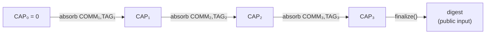
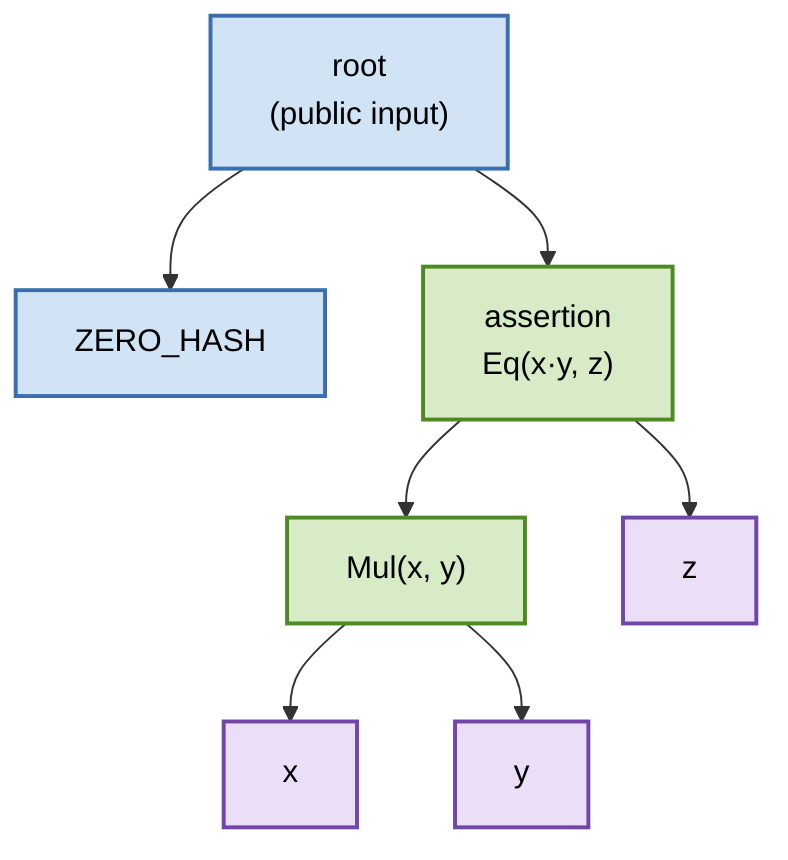
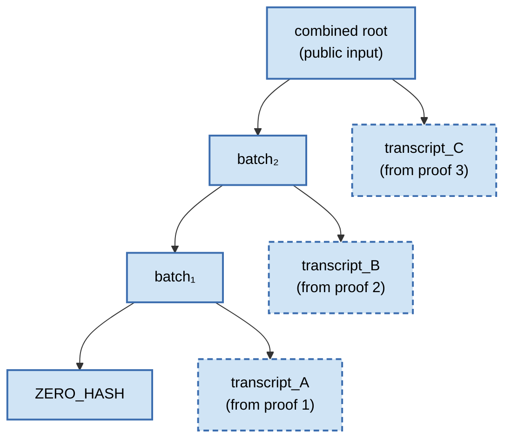

# `log_precompile` Opcode — Tagged-Tree Transcript Proposal

**Version:** 0 (initial)

> **This is a very tentative design.** Not a finalized spec — a more
> exhaustive, file-by-file implementation plan will follow in a separate
> issue. Everything below is open for discussion.
>
> *Co-authored with Claude (Opus 4.6).*

---

## Why this exists

The PVM AIR spec (comment 1, amended) and the host-side architecture
comment (sibling reply) both treat Miden's `log_precompile` as a
black-box primitive: *"append a 4-felt assertion hash to a running
public-input transcript root, with a deterministic shape."* **This
comment is the sibling proposal they reference** — the small
Miden-side change that makes the transcript root that `log_precompile`
commits to match the shape of the PVM's tag-0 Transcript node.

Concretely: switch the transcript from today's sponge absorb to a
one-shot tagged hash whose capacity carries a `CURRENT_VERSION`
constant (gating cleanly-breaking AIR upgrades) and whose rate carries
`[prev_root, assertion]`. That's the whole idea. Everything else —
the hasher chiplet, the helper register budget, the
`pc_transcript_state` public input slot, the virtual-table bus
structure — stays exactly as it is today.

## What changes

- **`core::precompile`** — new `pub const CURRENT_VERSION: Felt`.
  Replace `PrecompileTranscript::record(commitment)` with
  `append(assertion)`. Delete `finalize()` and `PrecompileCommitment`.
- **One AIR bus expression** — `compute_log_precompile_request` in
  `chiplet_requests.rs:288-322` is rewritten to reference different
  trace columns and use AIR compile-time constants for the capacity
  IV. A handful of column-range constants are renamed (e.g.
  `HELPER_CAP_PREV_RANGE` → `HELPER_PREV_ROOT_RANGE`). **No new
  hasher chiplet operation. No helper-budget change. Bus tuple width
  unchanged.**
- **One MASM wrapper** — `sys::log_precompile_request` goes from
  `padw movdnw.2 log_precompile dropw dropw dropw` (6 cycles) to
  `padw padw log_precompile dropw dropw` (5 cycles).
- **Caller audit** — four stdlib procs (keccak256, sha512, eddsa,
  ecdsa) that currently call the wrapper with `[COMM, TAG]` need a
  one-line migration to pass a single 4-felt assertion hash instead.

## Shape change, diagrammed

Two orthogonal things change in parallel: the **per-call state layout**
flips (rate and capacity roles swap), and the **overall transcript
structure** goes from a linear sponge chain to a content-addressed DAG
with structural dedup.

### Per-call state layout

```text
              state[0..4]     state[4..8]     state[8..12]        output
              (RATE0)         (RATE1)         (CAPACITY)

Sponge        COMM_n          TAG_n           CAP_prev            new CAP at state[8..12]
Tree          prev_root       assertion_n     [0,0,0,VERSION]     new_root at state[0..4]
```

Sponge: rate carries the data to absorb, capacity carries the running
state. Tree: rate carries `[prev_root, assertion]` (both the running
chain *and* the new data), capacity carries a fixed version-stamped
IV.

### Sponge — a linear chain of opaque absorptions



Each `COMMₙ` is an opaque 4-felt hash from the sponge's perspective —
the running state carries zero information about what was absorbed,
and two semantically identical calls produce two distinct absorptions.
There's no way to share work, no way to recover the underlying
expression structure, and the chain always ends with an extra
`finalize()` permutation to squeeze the state into a digest.

### Tree — a content-addressed DAG

Each Transcript node (tag 0) has exactly two children: `lhs = prev_root`
(the previous transcript prefix) and `rhs = assertion` (the thing
being appended). The spine of Transcript nodes is still linear, but
every assertion is a **hash-addressed expression DAG**.



**Legend:** 🟦 `Transcript` (tag 0) · 🟩 `FieldBinOp` (tag 4) · 🟪 `FieldLeaf` (tag 2)

The sketch shows a transcript with a single assertion `Eq(x·y, z)`.
With more assertions, the spine simply extends into a left-leaning
chain: `ZERO_HASH → root₁ → root₂ → root₃ → …`, each step a
single `log_precompile` call. The **DAG property** kicks in when
multiple assertions reference the same sub-expression — because
every node is keyed by its RPO hash, two assertions that both
reference `Mul(x, y)` end up pointing at the same DAG entry, and
the PVM's `FieldEval` trace has one row per unique sub-expression
instead of one row per assertion. Under the sponge, the same
computation would be re-absorbed as an opaque `COMM` in each
assertion with no mechanism for detecting the duplication.

## Headline properties

- **1 cycle cheaper MASM wrapper** (5 vs 6), with the new transcript
  root left on top of the stack as a free byproduct for callers that
  want to chain further hashes off of it.
- **No finalization step; the empty transcript is the zero word.**
  The sponge model required a `finalize()` call that applied a
  zero-rate permutation to squeeze the state into a digest, so a
  program making zero `log_precompile` calls produced a non-trivial
  "empty-transcript digest" `RPO(0^12)[0..4]` needing special
  handling. The tree model has no finalize: the running root *is* the
  final root, the initial `[0, 0, 0, 0]` state is itself a valid
  transcript commitment, and it matches the PVM spec's `ZERO_HASH`
  base case in §6 byte-for-byte. Zero glue between the two proof
  systems for the empty-transcript case.
- **Hasher chiplet untouched.** The existing HPERM-style 24-felt bus
  tuple is reused verbatim; only the consumer's column-reference
  mapping changes. Helper budget unchanged (5 slots,
  `addr + prev_root`). Public input slot at `[36..40]` unchanged.
- **Free recursion — transcripts can be appended as assertions.**
  Because the PVM spec §6.1 Transcript arm defines its check
  recursively (both children must evaluate to `True`), and because
  another Transcript root is itself a thing that evaluates to `True`,
  the `rhs` of a Transcript node can be another transcript root —
  appending it is structurally identical to appending any other
  assertion. This gives a recursive verifier a very cheap way to
  batch the transcript roots of N independent Miden proofs into a
  single combined root that feeds **one** PVM proof. See the
  "Free recursion" details block below.

---

## Details

Collapsed for discussion hygiene. Expand whichever section is relevant
to your review focus.

<details>
<summary><strong>Current state — what exists today</strong></summary>

The Miden VM already has a fully working **sponge-based** precompile
transcript. The architecture is very close to what we need for the
PVM; the delta is mostly in the *shape* of the hash.

Key components that exist today, in order of flow:

| Layer | Type / symbol | File |
|---|---|---|
| Opcode byte | `Operation::LogPrecompile` (`0b0101_1110`) | `core/src/operations/mod.rs:122, 598-600` |
| Handler | `op_log_precompile` | `processor/src/execution/operations/crypto_ops/mod.rs:462-508` |
| Processor state | `System.pc_transcript_state: Word` | `processor/src/trace/parallel/processor.rs:434-439` |
| Sponge type | `PrecompileTranscript { state: Word }` | `core/src/precompile.rs:332-390` |
| Public input | `pc_transcript_state` at `[36..40]` | `air/src/lib.rs:67, 77, 104-140` |
| Consumer-side bus expression | `compute_log_precompile_request` | `air/src/constraints/lookup/buses/chiplet_requests.rs:288-322` |
| Virtual-table bus add/remove | `pc_transcript_state` thread | `air/src/constraints/lookup/buses/range_logcap.rs:42-68` |
| MASM wrapper | `pub proc log_precompile_request` (6 cycles) | `crates/lib/core/asm/sys/mod.masm:38-49` |

**Today's opcode semantics:**

- Reads `COMM` from `stack[0..4]_cur` and `TAG` from `stack[4..8]_cur`
  (8 input felts).
- Reads `CAP_PREV` from helpers (4 helper felts).
- Hashes the 12-felt state via Miden's hasher chiplet (existing HPERM
  bus).
- Writes the full 12-felt output to `next.stack[0..12]` as
  `[R0, R1, CAP_NEXT]` (12 output felts).
- Updates `pc_transcript_state` to `CAP_NEXT` via the virtual-table bus.

**Today's MASM wrapper:**

```masm
pub proc log_precompile_request
    # Input:  [COMM, TAG, caller_stack...]
    padw movdnw.2            # [COMM, TAG, PAD, caller_stack...]
    log_precompile           # [R0, R1, CAP_NEXT, caller_stack...]
    dropw dropw dropw        # [caller_stack...]  (all output dropped)
end
```

6 cycles. Consumes `[COMM, TAG]` (8 felts) from the top of the stack
and produces nothing; the output of the permutation lands entirely in
the dropped `R0, R1, CAP_NEXT` slots.

The current consumer-side bus expression, for reference:

```rust
// chiplet_requests.rs:288-322
g.batch(op_flags.log_precompile(), move |b| {
    let log_addr_e: LB::Expr = log_addr.into();
    let logpre_in: [LB::Expr; 12] = [
        stk.get(STACK_COMM_RANGE.start + 0..4),  // RATE0 = COMM
        stk.get(STACK_TAG_RANGE.start  + 0..4),  // RATE1 = TAG
        user_helpers[HELPER_CAP_PREV_RANGE.start + 0..4],  // CAP = CAP_PREV
    ];
    let logpre_out: [LB::Expr; 12] = [
        stk_next.get(STACK_R0_RANGE.start       + 0..4),  // R0 at stack[0..4]_next
        stk_next.get(STACK_R1_RANGE.start       + 0..4),  // R1 at stack[4..8]_next
        stk_next.get(STACK_CAP_NEXT_RANGE.start + 0..4),  // CAP_NEXT at stack[8..12]_next
    ];
    b.remove(HasherMsg::linear_hash_init(log_addr_e.clone(), logpre_in));
    b.remove(HasherMsg::return_state(log_addr_e + last_off, logpre_out));
});
```

Note: the 12 output felts land in consecutive positions on the next
row's top 12 stack columns. That's the layout this proposal rearranges.

</details>

<details>
<summary><strong>Transcript shape change — sponge → tagged tree</strong></summary>

**Goal:** replace the sponge's "absorb commitment into capacity"
operation with a one-shot tagged hash matching the PVM's Transcript
node shape (tag 0) from the spec §3 and §6.1.

**`core/src/precompile.rs`** gets a new constant and a replaced
method:

```rust
pub const CURRENT_VERSION: Felt = Felt::new(0);

pub struct PrecompileTranscript { state: Word }

impl PrecompileTranscript {
    pub fn new() -> Self { Self { state: Word::ZERO } }

    /// Appends an assertion hash to the transcript root.
    ///
    /// Computes:
    ///
    ///   state[0..4]  = current_root  (RATE0)
    ///   state[4..8]  = assertion     (RATE1)
    ///   state[8..12] = [0, 0, 0, CURRENT_VERSION]  (CAPACITY)
    ///
    /// Then applies the RPO permutation and takes the first rate word
    /// (`state[0..4]` = Miden's `DIGEST_RANGE` = `RATE0'`) as the
    /// new transcript root.
    pub fn append(&mut self, assertion: Word) {
        let mut state = [ZERO; Poseidon2::STATE_WIDTH];
        state[Poseidon2::RATE0_RANGE].copy_from_slice(self.state.as_elements());
        state[Poseidon2::RATE1_RANGE].copy_from_slice(assertion.as_elements());
        state[Poseidon2::CAPACITY_RANGE.start + 3] = CURRENT_VERSION;
        // state[8..11] left as ZERO from initialization.

        Poseidon2::apply_permutation(&mut state);

        self.state = Word::new(state[Poseidon2::DIGEST_RANGE].try_into().unwrap());
    }

    pub fn state(&self) -> Word { self.state }
}
```

- Initial root is `ZERO_HASH = [0, 0, 0, 0]`, matching both today's
  default sponge state and the PVM spec's trivial-True base case.
- The old `record(PrecompileCommitment)` method and the
  `PrecompileCommitment` struct are deleted.
- The old `finalize()` method is deleted too. **Under the tree model
  the running root is the final root** — no per-program finalization
  step exists, and no intermediate "current state vs. final digest"
  distinction exists either.

**Why that matters: the empty transcript is the zero word.** Under the
sponge model, `finalize()` applied one extra permutation with an
empty rate word to squeeze the sponge capacity into a digest. The
consequence was that a program making zero `log_precompile` calls
produced a transcript digest of `RPO(0^12)[0..4]` — some non-trivial
hash that consumers had to know about and handle specially. Under the
tree model there's no finalize, so a program that makes zero
`log_precompile` calls just leaves `pc_transcript_state = [0, 0, 0, 0]`
as its public input. That's exactly the `ZERO_HASH` the PVM spec
§6 eval chip defines as the trivial True base case:

```text
fn eval(hash: Hash) {
    if hash == ZERO_HASH {
        provide!(Binding { hash, value: True })
        return
    }
    ...
}
```

So the Miden-side "empty transcript" is byte-identical to the PVM-side
"trivial True binding", with no glue between the two proof systems.
Every non-empty transcript is built by iterating
`root ← RPO([root, assertion, 0, 0, 0, VERSION])[0..4]` starting from
`[0, 0, 0, 0]`, and the spec's §6.1 Transcript arm walks the same
chain backward until it hits that same zero word. Miden and PVM
agree without any special-case handling on either side.

**Public input at `[36..40]` is unchanged** — it's still
`pc_transcript_state`, same slot, same boundary constraint. Only the
semantic changes: those 4 felts now hold a transcript-tree root
instead of a sponge capacity, and the "empty transcript" case becomes
syntactically trivial.

</details>

<details>
<summary><strong>Free recursion — transcripts as assertions, for recursive-verifier batching</strong></summary>

The tree shape gives us one non-obvious property for free: appending
an entire other transcript to the current one costs exactly one
`log_precompile` call, and the PVM will recursively verify the
nested transcript without any special-case handling.

**Why it works.** The PVM spec §6.1 Transcript arm requires both
children of a Transcript node to evaluate to `True`:

```text
Tag::Transcript

require Binding(lhs, True)
require Binding(rhs, True)
provide Binding(hash, True)
```

An individual assertion (`FieldBinOp::Eq`, `GroupBinOp::Eq`,
`Keccak`) is one kind of thing that evaluates to `True` — namely,
when its check holds. But another Transcript node is *also* a thing
that evaluates to `True`, by exactly the same rule applied
recursively: a Transcript whose subtree all evaluates to `True` is
itself `True`. So the `rhs` slot of a Transcript node accepts any
4-felt hash whose subtree evaluates to `True`, and another transcript
root qualifies.

**What this looks like.** Suppose a recursive verifier has already
verified three independent Miden proofs and extracted their
transcript roots `transcript_A`, `transcript_B`, `transcript_C`. It
can append each one to a running root via three ordinary
`log_precompile` calls:



**Legend:** 🟦 solid blue = Transcript nodes belonging to the combined
transcript (spine). 🟦 dashed blue = external Transcript roots being
appended as assertions (they came from other proofs, but structurally
they're also just Transcript nodes).

Every node above is a tag-0 Transcript node. The dashed ones are the
external roots being appended; to the combined transcript they look
like any other "thing that evaluates to `True`", and the `log_precompile`
opcode can't even tell the difference — from its perspective it's
just four felts.

**Use case — recursive-verifier batching.** A recursive verifier takes
the transcript roots of N independent Miden proofs, appends each one
to a running root via N calls to `log_precompile`, and produces a
single combined root. That combined root becomes the public input of
**one** PVM proof that discharges every assertion from every input
proof in a single STARK. Without this property, each input proof
would need its own PVM proof; with it, PVM amortization crosses
proof boundaries — which is exactly what you want for recursive
verification. The `log_precompile` opcode doesn't need to know about
any of this; the recursive structure is entirely in the semantics of
Transcript's recursive `True` rule.

**Why the sponge couldn't do this cleanly.** Absorbing two opaque
sponge digests into a third sponge just gives another opaque digest —
the sponge has no structural semantics for the verifier to recover
the nesting. You'd have to re-absorb every underlying commitment
individually, losing the whole point of recursive batching. The tree
model gets it for free because Transcript nodes are *typed and
recursively evaluated*, so the PVM's eval chip naturally walks into
nested transcripts without any extra machinery.

</details>

<details>
<summary><strong>Opcode stack contract — reading assertion from the third stack word</strong></summary>

**Design goal:** consume the assertion, thread the new transcript root
through processor state (via the existing virtual-table bus), and
produce a MASM wrapper sequence that's at least as cheap as today's.
The solution: read the assertion from `stack[8..12]_cur` (the third
stack word) so that a caller's `padw padw` naturally puts the assertion
exactly where the opcode expects it, and reorder the hasher bus output
so that two `dropw`s after the op leave `new_root` on top.

**Opcode stack contract:**

```
stack[0..8]_cur    : must be zero (provided by `padw padw` in the wrapper)
stack[8..12]_cur   : ASSERTION  (read by the opcode)
stack[12..16]_cur  : caller data (preserved)

stack[0..4]_next   : R1'        (junk, from permutation output state[4..8])
stack[4..8]_next   : CAP'       (junk, from permutation output state[8..12])
stack[8..12]_next  : R0' = new_root  (from permutation output state[0..4])
stack[12..16]_next : stack[12..16]_cur  (identity)

Stack shift: 0
```

**Internal (Miden-native `[RATE0, RATE1, CAPACITY]` layout):**

```rust
let prev_root = helper.prev_root;                 // via virtual-table bus "remove"
let assertion = stack.get_word(8);                // stack[8..12]_cur
let mut state = [ZERO; 12];
state[0..4]  = prev_root;                         // RATE0  (lhs  = prev prefix)
state[4..8]  = assertion;                         // RATE1  (rhs  = new assertion)
state[8..12] = [ZERO, ZERO, ZERO, CURRENT_VERSION]; // CAPACITY = [tag=0, pa=0, pb=0, version]
let permuted = Miden_Hasher_Chiplet::permute(state);
let new_root = permuted[0..4];                    // DIGEST_RANGE = RATE0' post-permutation

// Output written to next-row stack with the reordering:
stack_next.set_word(0, permuted[4..8]);           // R1' → stack[0..4]_next (junk)
stack_next.set_word(4, permuted[8..12]);          // CAP' → stack[4..8]_next (junk)
stack_next.set_word(8, new_root);                 // R0' → stack[8..12]_next

processor.pc_transcript_state = new_root;         // via virtual-table bus "add"
```

**Why read the assertion from `stack[8..12]_cur` instead of
`stack[0..4]_cur`?** So that `padw padw` is the only "positioning" the
wrapper needs — the two pads sink the assertion to exactly the depth
the opcode reads it from. Reading at depth 0 would require a `movupw.2`
in the wrapper to bring the assertion back to the top after the pads,
adding a cycle.

**Why reorder the hasher bus output as `[R1', CAP', R0']`?** So that
`new_root = R0'` lands at `stack[8..12]_next` — symmetric with where
the assertion was read from. After two `dropw`s drop the junk above
it, `new_root` is naturally at the top of the stack.

</details>

<details>
<summary><strong>MASM wrapper — stack trace walk-through</strong></summary>

**New wrapper (5 cycles, preserves the full caller stack, consumes the
assertion, leaves `new_root` on top):**

```masm
pub proc log_precompile_request
    # Input:  [ASSERTION, caller_stack...]
    # Output: [new_root,  caller_stack...]
    padw padw log_precompile dropw dropw
end
```

**Stack trace.** Starting from
`[A0 A1 A2 A3 X4 X5 X6 X7 X8 X9 X10 X11 X12 X13 X14 X15]` with
assertion `A` on top and caller data `X4..X15` below:

1. `padw` →
   `[0 0 0 0 A X4..X11]`,
   overflow: `[X12..X15]`
2. `padw` →
   `[0 0 0 0 0 0 0 0 A X4..X7]`,
   overflow: `[X12..X15, X8..X11]`
3. `log_precompile` reads the assertion at `stack[8..12]_cur`, writes
   reordered output to `stack[0..12]_next`, and threads `new_root`
   through the `pc_transcript_state` virtual-table bus.
   Result:
   `[j1 j2 new_root X4..X7]`
   (where `j1 = R1'`, `j2 = CAP'`, both don't-cares)
4. `dropw` →
   `[j2 new_root X4..X7 X8..X11]`,
   overflow: `[X12..X15]`
5. `dropw` →
   `[new_root X4..X15]`,
   overflow empty

**Final:** `[new_root, X4..X15]`. Assertion consumed, `new_root` on
top, full caller stack preserved.

**Drop-new_root variant** (6 cycles, same as today's wrapper,
consumes the assertion and leaves no residue):

```masm
pub proc log_precompile_request_drop
    # Input:  [ASSERTION, caller_stack...]
    # Output: [caller_stack...]
    padw padw log_precompile dropw dropw dropw
end
```

**Cycle comparison:**

| Variant | Sequence | Cycles | Net effect |
|---|---|---|---|
| Today | `padw movdnw.2 log_precompile dropw dropw dropw` | 6 | consume 8 felts (COMM+TAG), output dropped |
| **New (keep new_root)** | `padw padw log_precompile dropw dropw` | **5** | consume 4 felts (ASSERTION), `new_root` on top |
| New (drop new_root) | `padw padw log_precompile dropw dropw dropw` | 6 | consume 4 felts, output dropped |

The "keep new_root" wrapper is **1 cycle cheaper than today** *and*
provides the new transcript root on top of the stack for free if the
caller wants to chain further computation off of it.

</details>

<details>
<summary><strong>AIR-level change — the rewritten bus expression</strong></summary>

**No new hasher chiplet operation.** The existing HPERM-style bus
tuple (24 felts: 12 input + 12 output) is reused unchanged on the
chiplet's side. The entire AIR edit is a rewrite of
`compute_log_precompile_request` in
`air/src/constraints/lookup/buses/chiplet_requests.rs:288-322` — one
function, one file.

The hasher chiplet still emits its 12-felt input/output state in the
natural `[RATE0, RATE1, CAP]` order; the consumer's expression just
maps each state position to a different trace column than today.

**New bus expression:**

```rust
g.batch(op_flags.log_precompile(), move |b| {
    let log_addr_e: LB::Expr = log_addr.into();

    // Input state [RATE0, RATE1, CAPACITY]
    //   = [prev_root, assertion, (0, 0, 0, VERSION)]
    let logpre_in: [LB::Expr; 12] = [
        // RATE0 = prev_root, from helper columns (same helper slot as
        // today's cap_prev; only the constant name changes)
        user_helpers[HELPER_PREV_ROOT_RANGE.start + 0].into(),
        user_helpers[HELPER_PREV_ROOT_RANGE.start + 1].into(),
        user_helpers[HELPER_PREV_ROOT_RANGE.start + 2].into(),
        user_helpers[HELPER_PREV_ROOT_RANGE.start + 3].into(),
        // RATE1 = assertion, from the third stack word at the current row
        stk.get(STACK_ASSERTION_RANGE.start + 0).into(),  // stack[8..12]_cur
        stk.get(STACK_ASSERTION_RANGE.start + 1).into(),
        stk.get(STACK_ASSERTION_RANGE.start + 2).into(),
        stk.get(STACK_ASSERTION_RANGE.start + 3).into(),
        // CAPACITY = [0, 0, 0, VERSION], AIR compile-time constants
        LB::Expr::ZERO,
        LB::Expr::ZERO,
        LB::Expr::ZERO,
        LB::Expr::from(CURRENT_VERSION),
    ];

    // Output state [RATE0', RATE1', CAPACITY']
    //   = [new_root, junk_R1, junk_CAP]
    // Reordered so new_root lands at stack[8..12]_next, junks at [0..8].
    let logpre_out: [LB::Expr; 12] = [
        // RATE0' = new_root, at stack[8..12]_next
        stk_next.get(STACK_NEW_ROOT_RANGE.start + 0).into(),
        stk_next.get(STACK_NEW_ROOT_RANGE.start + 1).into(),
        stk_next.get(STACK_NEW_ROOT_RANGE.start + 2).into(),
        stk_next.get(STACK_NEW_ROOT_RANGE.start + 3).into(),
        // RATE1' = junk, at stack[0..4]_next
        stk_next.get(STACK_JUNK_R1_RANGE.start + 0).into(),
        stk_next.get(STACK_JUNK_R1_RANGE.start + 1).into(),
        stk_next.get(STACK_JUNK_R1_RANGE.start + 2).into(),
        stk_next.get(STACK_JUNK_R1_RANGE.start + 3).into(),
        // CAPACITY' = junk, at stack[4..8]_next
        stk_next.get(STACK_JUNK_CAP_RANGE.start + 0).into(),
        stk_next.get(STACK_JUNK_CAP_RANGE.start + 1).into(),
        stk_next.get(STACK_JUNK_CAP_RANGE.start + 2).into(),
        stk_next.get(STACK_JUNK_CAP_RANGE.start + 3).into(),
    ];

    b.remove(HasherMsg::linear_hash_init(log_addr_e.clone(), logpre_in));
    b.remove(HasherMsg::return_state(log_addr_e + last_off, logpre_out));
});
```

**New range constants** in `air/src/trace/log_precompile.rs`:

```rust
pub const HELPER_ADDR_IDX:        usize        = 0;
pub const HELPER_PREV_ROOT_RANGE: Range<usize> = 1..5;   // was HELPER_CAP_PREV_RANGE

pub const STACK_ASSERTION_RANGE:  Range<usize> = 8..12;  // assertion read at depth 8
pub const STACK_NEW_ROOT_RANGE:   Range<usize> = 8..12;  // new_root lands at next-row depth 8
pub const STACK_JUNK_R1_RANGE:    Range<usize> = 0..4;
pub const STACK_JUNK_CAP_RANGE:   Range<usize> = 4..8;

// DELETE: STACK_COMM_RANGE, STACK_TAG_RANGE,
//         STACK_R0_RANGE, STACK_R1_RANGE,
//         HELPER_CAP_PREV_RANGE  (replaced by HELPER_PREV_ROOT_RANGE above)
//         STACK_CAP_NEXT_RANGE   (replaced by STACK_NEW_ROOT_RANGE above)
```

**Helper register layout** (budget unchanged: 5 slots used out of 10):

- `addr` (1 felt)
- `prev_root` (4 felts) — consumed by `pc_transcript_state`
  virtual-table bus "remove"

**Virtual-table bus for `pc_transcript_state`**
(`range_logcap.rs:42-68`):

- Remove side: reads `prev_root` from helper columns (same as today's
  `cap_prev`; only the range-constant name changes).
- Add side: reads `new_root` from `next.stack[8..12]` (same column
  indices as today's `STACK_CAP_NEXT_RANGE`; only the range-constant
  name changes).

**Key observation:** the bus tuple is still 24 felts wide. The chiplet
provider side is unchanged. The entire change is a relabeling of which
trace columns each tuple position reads from, plus the capacity input
migrating from helper columns to AIR compile-time constants.

</details>

<details>
<summary><strong>Trace-column delta — today vs proposed</strong></summary>

| Aspect | Today | Proposed |
|---|---|---|
| Hasher bus tuple width | 24 felts (12 in + 12 out) | **24 felts** (same HPERM format) |
| New hasher chiplet operation | no | **no** |
| Helper felts used | 5 (`addr + cap_prev`) | 5 (`addr + prev_root`) |
| Stack columns touched next row | 12 | 12 (8 junk + 4 `new_root`, reordered) |
| Assertion read from | `stack[0..8]_cur` (COMM+TAG) | `stack[8..12]_cur` (third word) |
| `new_root` lands at | `stack[8..12]_next` (= CAP_NEXT) | `stack[8..12]_next` (reordered from R0') |
| Capacity IV source | `cap_prev` from helpers (4 columns) | AIR constants `[0, 0, 0, VERSION]` (0 columns) |
| `pc_transcript_state` public input | sponge capacity at `[36..40]` | tree root at `[36..40]` (same slot, new semantics) |
| MASM wrapper | 6 cycles, output dropped | **5 cycles**, `new_root` on top |

The proposed design is almost entirely a **relabeling** of trace-column
references in the bus expression, plus the capacity input migrating
from helper felts to AIR constants. The hasher chiplet is untouched;
the helper register budget is unchanged; the number of stack columns
touched per row is unchanged. The wrapper gets 1 cycle cheaper *and*
becomes useful (leaves `new_root` on top).

</details>

<details>
<summary><strong>Files to touch — the full change surface</strong></summary>

1. **`core/src/precompile.rs:332-390`** — add `pub const
   CURRENT_VERSION: Felt`. Replace `PrecompileTranscript::record` with
   `append(assertion: Word)`. Delete `PrecompileCommitment` struct
   and `PrecompileTranscript::finalize`.

2. **`core/src/operations/mod.rs:122, 598-600`** — update the doc
   comment on `Operation::LogPrecompile`. The opcode byte stays.

3. **`processor/src/execution/operations/crypto_ops/mod.rs:462-508`** —
   rewrite `op_log_precompile`. Read the assertion from
   `stack[8..12]_cur` (via `get_word(8)`, not `get_word(0)` or
   `get_word(4)`); build the 12-felt state from helpers + stack +
   compile-time constants; call the hasher chiplet; write the
   permutation output to next-row stack in reordered form (junk at
   `stack[0..8]_next`, `new_root` at `stack[8..12]_next`); update
   `pc_transcript_state` with the new root. Helper register variant
   returns `{ addr, prev_root }` (same 5-felt layout, renamed from
   `cap_prev`).

4. **`air/src/constraints/lookup/buses/chiplet_requests.rs:288-322`** —
   rewrite `compute_log_precompile_request` per the snippet in the
   "AIR-level change" section above. This is the central edit.

5. **`air/src/trace/log_precompile.rs`** — rename column range
   constants:
   - `HELPER_CAP_PREV_RANGE` → `HELPER_PREV_ROOT_RANGE`
   - `STACK_CAP_NEXT_RANGE` → `STACK_NEW_ROOT_RANGE`
   - Delete `STACK_COMM_RANGE`, `STACK_TAG_RANGE`, `STACK_R0_RANGE`,
     `STACK_R1_RANGE`.
   - Add `STACK_ASSERTION_RANGE = 8..12`, `STACK_JUNK_R1_RANGE = 0..4`,
     `STACK_JUNK_CAP_RANGE = 4..8`.

6. **`air/src/constraints/lookup/buses/range_logcap.rs:42-68`** — update
   the `pc_transcript_state` virtual-table bus consumer to reference
   the renamed constants. No structural change — the "remove" still
   reads `prev_root` from helpers, the "add" still reads from
   `next.stack[8..12]`.

7. **`processor/src/trace/chiplets/aux_trace/virtual_table.rs:170-256`** —
   update column references to match the renamed constants.

8. **`crates/lib/core/asm/sys/mod.masm:38-49`** — rewrite the
   `log_precompile_request` wrapper:

   ```masm
   #! Appends an assertion hash to the transcript root.
   #!
   #! Input  : [ASSERTION, caller_stack...]
   #! Output : [new_root,  caller_stack...]
   #! Cycles : 5
   pub proc log_precompile_request
       padw padw log_precompile dropw dropw
   end
   ```

   Optionally add a `log_precompile_request_drop` variant (6 cycles,
   no `new_root` on top) for callers that don't want to keep the root.

9. **Caller audit**: any MASM proc in stdlib that currently calls
   `sys::log_precompile_request` with `[COMM, TAG, ...]` needs to be
   updated to call it with `[ASSERTION, ...]`. Known callers today:
   keccak256, sha512, eddsa, ecdsa (per a codebase search). Each
   should compute a single 4-felt assertion hash and pass it to the
   new wrapper.

</details>

<details>
<summary><strong>Implementation hints & open questions</strong></summary>

**Confirm LogUp allows non-contiguous column references.** The new bus
expression reads `output[0..4]` from `stack[8..12]_next`, `output[4..8]`
from `stack[0..4]_next`, `output[8..12]` from `stack[4..8]_next` — i.e.
consecutive tuple positions come from non-consecutive trace columns.
This is standard in LogUp (each tuple position is a free AIR expression
over trace columns), but worth sanity-checking during implementation
that `compute_log_precompile_request` can be written this way without
tripping any bus-framework assumption. A 15-minute code-read of the
existing `chiplet_requests.rs` bus definitions should confirm.

**`CURRENT_VERSION` sync between Rust and MASM.** The Rust constant in
`core::precompile` and any MASM `const.CURRENT_VERSION=0` in stdlib
files must agree. Add a unit test that parses the relevant MASM file(s)
and asserts the extracted constant matches
`miden_core::precompile::CURRENT_VERSION`. Bumping the version
requires bumping both in lockstep; the test fails if only one moves.

**Audit existing callers of `log_precompile_request`.** The wrapper's
signature changes from "consume `[COMM, TAG]`" to "consume
`[ASSERTION]`, produce `[new_root]`". Every existing caller in
`stdlib/asm` needs a one-line migration: they should compute a single
4-felt assertion hash and pass it to the new wrapper instead of
`[COMM, TAG]`. This is a single-PR change; all callers live in
`crates/lib/core/asm/crypto/`.

**What `PrecompileCommitment` deletion implies.** The struct was
purely sponge-era bookkeeping. Removing it breaks any crate that
constructs one directly, but the only in-tree construction site is
`PrecompileTranscript::record` (which is being deleted in the same
PR). No external consumers should need updating — the struct is
internal to the precompile machinery.

**What `PrecompileVerifier` deletion implies (separate from this
proposal).** This proposal doesn't touch the `PrecompileVerifier`
registry — that deletion is part of the host-side architecture
comment's scope, not this one. Both can land independently; if the
host-side architecture isn't in place yet, this proposal coexists
fine with the legacy `PrecompileVerifier` infrastructure because it
only changes what the transcript root commits to, not how
post-execution verification works.

**Risk / blast radius.** The change is contained: one transcript
type, one opcode handler, one bus expression, one range-constant
module, one MASM wrapper, and a caller audit of ~4 stdlib procs.
The hasher chiplet is untouched; the helper register layout is
untouched; the public input layout is untouched. The blast radius is
bounded by the files listed above, plus anywhere `HELPER_CAP_PREV_RANGE`
or `STACK_CAP_NEXT_RANGE` is referenced (both are the only constants
being renamed).

</details>

---

## Open questions

1. **Deferring `PrecompileVerifier` cleanup.** Should this proposal
   include the deletion of the `PrecompileVerifier` registry (which
   becomes redundant once the PVM is online), or should that wait for
   the host-side architecture to land? My preference: defer —
   `PrecompileVerifier` is out of scope for an opcode proposal, and
   this proposal is cleanest as a surgical opcode + transcript
   retrofit. The registry can be removed in a follow-up once the
   host-side DAG is in place.

2. **Retain a `log_precompile_request_drop` variant?** The proposed
   default wrapper leaves `new_root` on top of the stack. Some callers
   will want to drop it immediately. Is it worth shipping both
   variants in the stdlib, or should callers just append `dropw`
   inline when they don't want the root?

3. **Naming of the reordered output slots.** I've called them
   `STACK_JUNK_R1_RANGE` and `STACK_JUNK_CAP_RANGE`. "Junk" is
   accurate but maybe too informal for a range constant name.
   Alternatives: `STACK_OUTPUT_UNUSED_0..7_RANGE`,
   `STACK_DISCARD_*_RANGE`, or just inline the ranges in the bus
   expression without named constants at all.

A more exhaustive issue with the concrete file-by-file implementation
plan will follow separately.
